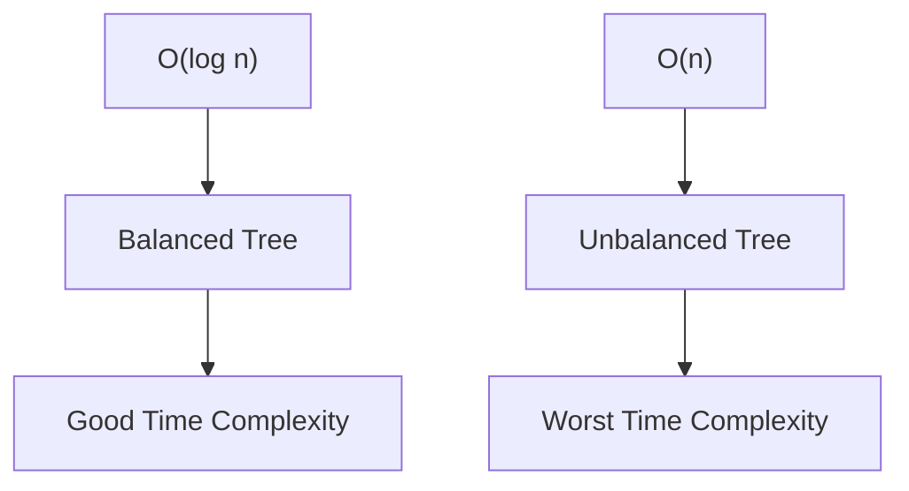

# 🌲 **Binary Search Tree Insertion Time Complexity** 🌲

In this tutorial, we will explore the time complexity of inserting nodes into a Binary Search Tree (BST). Depending on whether the tree is balanced or unbalanced, the complexity can vary. Let’s dive in and understand this concept with visuals!

## 📑 Table of Contents

1. 🌳 [What is a Binary Search Tree (BST)?](#1-what-is-a-binary-search-tree-bst)
2. ⏳ [Time Complexity Overview](#2-time-complexity-overview)
3. 📊 [Balanced vs. Unbalanced Trees](#3-balanced-vs-unbalanced-trees)
4. 🛠 [Why Self-Balancing Trees Matter](#4-why-self-balancing-trees-matter)
5. 🎨 [Complexity Pyramid Visualization](#5-complexity-pyramid-visualization)

---

## 1. 🌳 What is a Binary Search Tree (BST)?

A **Binary Search Tree (BST)** is a tree structure where each node follows a specific rule:

- **Left child nodes** contain values **smaller than or equal to** the parent node.
- **Right child nodes** contain values **greater than** the parent node.

This property makes searching, inserting, and deleting elements efficient in a balanced BST. Let’s now focus on **insertion** complexity.

---

## 2. ⏳ Time Complexity Overview

The time complexity for inserting an element into a BST depends on the **height** of the tree. The height determines how many steps we need to take to reach the appropriate position to insert the new node.

- **Best/Average Case (Balanced Tree)**: 🌟 **O(log n)**
- **Worst Case (Unbalanced Tree)**: ⚠️ **O(n)**

---

## 3. 📊 Balanced vs. Unbalanced Trees

### 3.1 🌟 **Balanced Tree** (Best/Average Case - O(log n))

A **balanced** BST has roughly the same number of nodes on the left and right subtrees at each level. In a balanced tree, the height of the tree is **logarithmic** relative to the number of nodes, resulting in an insertion time complexity of **O(log n)**.

- Example:
  ```
       20
      /  \
    10    30
   /  \   /  \
  5   15 25  35
  ```

### 3.2 ⚠️ **Unbalanced Tree** (Worst Case - O(n))

In an **unbalanced** BST, all nodes may be skewed to one side, essentially forming a **linked list**. This happens if elements are inserted in sorted order, and the height of the tree becomes **n**. As a result, the time complexity becomes **O(n)**.

- Example:
  ```
  1
   \
    2
     \
      3
       \
        4
         \
          5
  ```

---

## 4. 🛠 Why Self-Balancing Trees Matter

To avoid the **O(n)** worst-case scenario, we use **self-balancing trees** like **AVL trees** or **Red-Black trees**. These trees automatically restructure themselves after insertions and deletions to maintain a height of **O(log n)**, ensuring that the operations stay efficient.

---

## 5. 🎨 Complexity Pyramid Visualization

Here’s a diagram that shows the pyramid-shaped structure for time complexities in a BST:



### 🎨 Visualizing Time Complexity:

- **O(log n)** occurs when the tree is balanced, resulting in logarithmic growth as the tree size increases.
- **O(n)** occurs in the worst-case scenario when the tree is unbalanced and behaves like a linked list.

---

### 🏁 **Summary**

- In a **balanced** BST, insertion takes **O(log n)** time.
- In an **unbalanced** BST, insertion can degrade to **O(n)**.
- **Self-balancing trees** like AVL or Red-Black trees ensure the tree stays balanced and keeps insertion time at **O(log n)**.

---
