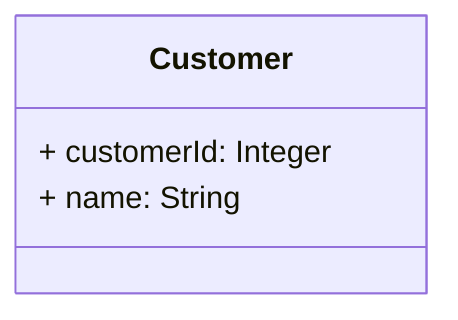
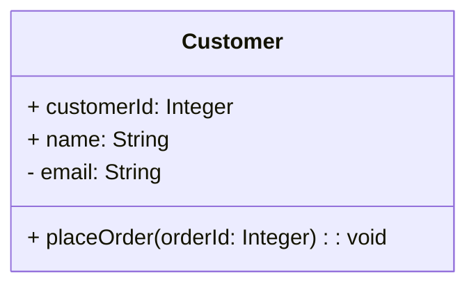
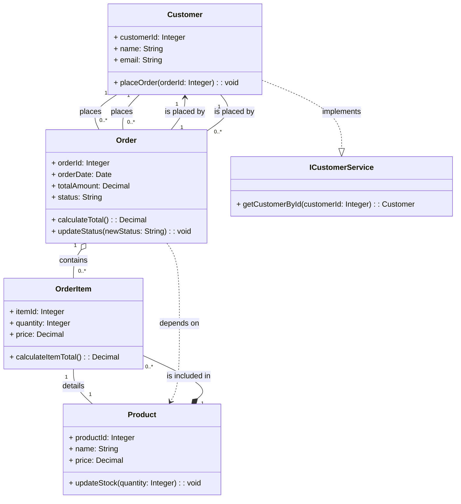

# 📘 Tutorial: Writing a Class Diagram Using Mermaid

Mermaid is an intuitive tool for creating diagrams and visualizations using a simple syntax. This tutorial will walk you through creating a class diagram using Mermaid and include various types of relationships.

## 📑 Table of Contents

1. 🛠️ [Introduction to Mermaid Syntax](#-introduction-to-mermaid-syntax)
2. 🏷️ [Defining Classes](#-defining-classes)
3. 📜 [Adding Attributes and Methods](#-adding-attributes-and-methods)
4. 🔗 [Creating Relationships](#-creating-relationships)
5. 🖼️ [Visualizing the Diagram](#-visualizing-the-diagram)
6. 📚 [Example Class Diagram](#-example-class-diagram)

---

## 🛠️ Introduction to Mermaid Syntax

Mermaid uses a markdown-inspired syntax to create diagrams. For class diagrams, you use the `classDiagram` keyword to start.

### Basic Structure

```mermaid
classDiagram
    % Define your classes here
    class ClassName {
        + attributeName: AttributeType
        - privateAttribute: AttributeType
        # protectedAttribute: AttributeType
        + methodName(param: Type): ReturnType
    }
    % Define relationships here
```

- **`classDiagram`**: Begins the class diagram definition.
- **`class ClassName`**: Defines a class.
- **`+`**: Public attribute or method.
- **`-`**: Private attribute or method.
- **`#`**: Protected attribute or method.

---

## 🏷️ Defining Classes

To define a class, use the `class` keyword followed by the class name.

### Example



---

## 📜 Adding Attributes and Methods

Inside each class, define attributes and methods using visibility indicators (`+`, `-`, `#`).

### Example



---

## 🔗 Creating Relationships

Mermaid supports several types of relationships. Below are examples of eight different types of relationships.

### 1. **Association**

Represents a simple connection between two classes.

```mermaid
Customer "1" -- "0..*" Order : places
```

### 2. **Aggregation**

Represents a "whole-part" relationship where the parts can exist independently of the whole.

```mermaid
Order "1" o-- "0..*" OrderItem : contains
```

### 3. **Composition**

A stronger form of aggregation where the parts cannot exist without the whole.

```mermaid
Order "1" *-- "0..*" OrderItem : consists of
```

### 4. **Inheritance (Generalization)**

Represents an "is-a" relationship where one class inherits from another.

```mermaid
Employee <|-- Manager : is a
```

### 5. **Realization (Interface Implementation)**

Indicates that a class implements an interface.

```mermaid
Customer ..|> ICustomerService : implements
```

### 6. **Dependency**

Represents a "uses" relationship where one class depends on another.

```mermaid
Order ..> Product : depends on
```

### 7. **Bidirectional Association**

A two-way association where both classes are aware of each other.

```mermaid
Customer "1" -- "0..*" Order : places
Order "0..*" -- "1" Customer : is placed by
```

### 8. **Unidirectional Association**

A one-way association where only one class is aware of and interacts with another.

```mermaid
Order "1" --> "1" Customer : is placed by
```

---

## 🖼️ Visualizing the Diagram

To visualize your Mermaid class diagram, use the following tools:

1. **Mermaid Live Editor**: Visit [Mermaid Live Editor](https://mermaid-js.github.io/mermaid-live-editor/) to paste your Mermaid code and see the rendered diagram.
2. **Markdown Editors**: Many editors (e.g., GitHub, GitLab) support Mermaid diagrams natively.
3. **IDE Integration**: IDEs like VSCode have Mermaid extensions for in-editor visualization.

---

## 📚 Example Class Diagram

Here’s an example of a complete class diagram for a shop system using all eight relationships:



---
