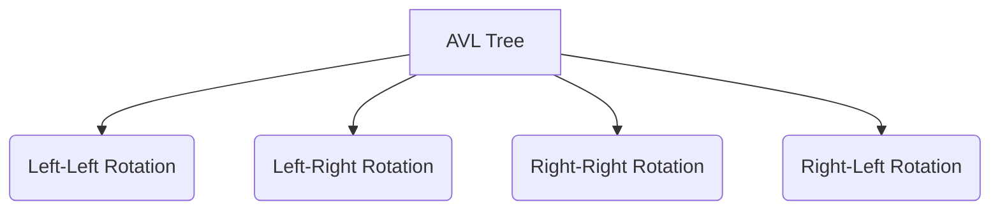
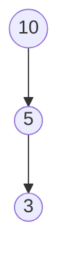
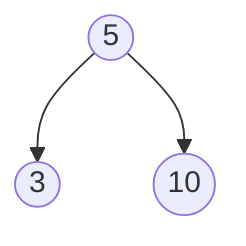
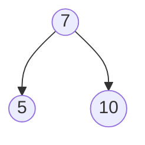
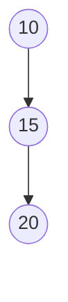
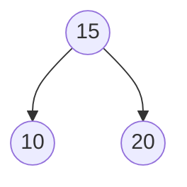
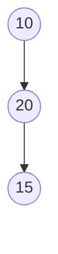

# AVL Trees Tutorial 🌳✨

---

## **Table of Contents**

1. [What is an AVL Tree? 🌳](#321-what-is-an-avl-tree)
2. [Why AVL Tree? ❓](#322-why-avl-tree)
3. [Common Operations on AVL Trees 🔧](#323-common-operations-on-avl-trees)
4. [Insert a Node in AVL Tree 🌲](#324-insert-a-node-in-avl)
   - Left-Left Condition (LL) 🌲⬅️⬅️
   - Left-Right Condition (LR) 🌲⬅️➡️
   - Right-Right Condition (RR) 🌲➡️➡️
   - Right-Left Condition (RL) 🌲➡️⬅️
5. [Delete a Node from AVL Tree 🪓](#331-delete-a-node-from-avl-all-together)
6. [Time and Space Complexity Table ⏳](#334-time-and-space-complexity-of-avl-tree)

---

## **321. What is an AVL Tree?** 🌳

An **AVL Tree** is a **self-balancing Binary Search Tree (BST)**.

### Properties:

- The difference between the heights of the left and right subtrees for any node is **no more than 1**.
- If the balance factor exceeds this, the tree is rebalanced using **rotations**.

### Rotations Ensure:

- Search, insertion, and deletion operations remain **O(log(n))** for balanced trees.

---

## **322. Why AVL Tree?** ❓

### Why Use AVL Trees?

- In an unbalanced Binary Search Tree (BST), operations can degrade to **O(n)**, turning into a linked list-like structure.
- In AVL Trees, operations like search, insertion, and deletion have a guaranteed time complexity of **O(log(n))** because they are always balanced. This results in efficient performance.

---

## **323. Common Operations on AVL Trees** 🔧

### Operations include:

1. **Inserting a Node** 🔄
2. **Deleting a Node** ❌
3. **Rotations** to restore balance after insertions and deletions.

### Types of Rotations in AVL Trees:



---

## **324. Insert a Node in AVL** 🌲

### **Left-Left (LL) Condition** 🌲⬅️⬅️

- **When**: A node is inserted into the **left subtree** of the left child of an unbalanced node.
- **Solution**: Perform a **single right rotation**.

#### Before Right Rotation:



#### After Right Rotation:



#### Code Example:

```python
class AVLNode:
    def __init__(self, key):
        self.key = key
        self.left = None
        self.right = None
        self.height = 1

class AVLTree:
    def insert(self, root, key):
        if not root:
            return AVLNode(key)

        if key < root.key:
            root.left = self.insert(root.left, key)
        else:
            root.right = self.insert(root.right, key)

        # Update the height of the node
        root.height = 1 + max(self.getHeight(root.left), self.getHeight(root.right))

        # Get the balance factor
        balance = self.getBalance(root)

        # Left Left Case
        if balance > 1 and key < root.left.key:
            return self.rightRotate(root)

        return root

    def getHeight(self, node):
        if not node:
            return 0
        return node.height

    def getBalance(self, node):
        if not node:
            return 0
        return self.getHeight(node.left) - self.getHeight(node.right)

    def rightRotate(self, z):
        y = z.left
        T3 = y.right

        y.right = z
        z.left = T3

        z.height = 1 + max(self.getHeight(z.left), self.getHeight(z.right))
        y.height = 1 + max(self.getHeight(y.left), self.getHeight(y.right))

        return y
```

---

### **Left-Right (LR) Condition** 🌲⬅️➡️

- **When**: A node is inserted into the **right subtree** of the left child of an unbalanced node.
- **Solution**: Perform a **left rotation** on the left child, followed by a **right rotation** on the unbalanced node.

#### Before Left-Right Rotation:


#### After Left-Right Rotation:



#### Code Example:

```python
class AVLTree:
    def leftRotate(self, z):
        y = z.right
        T2 = y.left

        y.left = z
        z.right = T2

        z.height = 1 + max(self.getHeight(z.left), self.getHeight(z.right))
        y.height = 1 + max(self.getHeight(y.left), self.getHeight(y.right))

        return y

    def insert(self, root, key):
        # Same insert logic
        # Handle Left-Right case
        if balance > 1 and key > root.left.key:
            root.left = self.leftRotate(root.left)
            return self.rightRotate(root)

        return root
```

---

### **Right-Right (RR) Condition** 🌲➡️➡️

- **When**: A node is inserted into the **right subtree** of the right child of an unbalanced node.
- **Solution**: Perform a **single left rotation**.

#### Before Left Rotation:



#### After Left Rotation:



#### Code Example:

```python
class AVLTree:
    def leftRotate(self, z):
        y = z.right
        T2 = y.left

        y.left = z
        z.right = T2

        z.height = 1 + max(self.getHeight(z.left), self.getHeight(z.right))
        y.height = 1 + max(self.getHeight(y.left), self.getHeight(y.right))

        return y

    def insert(self, root, key):
        # Handle Right-Right case
        if balance < -1 and key > root.right.key:
            return self.leftRotate(root)

        return root
```

---

### **Right-Left (RL) Condition** 🌲➡️⬅️

- **When**: A node is inserted into the **left subtree** of the right child of an unbalanced node.
- **Solution**: Perform a **right rotation** on the right child, followed by a **left rotation** on the unbalanced node.

#### Before Right-Left Rotation:



#### After Right-Left Rotation:


#### Code Example:

```python
class AVLTree:
    def insert(self, root, key):
        # Handle Right-Left case
        if balance < -1 and key < root.right.key:
            root.right = self.rightRotate(root.right)
            return self.leftRotate(root)

        return root
```

---

## **331. Delete a Node from AVL (All Together)** 🪓

### Steps to Delete a Node:

1. Perform standard BST deletion.
2. Rebalance the tree using rotations if the balance factor becomes greater than 1 or less than -1.

#### Code Example:

```python
class AVLTree:
    def delete(self, root, key):
        # Step 1: Perform standard BST delete
        if not root:
            return root

        if key < root.key:
            root.left = self.delete(root.left, key)
        elif key > root.key:
            root.right = self.delete(root.right, key)
        else:
            if root.left is None:
                temp = root.right
                root = None
                return temp
            elif root.right is None:
                temp = root.left
                root = None
                return temp

            temp = self.getMinValueNode(root.right)
            root.key = temp.key
            root.right = self.delete(root.right, temp.key)

        if root is None:
            return root

        # Step 2: Update height
        root.height = 1 + max(self.getHeight(root.left), self.getHeight(root.right))

        # Step 3: Check balance factor and rebalance
        balance = self.getBalance(root)

        # Left Left Case
        if balance > 1 and self.getBalance(root.left) >= 0:
            return self.rightRotate(root)

        # Left Right Case
        if balance > 1 and self.getBalance(root.left) < 0:
            root.left = self.leftRotate(root.left)
            return self.rightRotate(root)


        # Right Right Case
        if balance < -1 and self.getBalance(root.right) <= 0:
            return self.leftRotate(root)

        # Right Left Case
        if balance < -1 and self.getBalance(root.right) > 0:
            root.right = self.rightRotate(root.right)
            return self.leftRotate(root)

        return root

    def getMinValueNode(self, root):
        if root is None or root.left is None:
            return root
        return self.getMinValueNode(root.left)
```

---

## **334. Time and Space Complexity of AVL Tree** ⏳

| Operation | Time Complexity | Space Complexity |
| --------- | --------------- | ---------------- |
| Search    | O(log n)        | O(n)             |
| Insert    | O(log n)        | O(n)             |
| Delete    | O(log n)        | O(n)             |

---

This concludes our AVL Trees tutorial! I hope this guide makes the concept more accessible to you. 🌳
