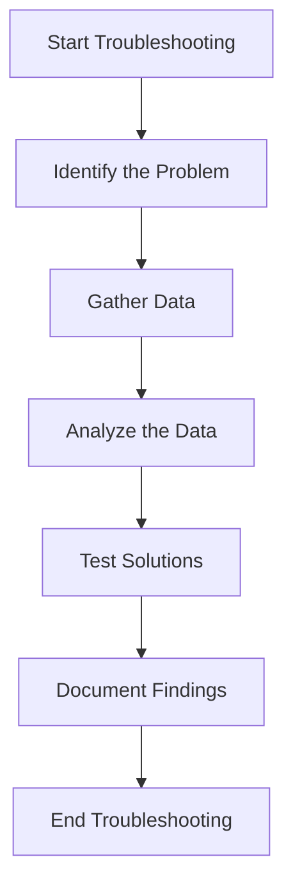
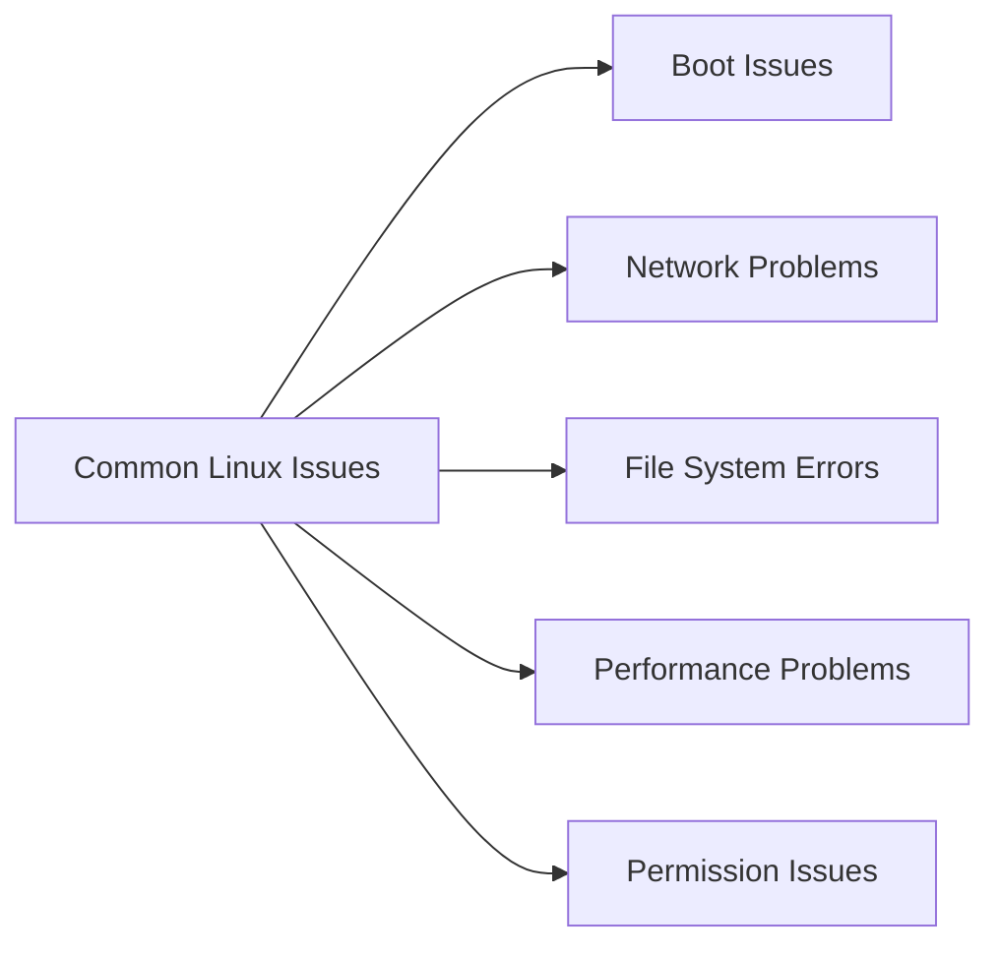

# **RHEL vs. CentOS: Troubleshooting Guide** 🐧🔧

**Welcome!** 🎉  
This tutorial provides an in-depth comparison between **Red Hat Enterprise Linux (RHEL)** and **CentOS**, explores troubleshooting techniques for both distributions, and offers a practical script to aid in troubleshooting CentOS systems. Whether you're a system administrator or a Linux enthusiast, this guide will equip you with the knowledge and tools to manage and resolve issues effectively.

---

### **📜 Table of Contents**

1. [Understanding RHEL and CentOS](#1-understanding-rhel-and-centos)
   - [What is RHEL?](#11-what-is-rhel)
   - [What is CentOS?](#12-what-is-centos)
2. [Key Differences Between RHEL and CentOS](#2-key-differences-between-rhel-and-centos)
3. [Troubleshooting in RHEL and CentOS](#3-troubleshooting-in-rhel-and-centos)
   - [Common Issues](#31-common-issues)
   - [Troubleshooting Techniques](#32-troubleshooting-techniques)
   - [Useful Commands](#33-useful-commands)
4. [Practical Troubleshooting Script for CentOS](#4-practical-troubleshooting-script-for-centos)
   - [Script Overview](#41-script-overview)
   - [Script Code](#42-script-code)
   - [How to Use the Script](#43-how-to-use-the-script)
5. [Collecting and Sending Information to Developers](#5-collecting-and-sending-information-to-developers)
6. [Best Practices](#6-best-practices)
7. [Conclusion](#7-conclusion)
8. [Visual Representation](#8-visual-representation)

---

### **1. Understanding RHEL and CentOS** 🖥️📂

#### **1.1 What is RHEL?** 🟥🟩

**Red Hat Enterprise Linux (RHEL)** is a commercial Linux distribution developed by Red Hat. It is designed for enterprise environments, offering robust security, stability, and support services. RHEL is widely used in corporate settings due to its comprehensive support and certifications.

**Key Features:**

- **Commercial Support:** Access to Red Hat's professional support and services.
- **Stability and Reliability:** Rigorous testing ensures a stable operating environment.
- **Certified Software:** Compatibility with a wide range of enterprise applications.
- **Security:** Regular updates and security patches to protect against vulnerabilities.

#### **1.2 What is CentOS?** 🟩🟦

**CentOS (Community ENTerprise Operating System)** is a free, community-supported computing platform functionally compatible with RHEL. CentOS aims to provide a free alternative to RHEL without the commercial support, making it a popular choice for developers and small businesses.

**Key Features:**

- **Free to Use:** No licensing costs, making it accessible for various use cases.
- **Compatibility:** Binary compatible with RHEL, allowing seamless migration.
- **Community Support:** Active community forums and resources for assistance.
- **Stability:** Inherits the stability and reliability of RHEL.

---

### **2. Key Differences Between RHEL and CentOS** ⚖️🔍

| **Feature**         | **RHEL**                                                          | **CentOS**                                                                       |
| ------------------- | ----------------------------------------------------------------- | -------------------------------------------------------------------------------- |
| **Cost**            | Subscription-based (paid)                                         | Free to use                                                                      |
| **Support**         | Commercial support from Red Hat                                   | Community-supported                                                              |
| **Release Cycle**   | Regular, with long-term support                                   | Follows RHEL's release cycle                                                     |
| **Updates**         | Timely updates and patches from Red Hat                           | Updates lag slightly behind RHEL                                                 |
| **Certifications**  | Certified for various enterprise applications and hardware        | Not officially certified, but compatible with RHEL-certified systems             |
| **Target Audience** | Enterprises requiring reliable support and certified environments | Developers, small businesses, and users who need RHEL compatibility without cost |

---

### **3. Troubleshooting in RHEL and CentOS** 🛠️🖥️

Effective troubleshooting is essential for maintaining system performance and reliability. Below are common issues, techniques, and useful commands tailored for both RHEL and CentOS.

#### **3.1 Common Issues** 🛑

1. **Boot Issues** 🚫🔄

   - **Symptoms:** System fails to start, error messages during boot, booting into recovery mode.
   - **Potential Causes:** Corrupted bootloader, missing kernel, hardware changes.

2. **Network Problems** 🌐🚫

   - **Symptoms:** Unable to connect to the internet or local network, network interfaces are down.
   - **Potential Causes:** Misconfigured network settings, faulty hardware, driver issues.

3. **File System Errors** 🗂️❌

   - **Symptoms:** Files not accessible, read/write errors, system prompts indicate filesystem corruption.
   - **Potential Causes:** Corruption, improper unmounting, disk failures.

4. **Performance Problems** ⚡🐢

   - **Symptoms:** Slow response times, application crashes, high system load.
   - **Potential Causes:** High CPU/memory usage, insufficient resources, hardware limitations.

5. **Permission Issues** 🔒📂
   - **Symptoms:** Users unable to access files or execute commands.
   - **Potential Causes:** Incorrect file permissions or ownership, SELinux/AppArmor restrictions.

#### **3.2 Troubleshooting Techniques** 🧩

- **Reproduce the Issue:** Attempt to replicate the problem to understand its scope and triggers.
- **Isolate Variables:** Change one factor at a time to pinpoint the cause.
- **Check Documentation:** Refer to manuals (`man command`) and official documentation for guidance.
- **Use Safe Mode:** Boot into a minimal environment to troubleshoot without additional services interfering.
- **Research Online:** Utilize forums, communities, and knowledge bases (e.g., Stack Overflow, LinuxQuestions) for similar issues and solutions.
- **Consult Logs:** Review system and application logs to gather detailed error information.

#### **3.3 Useful Commands** 🖥️🔍

Here are essential commands that aid in troubleshooting:

- **Viewing System Logs:**

  ```bash
  # View system log
  sudo tail -f /var/log/syslog    # Debian-based
  sudo tail -f /var/log/messages  # RHEL-based

  # View authentication log
  sudo tail -f /var/log/auth.log  # Debian-based
  sudo tail -f /var/log/secure    # RHEL-based
  ```

- **Monitoring System Resources:**

  ```bash
  # Top processes by CPU usage
  ps aux --sort=-%cpu | head -n 10 | awk '{print $1, $2, $11}'

  # Top processes by Memory usage
  ps aux --sort=-%mem | head -n 10 | awk '{print $1, $2, $11}'
  ```

- **Network Diagnostics:**

  ```bash
  # Check network interfaces
  ip a

  # Test connectivity
  ping -c 4 google.com

  # Restart network service
  sudo systemctl restart NetworkManager
  ```

- **Disk and Filesystem Checks:**

  ```bash
  # Check disk usage
  df -h

  # Check filesystem integrity
  sudo fsck /dev/sda1
  ```

- **Managing Services:**

  ```bash
  # Check status of a service
  sudo systemctl status <service>

  # Restart a service
  sudo systemctl restart <service>

  # Enable a service to start on boot
  sudo systemctl enable <service>
  ```

---

### **4. Practical Troubleshooting Script for CentOS** 🖥️💻

Automating troubleshooting tasks can save time and ensure consistency. Below is a practical script designed for CentOS systems to collect important information and facilitate communication with developers.

#### **4.1 Script Overview** 📄📝

The script performs the following actions:

1. **System Information Collection:** Gathers details about the system's hardware and software.
2. **Service Status Checks:** Lists the status of critical services.
3. **Resource Usage Reporting:** Reports on CPU, memory, and disk usage.
4. **Log Collection:** Extracts recent log entries related to common issues.
5. **Packaging and Sending Data:** Packages the collected information and prepares it for sending to developers.

#### **4.2 Script Code** 🖥️🔧

```bash
#!/bin/bash
# CentOS Troubleshooting Script
# This script collects system information, service statuses, resource usage, and relevant logs.

# Define output file
OUTPUT_FILE="troubleshooting_report_$(date +%F).tar.gz"

# Create a temporary directory
TMP_DIR=$(mktemp -d -t troubleshooting-XXXXXX)

echo "Collecting system information..." 🖥️
# System Information
hostnamectl > "$TMP_DIR/system_info.txt"
uname -a >> "$TMP_DIR/system_info.txt"
cat /etc/centos-release >> "$TMP_DIR/system_info.txt"

echo "Checking service statuses..." 🔍
# Service Statuses
systemctl list-units --type=service --state=running > "$TMP_DIR/running_services.txt"

echo "Gathering resource usage..." 📊
# Resource Usage
top -b -n1 | head -n 20 > "$TMP_DIR/top_output.txt"
df -h > "$TMP_DIR/disk_usage.txt"
free -h > "$TMP_DIR/memory_usage.txt"

echo "Collecting recent logs..." 📖
# Recent Logs (last 100 lines)
sudo journalctl -xe | tail -n 100 > "$TMP_DIR/recent_logs.txt"

echo "Identifying top CPU-consuming processes..." 🐢
# Top CPU-consuming processes
ps aux --sort=-%cpu | head -n 10 | awk '{print $1, $2, $11}' > "$TMP_DIR/top_cpu_processes.txt"

echo "Identifying top Memory-consuming processes..." 🧠
# Top Memory-consuming processes
ps aux --sort=-%mem | head -n 10 | awk '{print $1, $2, $11}' > "$TMP_DIR/top_mem_processes.txt"

echo "Packaging all collected information..." 📦
# Package all collected information
tar -czvf "$OUTPUT_FILE" -C "$TMP_DIR" .

# Clean up temporary directory
rm -rf "$TMP_DIR"

echo "Troubleshooting report created: $OUTPUT_FILE" 🎉
echo "You can now send this report to the developers for further analysis." 📤
```

#### **4.3 How to Use the Script** 🛠️🚀

1. **Save the Script:**

   - Create a new file named `troubleshoot_centos.sh`.
   - Copy and paste the script code into the file.

2. **Make the Script Executable:**

   ```bash
   chmod +x troubleshoot_centos.sh
   ```

3. **Run the Script:**

   ```bash
   ./troubleshoot_centos.sh
   ```

4. **Send the Report:**
   - After execution, a file named `troubleshooting_report_YYYY-MM-DD.tar.gz` will be created.
   - Send this file to the developers or support team for analysis.

**Note:** Ensure you have the necessary permissions to access system logs and execute the script. Running the script with `sudo` may be required for comprehensive log access.

---

### **5. Collecting and Sending Information to Developers** 📤📧

When encountering issues that require developer intervention, providing detailed and organized information is crucial. Here's how to effectively collect and send troubleshooting data:

#### **5.1 Collecting Information** 🗂️🔍

- **System Information:** Hardware specs, OS version, kernel version.
- **Service Statuses:** Running services and their states.
- **Resource Usage:** CPU, memory, and disk utilization.
- **Logs:** Relevant log entries that highlight errors or warnings.
- **Process Details:** Information about high-resource-consuming processes.

The troubleshooting script provided earlier automates this collection process, ensuring no critical information is missed.

#### **5.2 Sending Information** 📬💌

1. **Compress the Report:**

   - The script already packages the information into a `.tar.gz` file.

2. **Choose a Secure Method:**

   - **Email:** Attach the file and send it to the support or developer team.
   - **File Sharing Services:** Use platforms like Google Drive, Dropbox, or internal file servers.
   - **Direct Upload:** If the developers provide a specific portal or method for submissions.

3. **Include a Detailed Description:**

   - Explain the issue, steps taken to troubleshoot, and any patterns observed.
   - Provide context about when and how the issue occurs.

4. **Ensure Privacy:**
   - Review the report to ensure no sensitive information is unintentionally shared.
   - Remove or redact any personal or confidential data if necessary.

**Example Email Template:**

```plaintext
Subject: Troubleshooting Report for CentOS Issue on [Date]

Dear [Developer/Support Team],

I am experiencing an issue with my CentOS system where [brief description of the problem]. I have run the attached troubleshooting script to collect relevant information.

Please find the attached `troubleshooting_report_YYYY-MM-DD.tar.gz` for your analysis.

**Issue Details:**
- **Description:** [Detailed description]
- **When It Occurs:** [Frequency, specific actions]
- **Steps Taken So Far:** [Actions you've already tried]

Your assistance in resolving this matter would be greatly appreciated.

Best regards,
[Your Name]
[Your Contact Information]
```

---

### **6. Best Practices** ✅

- **Regular Backups:** Implement a routine backup strategy to safeguard data.
- **System Updates:** Keep your system and applications updated to benefit from security patches and improvements.
- **Documentation:** Maintain records of system configurations, installed packages, and troubleshooting steps taken.
- **Security Measures:** Use strong passwords, enable firewalls, and restrict unnecessary services.
- **Monitoring:** Utilize monitoring tools to proactively detect and address potential issues.

---

### **7. Conclusion** 🎉

Effective troubleshooting is essential for maintaining a healthy and efficient Linux environment. By understanding common issues, utilizing the right tools and commands, and following systematic troubleshooting techniques, you can swiftly identify and resolve problems in RHEL and CentOS systems. The provided script streamlines the troubleshooting process, making it easier to collect and share critical information with support teams or developers.

**Key Takeaways:**

- **Understand Your Tools:** Familiarize yourself with essential Linux commands and troubleshooting tools.
- **Stay Organized:** Use structured approaches and documentation to manage troubleshooting tasks.
- **Leverage Automation:** Utilize scripts to automate repetitive tasks and ensure consistency.
- **Engage with the Community:** Participate in forums and communities to seek assistance and share knowledge.

---

### **8. Visual Representation** 📊📈

#### **Mermaid Graph: Troubleshooting Process Flow**



#### **Mermaid Graph: Common Linux Issues Breakdown**



---
