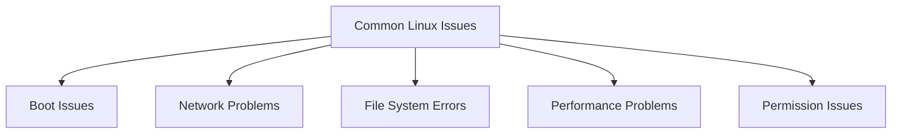
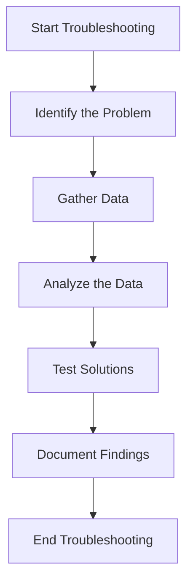
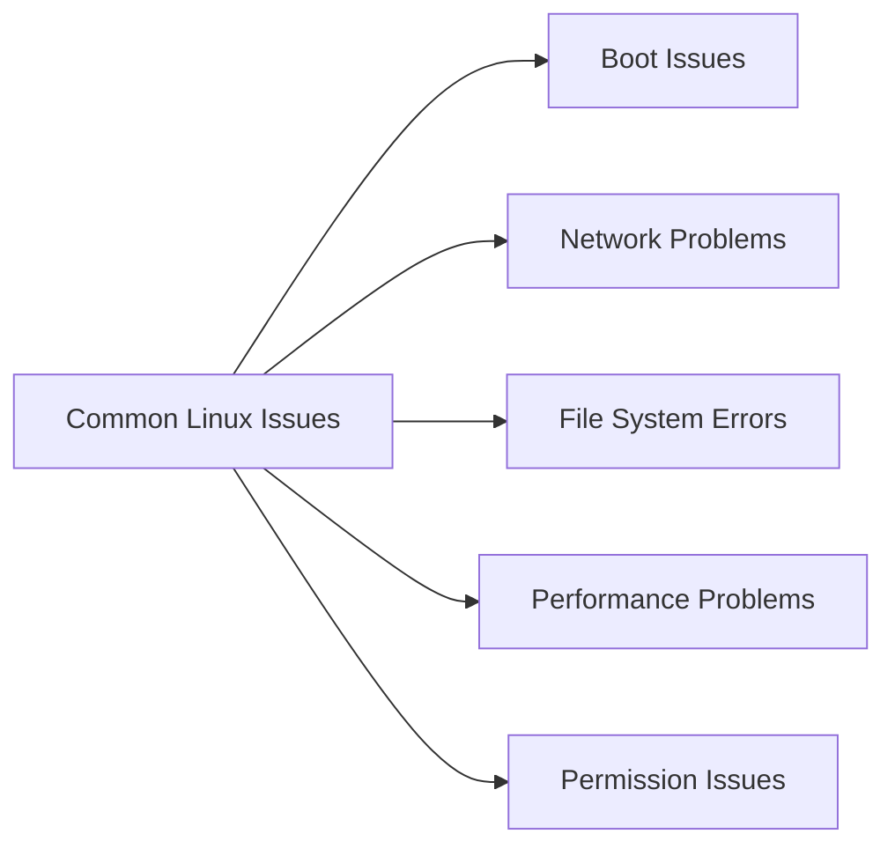

# **Comprehensive Linux Troubleshooting Tutorial** 🐧🔧

**Welcome!** 🎉  
This tutorial is designed to help you effectively troubleshoot four common Linux issues: **Network Problems**, **File System Errors**, **Performance Problems**, and **Permission Issues**. Whether you're a system administrator or a passionate Linux user, this guide will equip you with the knowledge and tools to diagnose and resolve problems efficiently.

---

### **📜 Table of Contents**

1. [Common Linux Issues Overview](#1-common-linux-issues-overview)
   - [Boot Issues](#11-boot-issues)
   - [Network Problems](#12-network-problems)
   - [File System Errors](#13-file-system-errors)
   - [Performance Problems](#14-performance-problems)
   - [Permission Issues](#15-permission-issues)
2. [Troubleshooting Techniques](#2-troubleshooting-techniques)
3. [Useful Commands for Troubleshooting](#3-useful-commands-for-troubleshooting)
4. [Summary Scripts](#4-summary-scripts)
5. [Visual Representation](#5-visual-representation)
6. [Conclusion](#6-conclusion)

---

### **1. Common Linux Issues Overview** 🛑

Understanding common issues is the first step toward effective troubleshooting. Below are four frequent problems you might encounter in Linux environments, along with their symptoms and potential causes.

#### **1.1 Boot Issues** 🚫🔄

**Symptoms:**

- The system fails to start.
- Error messages appear during boot.
- The system boots into recovery mode or a minimal shell.

**Potential Causes:**

- **Corrupted Bootloader:** Issues with GRUB or other bootloaders.
- **Missing Kernel:** The kernel image is missing or corrupted.
- **Hardware Changes:** New hardware that isn't properly recognized or configured.

**Troubleshooting Steps:**

1. **Check Bootloader Configuration:**

   ```bash
   sudo update-grub
   sudo grub-install /dev/sda
   ```

   _Replace `/dev/sda` with your boot device._

2. **Verify Kernel Images:**

   ```bash
   ls /boot/vmlinuz-*
   ```

   _Ensure that kernel images exist._

3. **Boot into a Previous Kernel:**

   - During boot, access the GRUB menu.
   - Select an older kernel version to boot.

4. **Repair Filesystem:**
   ```bash
   sudo fsck /dev/sda1
   ```
   _Replace `/dev/sda1` with your root partition._

**Summary Script:**

```bash
#!/bin/bash
# Boot Issues Troubleshooting Script

echo "Updating GRUB bootloader..." 🖥️
sudo update-grub
sudo grub-install /dev/sda  # Replace with your boot device

echo "Listing available kernel images..." 🗂️
ls /boot/vmlinuz-*

echo "Running filesystem check on root partition..." 🛠️
sudo fsck /dev/sda1  # Replace with your root partition
```

---

#### **1.2 Network Problems** 🌐🚫

**Symptoms:**

- Unable to connect to the internet or local network.
- Network interfaces are down.
- No response to ping requests.

**Potential Causes:**

- **Misconfigured Network Settings:** Incorrect IP addresses, subnet masks, or gateways.
- **Faulty Hardware:** Defective network cards or cables.
- **Driver Issues:** Missing or incompatible network drivers.

**Troubleshooting Steps:**

1. **Check Network Interface Status:**

   ```bash
   ip a
   ```

2. **Restart Network Services:**

   ```bash
   sudo systemctl restart NetworkManager
   ```

3. **Test Connectivity:**

   ```bash
   ping -c 4 google.com
   ping -c 4 8.8.8.8
   ```

4. **Check DNS Configuration:**

   ```bash
   cat /etc/resolv.conf
   ```

5. **Verify Network Drivers:**
   ```bash
   lspci -k | grep -A 3 -i network
   ```

**Summary Script:**

```bash
#!/bin/bash
# Network Problems Troubleshooting Script

echo "Displaying network interfaces..." 🌐
ip a

echo "Restarting NetworkManager service..." 🔄
sudo systemctl restart NetworkManager

echo "Testing internet connectivity..." 🌍
ping -c 4 google.com
ping -c 4 8.8.8.8

echo "Checking DNS settings..." 🔍
cat /etc/resolv.conf

echo "Listing network devices and drivers..." 🖥️
lspci -k | grep -A 3 -i network
```

---

#### **1.3 File System Errors** 🗂️❌

**Symptoms:**

- Files are not accessible.
- Read/write errors occur when accessing files or directories.
- System prompts indicate filesystem corruption.

**Potential Causes:**

- **Corruption:** Data corruption due to improper shutdowns or hardware failures.
- **Improper Unmounting:** Drives not being properly unmounted before removal.
- **Disk Failures:** Physical damage or wear and tear on storage devices.

**Troubleshooting Steps:**

1. **Identify Filesystem Type:**

   ```bash
   df -Th
   ```

2. **Check and Repair Filesystem:**

   ```bash
   sudo fsck /dev/sda1
   ```

   _Replace `/dev/sda1` with your affected partition._

3. **Remount Filesystem:**

   ```bash
   sudo mount -o remount /mount/point
   ```

   _Replace `/mount/point` with your actual mount point._

4. **Check Disk Health:**
   ```bash
   sudo smartctl -a /dev/sda
   ```
   _Requires the `smartmontools` package._

**Summary Script:**

```bash
#!/bin/bash
# File System Errors Troubleshooting Script

echo "Displaying filesystem types and mount points..." 🗂️
df -Th

echo "Running filesystem check on /dev/sda1..." 🛠️
sudo fsck /dev/sda1  # Replace with your affected partition

echo "Remounting the filesystem..." 🔄
sudo mount -o remount /mount/point  # Replace with your mount point

echo "Checking disk health..." 🖥️
sudo smartctl -a /dev/sda  # Requires smartmontools
```

---

#### **1.4 Performance Problems** ⚡🐢

**Symptoms:**

- Slow system response times.
- Applications crash or hang.
- High system load without apparent reason.

**Potential Causes:**

- **High CPU/Memory Usage:** Processes consuming excessive resources.
- **Insufficient Resources:** Lack of RAM or CPU power.
- **Hardware Limitations:** Aging or failing hardware components.

**Troubleshooting Steps:**

1. **Identify Resource-Heavy Processes:**

   ```bash
   # Top 10 CPU-consuming processes
   ps aux --sort=-%cpu | head -n 10 | awk '{print $1, $2, $11}'

   # Top 10 Memory-consuming processes
   ps aux --sort=-%mem | head -n 10 | awk '{print $1, $2, $11}'
   ```

2. **Monitor System Load:**

   ```bash
   top  # Real-time monitoring
   # or
   htop  # Enhanced interactive interface (install if not present)
   sudo apt install htop
   htop
   ```

3. **Check Disk I/O:**

   ```bash
   sudo iostat -xz 1 3
   ```

   _Requires the `sysstat` package._

4. **Review Running Services:**
   ```bash
   systemctl list-units --type=service --state=running
   ```

**Summary Script:**

```bash
#!/bin/bash
# Performance Problems Troubleshooting Script

echo "Listing top 10 CPU-consuming processes..." ⚡
ps aux --sort=-%cpu | head -n 10 | awk '{print $1, $2, $11}'

echo "Listing top 10 Memory-consuming processes..." 🧠
ps aux --sort=-%mem | head -n 10 | awk '{print $1, $2, $11}'

echo "Launching top for real-time monitoring..." 📊
top  # Press 'q' to exit

echo "Checking disk I/O..." 🖥️
sudo iostat -xz 1 3

echo "Listing running services..." 🛠️
systemctl list-units --type=service --state=running
```

---

#### **1.5 Permission Issues** 🔒📂

**Symptoms:**

- Users unable to access specific files or directories.
- Errors when attempting to execute commands or scripts.
- Unauthorized access attempts being denied.

**Potential Causes:**

- **Incorrect File Permissions:** Permissions not set correctly for users or groups.
- **Incorrect Ownership:** Files or directories owned by the wrong user or group.
- **SELinux/AppArmor Restrictions:** Security modules enforcing restrictive policies.

**Troubleshooting Steps:**

1. **Check File Permissions:**

   ```bash
   ls -l /path/to/file_or_directory
   ```

2. **Modify Permissions:**

   ```bash
   sudo chmod 755 /path/to/directory
   sudo chmod 644 /path/to/file
   ```

3. **Change Ownership:**

   ```bash
   sudo chown username:groupname /path/to/file_or_directory
   ```

4. **Check SELinux Status:**

   ```bash
   sestatus
   ```

   _For systems using AppArmor:_

   ```bash
   sudo aa-status
   ```

5. **Adjust SELinux/AppArmor Policies:**
   - **SELinux:**
     ```bash
     sudo setenforce 0  # Temporarily set SELinux to permissive mode
     ```
   - **AppArmor:**
     ```bash
     sudo aa-complain /path/to/profile
     ```

**Summary Script:**

```bash
#!/bin/bash
# Permission Issues Troubleshooting Script

echo "Displaying file permissions for /path/to/file_or_directory..." 🔒
ls -l /path/to/file_or_directory

echo "Modifying permissions..." 🛠️
sudo chmod 755 /path/to/directory
sudo chmod 644 /path/to/file

echo "Changing ownership to username:groupname..." 👥
sudo chown username:groupname /path/to/file_or_directory

echo "Checking SELinux status..." 🛡️
sestatus

echo "If using AppArmor, checking its status..." 🔍
sudo aa-status

echo "Temporarily setting SELinux to permissive mode..." ⚙️
sudo setenforce 0

echo "Setting AppArmor profile to complain mode..." 🔧
sudo aa-complain /path/to/profile
```

---

### **2. Troubleshooting Techniques** 🧩

Effective troubleshooting involves a systematic approach to identify and resolve issues. Here are some essential strategies:

- **Reproduce the Issue:** Attempt to replicate the problem consistently.
- **Isolate Variables:** Change one factor at a time to pinpoint the cause.
- **Check Documentation:** Utilize manuals (`man command`) and online resources for specific commands or software.
- **Use Safe Mode:** Boot into a minimal environment to diagnose problems without additional services interfering.
- **Research Online:** Search forums or communities (like Stack Overflow or LinuxQuestions) for similar issues faced by others.
- **Consult Logs:** Review system and application logs to gather detailed error information.

---

### **3. Useful Commands for Troubleshooting** 🖥️🔍

Here are several essential commands that can aid in troubleshooting various Linux issues:

- **Viewing System Logs:**

  ```bash
  # View system log (RHEL/CentOS)
  sudo tail -f /var/log/messages

  # View system log (Debian/Ubuntu)
  sudo tail -f /var/log/syslog

  # View authentication log (RHEL/CentOS)
  sudo tail -f /var/log/secure

  # View authentication log (Debian/Ubuntu)
  sudo tail -f /var/log/auth.log
  ```

- **Monitoring System Resources:**

  ```bash
  # Top processes by CPU usage
  ps aux --sort=-%cpu | head -n 10 | awk '{print $1, $2, $11}'

  # Top processes by Memory usage
  ps aux --sort=-%mem | head -n 10 | awk '{print $1, $2, $11}'
  ```

- **Network Diagnostics:**

  ```bash
  # Check network interfaces
  ip a

  # Test connectivity
  ping -c 4 google.com

  # Restart network service
  sudo systemctl restart NetworkManager
  ```

- **Disk and Filesystem Checks:**

  ```bash
  # Check disk usage
  df -h

  # Check filesystem integrity
  sudo fsck /dev/sda1
  ```

- **Managing Services:**

  ```bash
  # Check status of a service
  sudo systemctl status <service>

  # Restart a service
  sudo systemctl restart <service>

  # Enable a service to start on boot
  sudo systemctl enable <service>
  ```

- **Advanced Text Processing:**

  ```bash
  # Search for errors in logs
  grep "error" /var/log/syslog

  # Extract specific fields using awk
  ps aux --sort=-%cpu | head -n 10 | awk '{print $1, $2, $11}'
  ```

---

### **4. Summary Scripts** 🗒️

Here are summary scripts for each troubleshooting task covered in this tutorial. These scripts automate the collection of relevant information, making the troubleshooting process more efficient.

#### **4.1 Boot Issues Summary Script**

```bash
#!/bin/bash
# Boot Issues Troubleshooting Script

echo "🖥️ Updating GRUB bootloader..."
sudo update-grub
sudo grub-install /dev/sda  # Replace with your boot device

echo "🗂️ Listing available kernel images..."
ls /boot/vmlinuz-*

echo "🛠️ Running filesystem check on root partition..."
sudo fsck /dev/sda1  # Replace with your root partition
```

#### **4.2 Network Problems Summary Script**

```bash
#!/bin/bash
# Network Problems Troubleshooting Script

echo "🌐 Displaying network interfaces..."
ip a

echo "🔄 Restarting NetworkManager service..."
sudo systemctl restart NetworkManager

echo "🌍 Testing internet connectivity..."
ping -c 4 google.com
ping -c 4 8.8.8.8

echo "🔍 Checking DNS settings..."
cat /etc/resolv.conf

echo "🖥️ Listing network devices and drivers..."
lspci -k | grep -A 3 -i network
```

#### **4.3 File System Errors Summary Script**

```bash
#!/bin/bash
# File System Errors Troubleshooting Script

echo "🗂️ Displaying filesystem types and mount points..."
df -Th

echo "🛠️ Running filesystem check on /dev/sda1..."
sudo fsck /dev/sda1  # Replace with your affected partition

echo "🔄 Remounting the filesystem..."
sudo mount -o remount /mount/point  # Replace with your mount point

echo "🖥️ Checking disk health..."
sudo smartctl -a /dev/sda  # Requires smartmontools
```

#### **4.4 Performance Problems Summary Script**

```bash
#!/bin/bash
# Performance Problems Troubleshooting Script

echo "⚡ Listing top 10 CPU-consuming processes..."
ps aux --sort=-%cpu | head -n 10 | awk '{print $1, $2, $11}'

echo "🧠 Listing top 10 Memory-consuming processes..."
ps aux --sort=-%mem | head -n 10 | awk '{print $1, $2, $11}'

echo "📊 Launching top for real-time monitoring..."
top  # Press 'q' to exit

echo "🖥️ Checking disk I/O..."
sudo iostat -xz 1 3

echo "🛠️ Listing running services..."
systemctl list-units --type=service --state=running
```

#### **4.5 Permission Issues Summary Script**

```bash
#!/bin/bash
# Permission Issues Troubleshooting Script

echo "🔒 Displaying file permissions for /path/to/file_or_directory..."
ls -l /path/to/file_or_directory

echo "🛠️ Modifying permissions..."
sudo chmod 755 /path/to/directory
sudo chmod 644 /path/to/file

echo "👥 Changing ownership to username:groupname..."
sudo chown username:groupname /path/to/file_or_directory

echo "🛡️ Checking SELinux status..."
sestatus

echo "🔍 If using AppArmor, checking its status..."
sudo aa-status

echo "⚙️ Temporarily setting SELinux to permissive mode..."
sudo setenforce 0

echo "🔧 Setting AppArmor profile to complain mode..."
sudo aa-complain /path/to/profile
```

**Note:**

- Replace `/path/to/file_or_directory`, `username:groupname`, `/dev/sda1`, `/mount/point`, and `/dev/sda` with your actual file paths, user/group names, partition identifiers, and device names.
- Ensure you have the necessary permissions to execute these scripts. Running them with `sudo` may be required.
- Use these scripts cautiously, especially commands like `fsck` and `grub-install`, as improper use can cause system instability.

---

### **5. Visual Representation** 📊📈

Visual aids can help in understanding the troubleshooting process and the relationships between different components.

#### **5.1 Troubleshooting Process Flow**



#### **5.2 Troubleshooting Steps Flowchart**



#### **5.3 Common Linux Issues Breakdown**



---

### **6. Conclusion** 🎉

Troubleshooting in Linux is an essential skill that ensures system stability, security, and performance. By understanding common issues and utilizing effective techniques and tools, you can efficiently diagnose and resolve problems in your Linux environment. The provided scripts streamline the troubleshooting process, making it easier to collect and share critical information with support teams or developers.

**Key Takeaways:**

- **Systematic Approach:** Follow a structured troubleshooting process to identify and resolve issues.
- **Use the Right Tools:** Familiarize yourself with essential Linux commands and troubleshooting tools.
- **Leverage Automation:** Utilize scripts to automate repetitive tasks and ensure consistency.
- **Stay Informed:** Keep up with system updates and best practices to prevent issues.
- **Documentation:** Maintain records of issues and resolutions for future reference.

---
