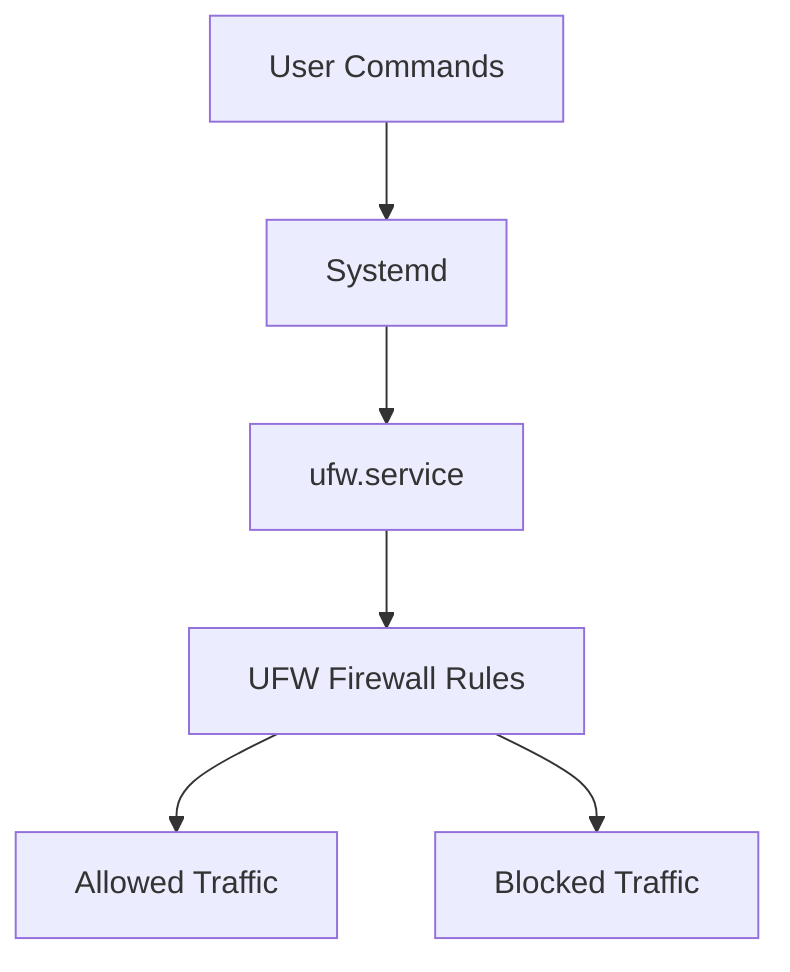
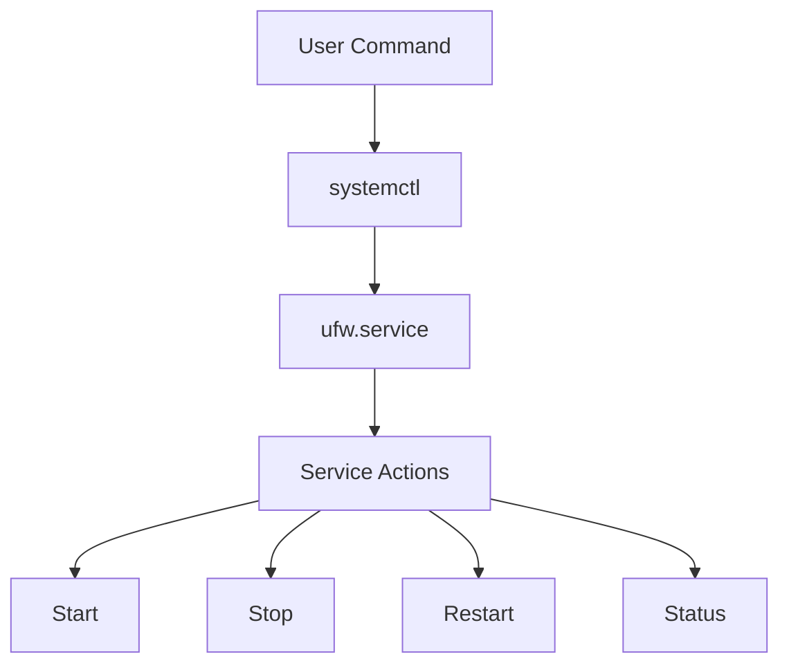
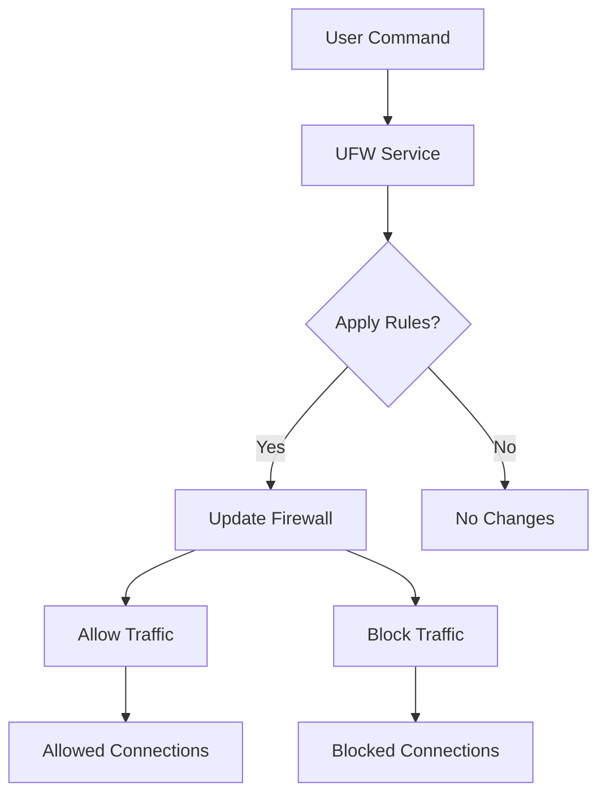

# **Comprehensive UFW (Uncomplicated Firewall) Tutorial for Linux**

## **Table of Contents**

1. [What is UFW?](#what-is-ufw)
2. [Understanding `ufw.service`](#understanding-ufwservice)
3. [Basic UFW Commands](#basic-ufw-commands)
4. [Managing `ufw.service` with `systemd`](#managing-ufwservice-with-systemd)
5. [Visualizing UFW with Mermaid Diagrams](#visualizing-ufw-with-mermaid-diagrams)
6. [Examples and Use Cases](#examples-and-use-cases)
7. [Advanced Configuration](#advanced-configuration)
8. [Additional Resources](#additional-resources)

---

## **1. What is UFW?** 🌐

**UFW (Uncomplicated Firewall)** is a simple interface for managing firewall rules in Linux. It makes configuring firewall settings easier compared to the more complex `iptables`.

### **Key Features:**

- **Simplicity**: User-friendly commands for managing firewall rules.
- **Default Configuration**: Blocks all incoming connections by default and allows outgoing ones.
- **Integration**: Seamlessly integrates with `systemd` for service management.

### **How UFW Works**

UFW simplifies firewall configuration by abstracting the complexities of `iptables` into a more intuitive command set.

---

## **2. Understanding `ufw.service`** 🔧

**`ufw.service`** is the `systemd` service file that controls UFW. It allows you to start, stop, and manage the UFW service.

### **Purpose:**

- **Service Management**: Handles starting, stopping, and restarting UFW.
- **Configuration Application**: Applies firewall rules defined by UFW commands.

### **Mermaid Diagram:**



---

## **3. Basic UFW Commands** 📜

Here are some essential UFW commands:

| Command                              | Description                                 |
| ------------------------------------ | ------------------------------------------- |
| `sudo ufw enable`                    | Enables the UFW firewall and applies rules. |
| `sudo ufw disable`                   | Disables UFW and removes all rules.         |
| `sudo ufw status`                    | Shows the current status of UFW.            |
| `sudo ufw allow <service>`           | Allows traffic for a specified service.     |
| `sudo ufw deny <service>`            | Blocks traffic for a specified service.     |
| `sudo ufw delete <rule>`             | Deletes a specific firewall rule.           |
| `sudo systemctl start ufw.service`   | Starts the UFW service.                     |
| `sudo systemctl stop ufw.service`    | Stops the UFW service.                      |
| `sudo systemctl restart ufw.service` | Restarts the UFW service.                   |
| `sudo systemctl status ufw.service`  | Checks the status of the UFW service.       |

### **Example Commands:**

- **Allow SSH Traffic**: `sudo ufw allow ssh` 🚀
- **Block HTTP Traffic**: `sudo ufw deny http` 🚫
- **Check Status**: `sudo ufw status verbose` 🔍

---

## **4. Managing `ufw.service` with `systemd`** 🛠️

**`systemd`** is used to manage the UFW service. You can control the UFW service with the following commands:

### **Service Management Commands**

- **Start UFW**:

  ```bash
  sudo systemctl start ufw.service
  ```

- **Stop UFW**:

  ```bash
  sudo systemctl stop ufw.service
  ```

- **Restart UFW**:

  ```bash
  sudo systemctl restart ufw.service
  ```

- **Check Status**:
  ```bash
  sudo systemctl status ufw.service
  ```

### **Mermaid Diagram:**



---

## **5. Visualizing UFW with Mermaid Diagrams** 📊

### **UFW Workflow:**



---

## **6. Examples and Use Cases** 🔍

### **Example 1: Allowing SSH Access**

To allow SSH access through the firewall:

```bash
sudo ufw allow ssh
```

### **Example 2: Blocking a Specific IP**

To block traffic from a specific IP address:

```bash
sudo ufw deny from 192.168.1.100
```

### **Example 3: Allowing a Port**

To allow traffic on a specific port (e.g., port 8080):

```bash
sudo ufw allow 8080
```

---

## **7. Advanced Configuration** 🔒

### **1. Allowing Traffic from Specific IP**

To allow traffic from a specific IP address on a certain port:

```bash
sudo ufw allow from 192.168.1.100 to any port 22
```

### **2. Limiting Connections**

To limit connections to SSH to prevent brute force attacks:

```bash
sudo ufw limit ssh
```

### **3. Using UFW with Custom Rules**

Add custom rules directly by editing `/etc/ufw/before.rules` and `/etc/ufw/after.rules`.

---

## **8. Additional Resources** 📚

- **UFW Official Documentation**: [UFW Documentation](https://help.ubuntu.com/community/UFW)

---
