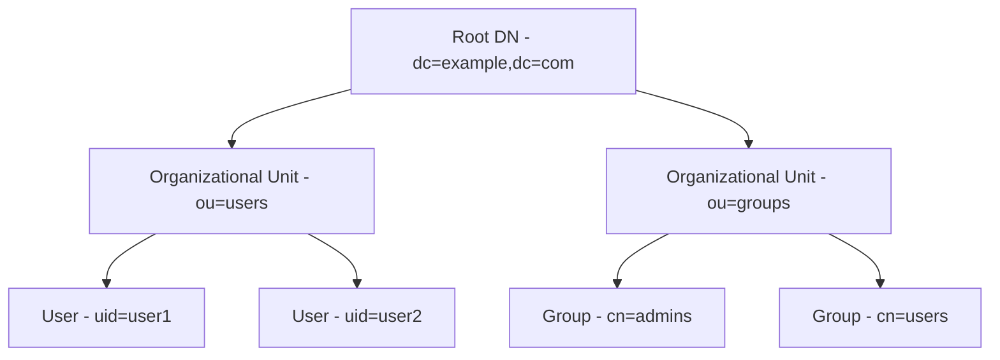
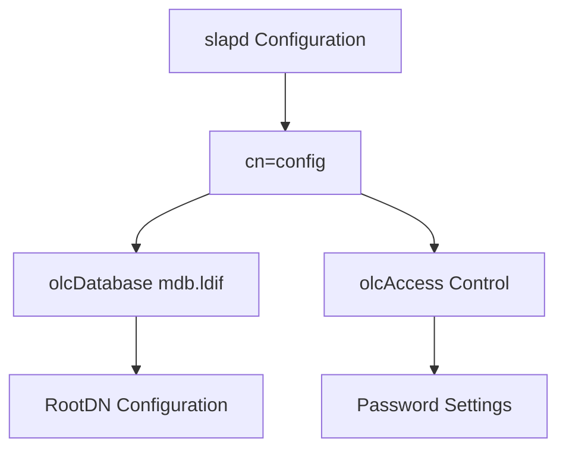

# 🛠️ 165. OpenLDAP Installation & Configuration Guide 🌐

> **Table of Contents**:

- 🔍 [What is OpenLDAP?](#what-is-openldap)
- 🛠️ [How to Install and Configure OpenLDAP](#how-to-install-and-configure-openldap)
- 🗂️ [OpenLDAP Service: Slapd](#openldap-service-slapd)
- 🚀 [Start, Stop, and Enable OpenLDAP Service](#start-stop-and-enable-openldap-service)
- ⚙️ [Configuration Files](#configuration-files)
  - 🔑 [Important Configurations](#important-configurations)
  - 📝 [Common Use Cases](#common-use-cases)
- 📜 [Script for Common Usage and Configuration](#script-for-common-usage-and-configuration)
- 📊 [Visual Representation](#visual-representation)

---

## 🔍 What is OpenLDAP?

**OpenLDAP** is an open-source implementation of the Lightweight Directory Access Protocol (LDAP). It provides a robust directory service that can manage and organize information across networks, particularly for centralized user authentication, group management, and more.

---

## 🛠️ How to Install and Configure OpenLDAP

1. **Install OpenLDAP**:
   Install the OpenLDAP server and client utilities:
   ```bash
   sudo apt update
   sudo apt install slapd ldap-utils
   ```
2. **Configure OpenLDAP**:
   During installation, configure the directory administrator password. You can reconfigure it later:

   ```bash
   sudo dpkg-reconfigure slapd
   ```

3. **Check Service Status**:
   Verify the service is running:
   ```bash
   sudo systemctl status slapd
   ```

---

## 🗂️ OpenLDAP Service: Slapd

The **slapd** service is the core daemon for OpenLDAP, responsible for handling LDAP requests.

### 🔄 Managing Slapd:

- Start, stop, restart, and enable the slapd service using `systemctl` (details in the next section).

---

## 🚀 Start, Stop, and Enable OpenLDAP Service

To manage the OpenLDAP service:

- **Start the service**:

  ```bash
  sudo systemctl start slapd
  ```

- **Enable the service** (start automatically on boot):

  ```bash
  sudo systemctl enable slapd
  ```

- **Stop the service**:

  ```bash
  sudo systemctl stop slapd
  ```

- **Restart the service**:
  ```bash
  sudo systemctl restart slapd
  ```

---

## ⚙️ Configuration Files

The main configuration files for OpenLDAP are located in `/etc/openldap/slapd.d/`. OpenLDAP uses a dynamic configuration model that allows changes without stopping the service.

### 🔑 Important Configurations

1. **`/etc/openldap/slapd.d/cn=config`**:

   - **Purpose**: This directory contains the dynamic configuration settings for slapd. These configurations control everything from database management to user access.
   - **Key files**:
     - **`olcDatabase={1}mdb.ldif`**: This file contains settings for the **main database** (MDB) used by OpenLDAP.
     - **`olcRootDN`**: The distinguished name (DN) for the root user, typically `cn=admin,dc=example,dc=com`.

2. **`/etc/openldap/ldap.conf`**:

   - **Purpose**: Client configuration file that sets default options for LDAP utilities like `ldapsearch` and `ldapadd`.
   - **Common options**:
     - `BASE dc=example,dc=com`: Specifies the base DN for client queries.
     - `URI ldap://localhost`: The URI of the LDAP server.

3. **Schemas (`/etc/openldap/schema/`)**:
   - **Purpose**: Defines object classes and attributes for the directory. For example, the **inetOrgPerson** schema is commonly used for user management.
   - **Usage**: Schemas are loaded dynamically and allow you to extend LDAP’s capabilities with custom attributes.

### 📝 Common Use Cases

1. **Adding a New Schema**:
   To add a schema (e.g., the `cosine` schema):

   ```bash
   ldapadd -Y EXTERNAL -H ldapi:/// -f /etc/openldap/schema/cosine.ldif
   ```

2. **Changing the RootDN Password**:
   To change the administrator's password, generate an encrypted password and apply it to the configuration:

   ```bash
   slappasswd
   ```

   Then update the password:

   ```bash
   ldapmodify -Y EXTERNAL -H ldapi:/// <<EOF
   dn: olcDatabase={1}mdb,cn=config
   replace: olcRootPW
   olcRootPW: {SSHA}generated_password
   EOF
   ```

3. **Configuring Access Controls**:
   Set access controls to restrict who can read or write data. For example, restrict write access to the root user:
   ```bash
   dn: olcDatabase={1}mdb,cn=config
   changetype: modify
   replace: olcAccess
   olcAccess: to attrs=userPassword by self write by anonymous auth by dn.base="cn=admin,dc=example,dc=com" write by * none
   ```

---

## 📜 Script for Common Usage and Configuration

Here’s a script to manage OpenLDAP with common tasks like adding users, starting/stopping services, and more.

```bash
#!/bin/bash

# Function to add a user to OpenLDAP
add_user() {
  ldapadd -x -D "cn=admin,dc=example,dc=com" -W <<EOF
dn: uid=$1,ou=users,dc=example,dc=com
objectClass: inetOrgPerson
sn: $1
cn: $1
uid: $1
userPassword: $2
EOF
}

# Start OpenLDAP service
start_service() {
  sudo systemctl start slapd
  echo "OpenLDAP service started."
}

# Stop OpenLDAP service
stop_service() {
  sudo systemctl stop slapd
  echo "OpenLDAP service stopped."
}

# Restart OpenLDAP service
restart_service() {
  sudo systemctl restart slapd
  echo "OpenLDAP service restarted."
}

# Main Menu
echo "OpenLDAP Management Script"
echo "1. Add User"
echo "2. Start Service"
echo "3. Stop Service"
echo "4. Restart Service"
read -p "Choose an option: " option

case $option in
  1)
    read -p "Enter username: " username
    read -p "Enter password: " password
    add_user $username $password
    ;;
  2)
    start_service
    ;;
  3)
    stop_service
    ;;
  4)
    restart_service
    ;;
  *)
    echo "Invalid option."
    ;;
esac
```

---

## 📊 Visual Representation

### 🌳 LDAP Directory Structure



### ⚙️ Slapd Configuration Flow



---
