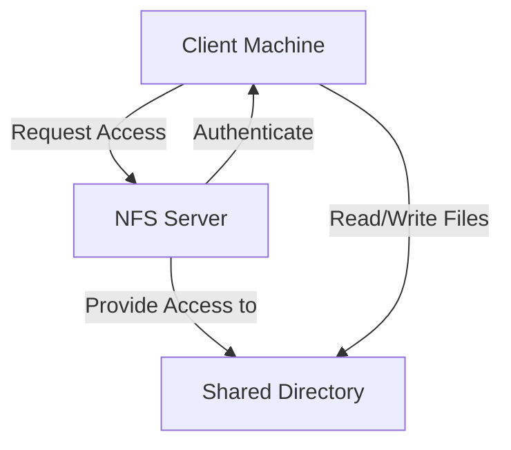

### **Comprehensive NFS Setup Guide** 📚🖥️

**Welcome!** 🎉  
In this guide, we will cover everything you need to know about **Network File System (NFS)** configuration—from setting up the server to configuring the client, troubleshooting, and more! By the end, you'll have a fully functional NFS system and be equipped to handle common issues along the way. 🌐💾

---

### **📜 Table of Contents**

1. [Introduction to Network File System (NFS)](#1-introduction-to-network-file-system-nfs)
2. [When is NFS Needed?](#2-when-is-nfs-needed)
3. [How NFS Works (With Mermaid Graph)](#3-how-nfs-works-with-mermaid-graph)
4. [NFS Server Configuration](#4-nfs-server-configuration)
   1. [Installing NFS Packages](#installing-nfs-packages)
   2. [Starting the NFS Services](#starting-the-nfs-services)
   3. [Creating NFS Directory & Setting Permissions](#creating-nfs-directory--setting-permissions)
   4. [Editing the `/etc/exports` File](#editing-the-etcexports-file)
   5. [Exporting NFS Filesystems](#exporting-nfs-filesystems)
   6. [Adjusting Firewall Settings](#adjusting-firewall-settings)
5. [NFS Client Configuration](#5-nfs-client-configuration)
   1. [Installing NFS Packages on the Client](#installing-nfs-packages-on-the-client)
   2. [Starting the Client Services](#starting-the-client-services)
   3. [Firewall Configuration](#firewall-configuration)
   4. [Mounting NFS Shares](#mounting-nfs-shares)
6. [Verifying NFS Setup](#6-verifying-nfs-setup)
7. [Unmounting NFS Filesystems](#7-unmounting-nfs-filesystems)
8. [Troubleshooting Common NFS Issues](#8-troubleshooting-common-nfs-issues)
9. [Complete Bash Scripts for NFS Setup](#9-complete-bash-scripts-for-nfs-setup)

---

### **1. Introduction to Network File System (NFS)** 🌐💡

**Network File System (NFS)** is a client-server file system protocol that allows users to access files on remote systems as if they were on their local machine. It is ideal for sharing directories across multiple systems in a network, especially for projects requiring real-time collaboration.

### **2. When is NFS Needed?** 🤔🔧

NFS is particularly useful in scenarios like:

- **Development Environments:** Multiple developers working on a shared codebase.
- **Centralized Data Storage:** Allowing clients to access and manipulate files in one centralized location.
- **Backup Solutions:** Efficient backups by accessing remote filesystems.

### **3. How NFS Works (With Mermaid Graph)** 🖥️🔗

Here's a visual representation of how NFS operates:



### **4. NFS Server Configuration** 🛠️💻

Setting up the NFS server is the first step to creating your networked file system.

#### **Installing NFS Packages** 📦

First, you need to install the NFS server package:

```bash
sudo apt update
sudo apt install nfs-kernel-server
```

#### **Starting the NFS Services** 🚀

Enable and start the NFS server:

```bash
sudo systemctl enable nfs-server
sudo systemctl start nfs-server
```

#### **Creating NFS Directory & Setting Permissions** 📂🔐

Create the directory that will be shared across the network and set the appropriate permissions:

```bash
sudo mkdir -p /srv/nfs/shared
sudo chown nobody:nogroup /srv/nfs/shared
sudo chmod 755 /srv/nfs/shared
```

#### **Editing the `/etc/exports` File** ✏️

Open the `/etc/exports` file and specify the shared directory and the network that will have access:

```bash
sudo nano /etc/exports
```

Add the following line:

```
/srv/nfs/shared 192.168.1.0/24(rw,sync,no_subtree_check)
```

#### **Exporting NFS Filesystems** 📜

Export the filesystem so that the NFS server shares the directories:

```bash
sudo exportfs -a
```

#### **Adjusting Firewall Settings** 🛡️

Make sure your firewall is configured to allow NFS traffic:

```bash
sudo ufw allow from 192.168.1.0/24 to any port nfs
sudo ufw reload
```

---

### **5. NFS Client Configuration** 🔗🖥️

Once the server is up and running, the next step is to configure the clients that will access the NFS shares.

#### **Installing NFS Packages on the Client** 📦

Install the required NFS packages:

```bash
sudo apt update
sudo apt install nfs-common
```

#### **Starting the Client Services** 🚀

Enable and start the NFS client services:

```bash
sudo systemctl enable nfs-client.target
sudo systemctl start nfs-client.target
```

#### **Firewall Configuration** 🛡️

Allow NFS traffic through the client’s firewall:

```bash
sudo ufw allow from 192.168.1.0/24 to any port nfs
sudo ufw reload
```

#### **Mounting NFS Shares** 📂

Create a mount point and mount the NFS share from the server:

```bash
sudo mkdir -p /mnt/nfs/shared
sudo mount 192.168.1.100:/srv/nfs/shared /mnt/nfs/shared
```

Replace `192.168.1.100` with the IP address of your NFS server.

---

### **6. Verifying NFS Setup** ✅🔍

To check if the NFS filesystem is mounted properly, run:

```bash
df -h | grep nfs
```

Alternatively, you can use:

```bash
mount | grep nfs
```

---

### **7. Unmounting NFS Filesystems** ❌📂

If you need to unmount the NFS share:

```bash
sudo umount /mnt/nfs/shared
```

---

### **8. Troubleshooting Common NFS Issues** 🛠️🔍

Here are some common issues you might encounter with NFS, along with possible solutions:

1. **Permission Denied** 🔐:

   - Verify the permissions and ownership of the shared directory.
   - Check the configuration in `/etc/exports`.

2. **Mount Timeout** 🕒:

   - Ensure the NFS server is running.
   - Verify network connectivity between the server and client.

3. **Stale File Handles** 🗂️:

   - Unmount and remount the NFS filesystem.
   - Restart the NFS services.

4. **Checking Logs** 📄:

   - Review log files for errors:
     ```bash
     sudo tail -f /var/log/syslog
     ```

5. **Firewall Issues** 🛡️:

   - Ensure the firewall allows NFS traffic on both server and client.

6. **Verifying Exports** 📝:

   - List exported NFS shares:
     ```bash
     sudo exportfs -v
     ```

7. **Network Connectivity** 🌐:
   - Ping the NFS server from the client to ensure they can communicate:
     ```bash
     ping 192.168.1.100
     ```

---

### **9. Complete Bash Scripts for NFS Setup** 📝📜

Here are complete scripts for setting up an NFS server and client.

#### **Server Script** 🖥️

```bash
#!/bin/bash
# NFS Server Setup Script

# Update and install NFS server
sudo apt update
sudo apt install nfs-kernel-server -y

# Enable and start NFS service
sudo systemctl enable nfs-server
sudo systemctl start nfs-server

# Create shared directory and set permissions
sudo mkdir -p /srv/nfs/shared
sudo chown nobody:nogroup /srv/nfs/shared
sudo chmod 755 /srv/nfs/shared

# Configure exports
echo "/srv/nfs/shared 192.168.1.0/24(rw,sync,no_subtree_check)" | sudo tee -a /etc/exports

# Export filesystem
sudo exportfs -a

# Adjust firewall
sudo ufw allow from 192.168.1.0/24 to any port nfs
sudo ufw reload
```

#### **Client Script** 🖥️

```bash
#!/bin/bash
# NFS Client Setup Script

# Update and install NFS client
sudo apt update
sudo apt install nfs-common -y

# Enable and start NFS client services
sudo systemctl enable nfs-client.target
sudo systemctl start nfs-client.target

# Adjust firewall
sudo ufw allow from 192.168.1.0/24 to any port nfs
sudo ufw reload

# Create mount point and mount NFS share
sudo mkdir -p /mnt/nfs/shared
sudo mount 192.

168.1.100:/srv/nfs/shared /mnt/nfs/shared
```

---
