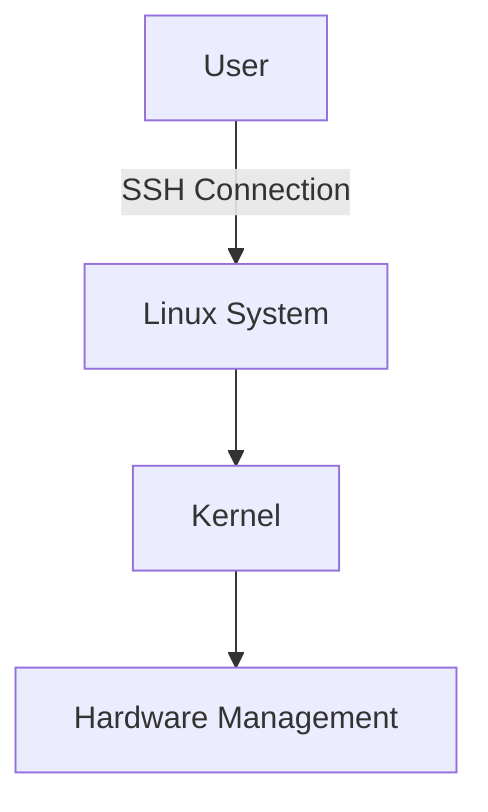
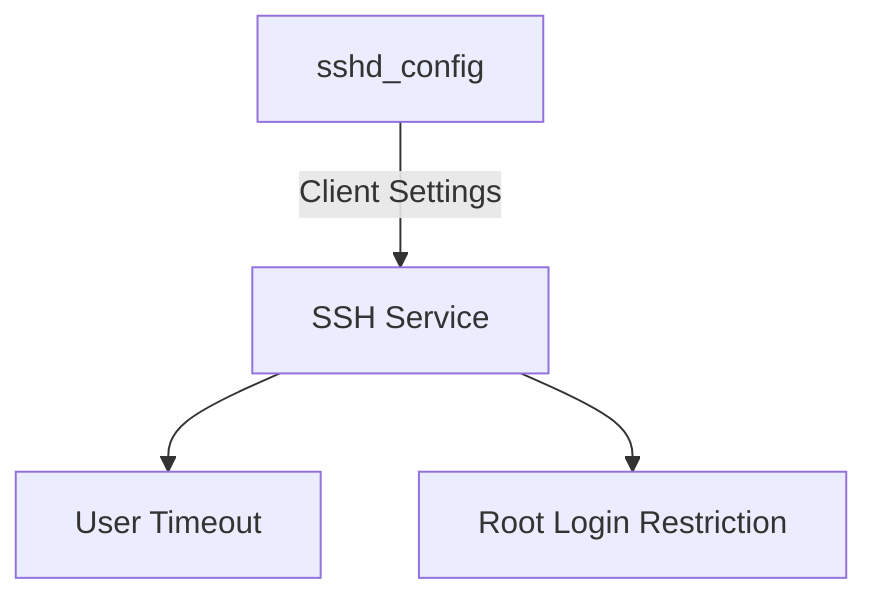
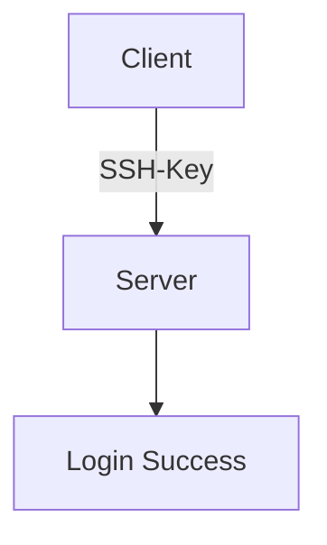
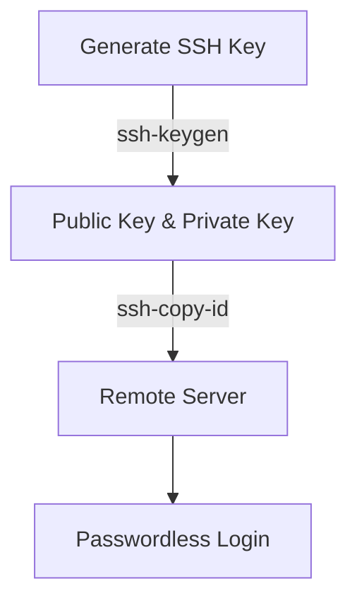

# 🎛️ **168. Configure and Secure SSH**

## 📑 **Table of Contents**
1. 🔑 [What is SSH?](#what-is-ssh)
2. 🛠️ [How to Install SSH?](#how-to-install-ssh)
3. 🔧 [How to Configure SSH?](#how-to-configure-ssh)
   - Timeout and Idle Session Control
   - Disable Root Login
   - Disable Empty Passwords
   - Limit User's SSH Access
   - Change SSH Port
4. 🔒 [SSH-Keys - Access Remote Server without Password](#ssh-keys-access-remote-server-without-password)
   - Generate and Configure SSH-Keys
   - Passwordless Login Setup
5. 📝 [Summary of Lessons (Scripts)](#summary-of-lessons-scripts)
   - Script 1: Change SSH Port Every Hour
   - Script 2: Synchronize SSH Port (Client-side)

---

## 🔑 **What is SSH?**
SSH stands for **Secure Shell**. It provides a secure way to access and manage Linux systems remotely by sending encrypted commands from a client to the server. It acts as a bridge, allowing you to communicate with your system and instruct the kernel to manage hardware.



## 🛠️ **How to Install SSH?**
To install SSH, follow these steps depending on your Linux distribution:

- **Debian/Ubuntu**:
  ```bash
  sudo apt update
  sudo apt install openssh-server
  ```
- **CentOS/RHEL**:
  ```bash
  sudo yum install openssh-server
  ```

Once installed, start the SSH service:
```bash
sudo systemctl start sshd
```

---

## 🔧 **How to Configure SSH?**

### **Edit SSH Configuration File**
The main configuration file for SSH is located at `/etc/ssh/sshd_config`. Here's how to configure some key settings:

1. Become the root user:
   ```bash
   sudo su
   ```

2. Open the SSH config file:
   ```bash
   nano /etc/ssh/sshd_config
   ```

3. **ClientAliveInterval**: Set the idle timeout interval (in seconds):
   ```bash
   ClientAliveInterval 600
   ```

4. **ClientAliveCountMax**: The maximum number of messages sent before terminating the session:
   ```bash
   ClientAliveCountMax 0
   ```

5. Restart the SSH service:
   ```bash
   sudo systemctl restart sshd
   ```



---

### 🔒 **Securing SSH**

1. **Disable Root Login**:
   Disable root access to reduce the risk of brute-force attacks:
   ```bash
   PermitRootLogin no
   ```

2. **Disable Empty Passwords**:
   Prevent users with empty passwords from logging in:
   ```bash
   PermitEmptyPasswords no
   ```

3. **Limit SSH Access to Specific Users**:
   Specify which users can access the system via SSH:
   ```bash
   AllowUsers user1 user2
   ```

4. **Use a Different Port**:
   Change the default SSH port (22) to something less common to avoid automated attacks:
   ```bash
   Port 2022
   ```

---

# 🎛️ **169. SSH-Keys - Access Remote Server without Password**

## 🔐 **What are SSH-Keys?**
SSH keys provide a secure, password-less way to access remote servers. They use public-key cryptography for authentication, enabling automated scripts and frequent logins without needing a password.



### **Why Use SSH-Keys?**
- 🕒 **Repetitive Logins**: Frequent logins without needing to type your password.
- 🤖 **Automation**: Useful in scripts where manual password input isn't ideal.

---

### 🛠️ **How to Generate SSH-Keys?**
1. Generate an SSH key pair:
   ```bash
   ssh-keygen -t rsa -b 4096
   ```
   You will be prompted to save the keys and optionally provide a passphrase.

2. Copy the public key to the remote server:
   ```bash
   ssh-copy-id user@server
   ```

3. Log in without a password:
   ```bash
   ssh user@server
   ```



---

## 📝 **Summary of Lessons (Scripts)**

### Script 1: Change SSH Port Every Hour
```bash
#!/bin/bash
# Random SSH port based on time (Example: every hour)

SEED=$(date +%Y%m%d%H)  # Use current date and hour as seed
MIN_PORT=1025
MAX_PORT=65535

PORT=$(( SEED % (MAX_PORT - MIN_PORT + 1) + MIN_PORT ))

# Update the SSH configuration
sudo sed -i "s/^Port.*/Port $PORT/" /etc/ssh/sshd_config
sudo systemctl reload sshd

echo "SSH port changed to: $PORT"
```

### Script 2: Synchronize SSH Port (Client-side)
```bash
#!/bin/bash
# Predict SSH port based on time

SEED=$(date +%Y%m%d%H)
MIN_PORT=1025
MAX_PORT=65535

PORT=$(( SEED % (MAX_PORT - MIN_PORT + 1) + MIN_PORT ))

echo "Current SSH port is: $PORT"
ssh -p $PORT user@server
```

---

