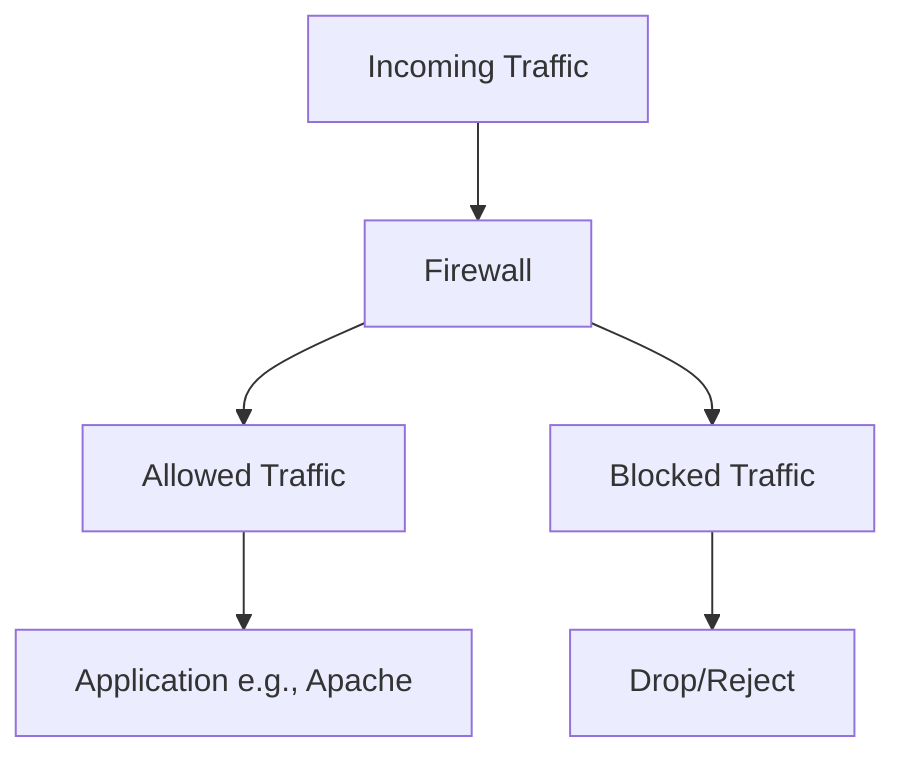

# 🔥 Linux Firewall Configuration Tutorial 🔥

> **Table of Contents:**

- [1. What is a Firewall?](#1-what-is-a-firewall)
- [2. Types of Firewalls](#2-types-of-firewalls)
- [3. Firewall Tools in Linux](#3-firewall-tools-in-linux)
  - [3.1 iptables](#31-iptables)
  - [3.2 firewalld](#32-firewalld)
  - [3.3 nftables](#33-nftables)
- [4. Practical Firewall Configuration](#4-practical-firewall-configuration)
  - [4.1 Allow Apache/NGINX Through the Firewall](#41-allow-apachenginx-through-the-firewall)
  - [4.2 Basic Commands](#42-basic-commands)
- [5. Adding Rules for Software to Bypass the Firewall](#5-adding-rules-for-software-to-bypass-the-firewall)
- [6. Summary of Firewall Commands (Table)](#6-summary-of-firewall-commands)

---

## 1. What is a Firewall? 🛡️

A **firewall** is a network security system that monitors and controls incoming and outgoing network traffic based on predetermined security rules. In Linux, the kernel includes firewall functionality, which is configured using different tools like **iptables**, **firewalld**, and **nftables**.

- **Purpose**: The primary goal is to filter traffic, allowing only authorized packets to pass and blocking unauthorized access.

---

## 2. Types of Firewalls 🔥

There are various types of firewalls:

| Firewall Type           | Description                                                                                        |
| ----------------------- | -------------------------------------------------------------------------------------------------- |
| **Packet Filtering**    | Controls network access by monitoring outgoing and incoming packets based on IP, port, etc.        |
| **Stateful Inspection** | Tracks the state of active connections and uses this information to decide which packets to allow. |
| **Application Layer**   | Inspects the payload of the packet to enforce application-specific rules.                          |

---

## 3. Firewall Tools in Linux ⚙️

Linux offers different firewall management tools, each with its unique features. Below are the most commonly used tools:

### 3.1 **iptables** 🛠️

`iptables` is one of the most well-known command-line utilities used to configure packet filtering rules.

- **Advantages**: Provides fine-grained control over network traffic.
- **Common Use**: Allows you to create custom rules for controlling the traffic based on IP, port, and protocol.

### 3.2 **firewalld** 🚀

`firewalld` is a more user-friendly and dynamic firewall manager with support for zones (network areas).

- **Advantages**: Easier to use, designed for modern Linux systems.
- **Common Use**: It's popular on systems like **CentOS**, **RHEL**, and **Fedora**.

### 3.3 **nftables** 🌐

`nftables` is the modern replacement for `iptables` offering a more powerful and flexible interface.

- **Advantages**: Provides better performance and flexibility.
- **Common Use**: Suitable for managing larger and more complex firewall rulesets.

---

## 4. Practical Firewall Configuration 🚀

Let’s dive into the practical steps for configuring a firewall on Linux, using examples for **iptables**, **firewalld**, and **nftables**.

### 4.1 Allow Apache/NGINX Through the Firewall 🍃

Both **Apache** and **NGINX** web servers need to be allowed through the firewall to serve content on HTTP (port 80) or HTTPS (port 443).

#### **Using `iptables`**:

```bash
# Allow Apache or NGINX on HTTP
sudo iptables -A INPUT -p tcp --dport 80 -j ACCEPT

# Allow HTTPS traffic
sudo iptables -A INPUT -p tcp --dport 443 -j ACCEPT

# Save the rules
sudo iptables-save > /etc/iptables/rules.v4
```

#### **Using `firewalld`**:

```bash
# Allow HTTP through firewalld
sudo firewall-cmd --permanent --add-service=http

# Allow HTTPS through firewalld
sudo firewall-cmd --permanent --add-service=https

# Reload firewall settings
sudo firewall-cmd --reload
```

#### **Using `nftables`**:

```bash
# Allow HTTP and HTTPS traffic
sudo nft add rule inet filter input tcp dport 80 accept
sudo nft add rule inet filter input tcp dport 443 accept

# Save the configuration
sudo nft list ruleset > /etc/nftables.conf
```

### 4.2 Basic Commands

Here are some common firewall commands for each tool:

| Task                   | `iptables` Command                                    | `firewalld` Command                                | `nftables` Command                                         |
| ---------------------- | ----------------------------------------------------- | -------------------------------------------------- | ---------------------------------------------------------- |
| **Allow port 80**      | `sudo iptables -A INPUT -p tcp --dport 80 -j ACCEPT`  | `sudo firewall-cmd --add-port=80/tcp --permanent`  | `sudo nft add rule inet filter input tcp dport 80 accept`  |
| **Allow port 443**     | `sudo iptables -A INPUT -p tcp --dport 443 -j ACCEPT` | `sudo firewall-cmd --add-port=443/tcp --permanent` | `sudo nft add rule inet filter input tcp dport 443 accept` |
| **View rules**         | `sudo iptables -L`                                    | `sudo firewall-cmd --list-all`                     | `sudo nft list ruleset`                                    |
| **Save configuration** | `sudo iptables-save > /etc/iptables/rules.v4`         | `sudo firewall-cmd --reload`                       | `sudo nft list ruleset > /etc/nftables.conf`               |

---

## 5. Adding Rules for Software to Bypass the Firewall 🛠️

If you need to let certain applications, such as **Apache** or **NGINX**, bypass the firewall or function without being blocked, follow these steps:

### Example: Allow NGINX to bypass firewall filters

- **Using `iptables`**:

  ```bash
  sudo iptables -A INPUT -p tcp --dport 80 -j ACCEPT
  sudo iptables -A INPUT -p tcp --dport 443 -j ACCEPT
  ```

- **Using `firewalld`**:

  ```bash
  sudo firewall-cmd --add-service=http --permanent
  sudo firewall-cmd --add-service=https --permanent
  sudo firewall-cmd --reload
  ```

- **Using `nftables`**:

  ```bash
  sudo nft add rule inet filter input tcp dport 80 accept
  sudo nft add rule inet filter input tcp dport 443 accept
  sudo nft list ruleset > /etc/nftables.conf
  ```

By doing this, software like **Apache** or **NGINX** will be able to serve traffic without being blocked by the firewall.

---

## 6. Summary of Firewall Commands (Table) 📊

Here’s a handy table summarizing the key firewall commands across different tools:

| Task                            | `iptables` Command                                    | `firewalld` Command                                 | `nftables` Command                                         |
| ------------------------------- | ----------------------------------------------------- | --------------------------------------------------- | ---------------------------------------------------------- |
| **Allow HTTP**                  | `sudo iptables -A INPUT -p tcp --dport 80 -j ACCEPT`  | `sudo firewall-cmd --add-service=http --permanent`  | `sudo nft add rule inet filter input tcp dport 80 accept`  |
| **Allow HTTPS**                 | `sudo iptables -A INPUT -p tcp --dport 443 -j ACCEPT` | `sudo firewall-cmd --add-service=https --permanent` | `sudo nft add rule inet filter input tcp dport 443 accept` |
| **View active rules**           | `sudo iptables -L`                                    | `sudo firewall-cmd --list-all`                      | `sudo nft list ruleset`                                    |
| **Save firewall configuration** | `sudo iptables-save > /etc/iptables/rules.v4`         | `sudo firewall-cmd --reload`                        | `sudo nft list ruleset > /etc/nftables.conf`               |

---

### 🧠 **Visual Summary of Firewalls:**

Here’s a flowchart to understand how traffic flows through a firewall:



---
