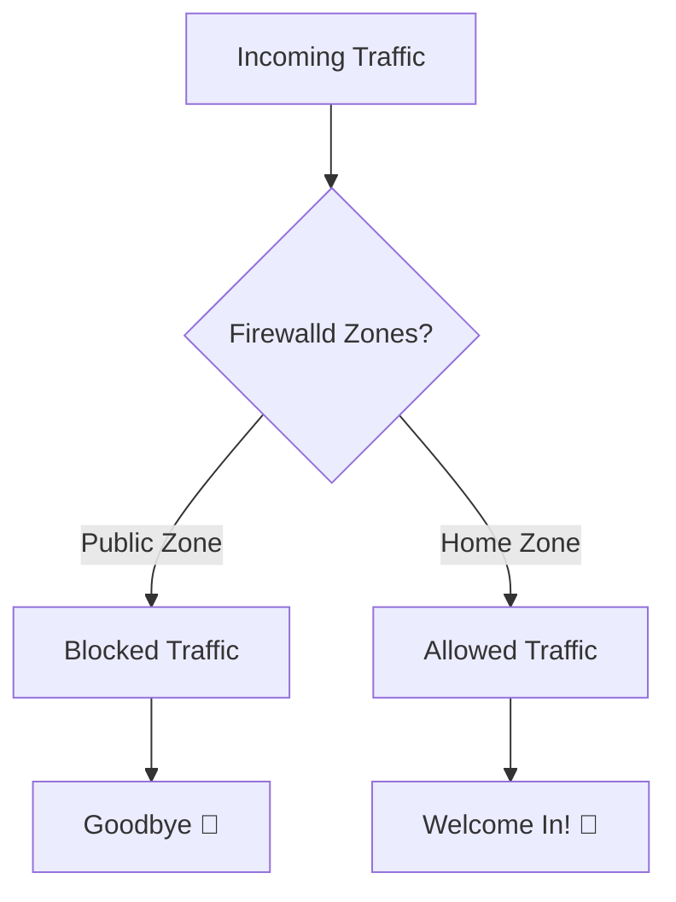
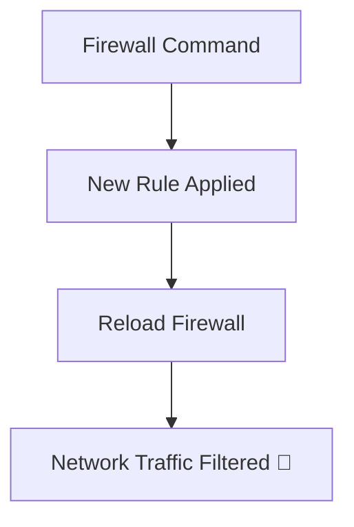

# **Firewalld Mastery Tutorial: The Fun Way!** 🔥🛡️

Welcome to this **interactive guide** to mastering firewalls in Linux using `firewalld`! 🎉 In this tutorial, you'll learn through **practical examples**, awesome **emojis**, and even a **mermaid diagram** to visualize concepts. Let's make securing your Linux system an exciting adventure! 🌟

---

## **Table of Contents** 📋

1. [What is Firewalld?](#what-is-firewalld)
2. [How Firewalld Works](#how-firewalld-works)
3. [Basic Commands](#basic-commands)
4. [Practical Examples](#practical-examples)
5. [Exploring Zones](#exploring-zones)
6. [Advanced Firewalld](#advanced-firewalld)
7. [Systemd and Firewalld](#systemd-and-firewalld)
8. [Conclusion](#conclusion)

---

## **1. What is Firewalld?** 🔥

`firewalld` is a **dynamic firewall tool** for Linux. It's like the **bodyguard** for your system, controlling who can access it and what can pass through. 🛡️ Unlike traditional firewalls, `firewalld` allows you to change rules **on the fly** without restarting. 🔄

### **Firewalld Key Features**:

- **Zones** 🗂️: Different trust levels for network interfaces.
- **Dynamic Configuration** ⚙️: Apply rules without restarting.
- **Services** 🎛️: Easily allow traffic for web, SSH, etc.
- **Rich Rules** 🛠️: Fine-grained access control.

---

## **2. How Firewalld Works** 🧐

Firewalld uses **zones** to determine what traffic is allowed based on the trust level. It organizes traffic like a bouncer at a club 🕺, deciding who gets in and who doesn't based on rules for that area.



---

## **3. Basic Commands** 🛠️

Let's start with the basics! Here's a quick list of the commands you'll be using regularly.

| Command                                      | Description                           |
| -------------------------------------------- | ------------------------------------- |
| `sudo systemctl start firewalld`             | Start Firewalld 🟢                    |
| `sudo systemctl stop firewalld`              | Stop Firewalld 🔴                     |
| `sudo firewall-cmd --state`                  | Check if Firewalld is running 🛠️      |
| `sudo firewall-cmd --get-active-zones`       | Show active zones 🛰️                  |
| `sudo firewall-cmd --zone=public --list-all` | List all rules for the public zone 🌍 |
| `sudo firewall-cmd --reload`                 | Reload firewalld configuration 🔄     |

---

## **4. Practical Examples** 🛠️🎯

Now let's jump into the **fun part**! Below are practical commands you'll need for day-to-day firewall management.

### **1. Opening HTTP Port (80)** 🌐

To allow HTTP traffic on port 80, type:

```bash
sudo firewall-cmd --zone=public --add-service=http --permanent
sudo firewall-cmd --reload
```

🎉 **Now your server is ready to serve web traffic!**

---

### **2. Allow SSH Access (22)** 🗝️

Allow remote access via SSH on port 22:

```bash
sudo firewall-cmd --zone=public --add-service=ssh --permanent
sudo firewall-cmd --reload
```

🛡️ **You've secured remote management.**

---

### **3. Blocking an IP Address** 🚫

Want to block a specific IP from accessing your server? Use:

```bash
sudo firewall-cmd --add-rich-rule="rule family='ipv4' source address='192.168.1.100' reject" --permanent
sudo firewall-cmd --reload
```

❌ **That IP won't bother you anymore.**

---

### **4. Opening a Custom Port (8080)** 📦

Let's say you're running an app on port 8080:

```bash
sudo firewall-cmd --zone=public --add-port=8080/tcp --permanent
sudo firewall-cmd --reload
```

🚪 **Port 8080 is now open!**

---

### **Mermaid Diagram for Example Workflow** 🛠️



---

## **5. Exploring Firewalld Zones** 🏰

Zones are like **safety bubbles**. Each one has its own rules for traffic. Think of zones as **layers of trust**. For example, a **public zone** has less trust and more restrictions, while a **home zone** is more relaxed.

### **Common Zones**:

| Zone     | Trust Level  | Usage                            |
| -------- | ------------ | -------------------------------- |
| `public` | Low Trust    | Use in untrusted environments 🌍 |
| `home`   | Medium Trust | For home networks 🏠             |
| `work`   | Medium Trust | For office networks 🏢           |
| `block`  | No Trust     | Blocks everything 🚫             |

---

### **Assigning a Zone to an Interface** 📡

To assign the **home** zone to your interface:

```bash
sudo firewall-cmd --zone=home --change-interface=eth0 --permanent
sudo firewall-cmd --reload
```

🌍 **Now your interface follows home zone rules.**

---

## **6. Advanced Firewalld** 🎛️

For those who like to dig deeper into their firewall settings, `firewalld` supports **rich rules**, which allow complex configurations.

### **Example: Blocking an IP Range** 🎯

```bash
sudo firewall-cmd --add-rich-rule="rule family='ipv4' source address='192.168.1.0/24' reject" --permanent
sudo firewall-cmd --reload
```

---

### **Allow Services for Specific Time Ranges** ⏲️

```bash
sudo firewall-cmd --add-rich-rule="rule family='ipv4' source address='192.168.1.50' port port=22 protocol=tcp accept time start-time='09:00' end-time='17:00'" --permanent
sudo firewall-cmd --reload
```

⏰ **Only allow SSH access between working hours.**

---

## **7. Systemd and Firewalld** 🔌

Firewalld is managed by **systemd**, just like other Linux services. Below are some useful commands.

### **Starting Firewalld**:

```bash
sudo systemctl start firewalld
```

🔄 **Now the firewall is active.**

---

### **Stopping Firewalld**:

```bash
sudo systemctl stop firewalld
```

🛑 **Firewall deactivated.**

---

### **Enabling Firewalld on Boot**:

```bash
sudo systemctl enable firewalld
```

⚡ **Ensure firewalld starts automatically.**

---

## **8. Conclusion** 🎯

You’ve now gained a solid foundation in managing **firewalld**! Whether it's opening ports, assigning zones, or setting rich rules, you're ready to take full control of your firewall and safeguard your Linux systems.

🔥💪 **Secure, smart, and effective!**

---
