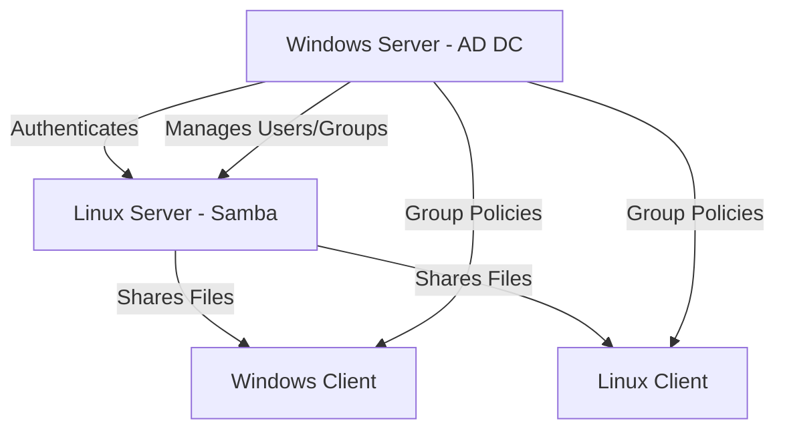

# **C** 🗂️

### **Table of Contents**

1. [What is Active Directory?](#1-what-is-active-directory)
2. [Key Components of Active Directory](#2-key-components-of-active-directory)
3. [Use Case for Active Directory](#3-use-case-for-active-directory)
4. [Active Directory Installation via PowerShell](#4-active-directory-installation-via-powershell)
5. [Active Directory Configuration via PowerShell](#5-active-directory-configuration-via-powershell)
6. [Adding Users to Active Directory](#6-adding-users-to-active-directory)
7. [Sharing Files via Samba](#7-sharing-files-via-samba)
8. [Best Practices](#8-best-practices)
9. [Conclusion](#9-conclusion)

---

### **1. What is Active Directory?** 🖥️

**Active Directory (AD)** is a directory service developed by Microsoft for Windows domain networks. It centralizes the management of users, devices, and resources, enabling administrators to configure security and policies efficiently.

---

### **2. Key Components of Active Directory** 🔑

- **Domain:** A logical grouping of network objects (computers, users, devices) that share the same AD database.
- **Organizational Units (OUs):** Containers that can hold users, groups, and computers, allowing for structured organization.
- **Domain Controllers (DCs):** Servers that host the AD database and manage authentication requests.
- **Group Policy Objects (GPOs):** Policies that manage settings and configurations for user and computer accounts.

---

### **3. Use Case for Active Directory** 💼

**Scenario:** A mid-sized company, Tech Solutions, wants to manage its network resources efficiently. They have several departments, including Sales, HR, and IT, each requiring different access levels to shared resources.

**Solution:**

- **Domain Structure:** Create a domain called `techsolutions.local` with OUs for each department.
- **User Management:** Add users to their respective OUs, applying GPOs to enforce security policies.
- **Resource Sharing:** Use Samba to share files between the Windows and Linux environments, enabling cross-platform collaboration.

---

### **4. Active Directory Installation via PowerShell** 📦

This section will guide you through the installation of Active Directory Domain Services (AD DS) using PowerShell.

#### **Steps to Install Active Directory via PowerShell**

1. **Open PowerShell as Administrator:**

   - Right-click the **Start** button and select **Windows PowerShell (Admin)**.

2. **Install the AD DS Role:**

   - Run the following command:

   ```powershell
   Install-WindowsFeature -Name AD-Domain-Services -IncludeManagementTools
   ```

3. **Import the AD DS Module:**

   - Import the Active Directory module:

   ```powershell
   Import-Module ADDSDeployment
   ```

4. **Promote the Server to a Domain Controller:**

   - Use the following command to create a new forest:

   ```powershell
   Install-ADDSForest -DomainName "techsolutions.local" -DomainNetbiosName "TECHSOLUTIONS" -InstallDNS -CreateDNSDelegation:$false -SafeModeAdministratorPassword (ConvertTo-SecureString "YourDSRMpassword" -AsPlainText -Force) -Force
   ```

   - Replace `"YourDSRMpassword"` with a secure password.

5. **Restart the Server:**
   - The server will automatically restart to complete the installation.

---

### **5. Active Directory Configuration via PowerShell** ⚙️

After installation, configure AD for user and resource management.

#### **Basic Configuration Tasks**

1. **Log into the Domain Controller:**

   - Use the administrator credentials created during installation.

2. **Open Active Directory Users and Computers (ADUC):**

   - Launch the console using PowerShell:

   ```powershell
   dsa.msc
   ```

3. **Create Organizational Units (OUs):**

   - Create OUs for different departments:

   ```powershell
   New-ADOrganizationalUnit -Name "Sales" -Path "DC=techsolutions,DC=local"
   New-ADOrganizationalUnit -Name "HR" -Path "DC=techsolutions,DC=local"
   New-ADOrganizationalUnit -Name "IT" -Path "DC=techsolutions,DC=local"
   ```

4. **Create User Accounts:**

   - Create user accounts for the Sales department:

   ```powershell
   New-ADUser -Name "Jane Smith" -GivenName "Jane" -Surname "Smith" -SamAccountName "jsmith" -UserPrincipalName "jsmith@techsolutions.local" -Path "OU=Sales,DC=techsolutions,DC=local" -AccountPassword (ConvertTo-SecureString "UserPassword123!" -AsPlainText -Force) -Enabled $true
   ```

5. **Create Groups:**

   - Create a security group for the Sales team:

   ```powershell
   New-ADGroup -Name "Sales Team" -GroupScope Global -Path "OU=Sales,DC=techsolutions,DC=local"
   ```

6. **Configure Group Policies:**
   - Create and link a GPO for the Sales department:
   ```powershell
   New-GPO -Name "Sales Policy" | New-GPLink -Target "OU=Sales,DC=techsolutions,DC=local"
   ```

---

### **6. Adding Users to Active Directory** 👥

#### **Adding Additional Users**

1. **Add More Users:**

   - For additional users, you can create a script or run individual commands:

   ```powershell
   New-ADUser -Name "John Doe" -GivenName "John" -Surname "Doe" -SamAccountName "jdoe" -UserPrincipalName "jdoe@techsolutions.local" -Path "OU=Sales,DC=techsolutions,DC=local" -AccountPassword (ConvertTo-SecureString "UserPassword123!" -AsPlainText -Force) -Enabled $true
   ```

2. **Add Users to the Sales Team Group:**
   - To add users to the Sales Team group:
   ```powershell
   Add-ADGroupMember -Identity "Sales Team" -Members "jsmith", "jdoe"
   ```

---

### **7. Sharing Files via Samba** 🌐

This section covers how to set up file sharing between Linux and Windows environments using Samba, integrated with Active Directory.

#### **Install Samba on a Linux Server:**

1. **Install Samba and Necessary Packages:**

   ```bash
   sudo apt update
   sudo apt install samba samba-vfs-modules winbind
   ```

2. **Configure Samba to Use AD for Authentication:**

   - Edit the `/etc/samba/smb.conf` file:

   ```ini
   [global]
      workgroup = TECHSOLUTIONS
      realm = TECHSOLUTIONS.LOCAL
      security = ADS
      idmap config * : backend = tdb
      idmap config * : range = 10000-99999
   ```

3. **Join the AD Domain:**

   - Use the following command to join the AD domain:

   ```bash
   sudo net ads join -U adminuser
   ```

   - Replace `adminuser` with your AD administrator account.

4. **Create a Samba Share Directory:**

   - Create a directory to share:

   ```bash
   sudo mkdir -p /srv/samba/adshared
   sudo chown -R nobody:nogroup /srv/samba/adshared
   sudo chmod 0777 /srv/samba/adshared
   ```

5. **Configure the Samba Share in smb.conf:**

   - Add the share configuration to `/etc/samba/smb.conf`:

   ```ini
   [ADShare]
      path = /srv/samba/adshared
      valid users = @"TECHSOLUTIONS\Domain Users"
      read only = no
      browseable = yes
   ```

6. **Restart Samba Services:**
   ```bash
   sudo systemctl restart smbd
   sudo systemctl restart nmbd
   ```

#### **Accessing Samba Shares from Windows:**

1. **Open File Explorer.**
2. **In the address bar, enter:**

   ```plaintext
   \\<IP_Address_of_Linux_Server>\ADShare
   ```

   - Replace `<IP_Address_of_Linux_Server>` with the actual IP address.

3. **Log in with Active Directory Credentials:**
   - Use the AD credentials of any user who has been granted access to the shared folder.

#### **Accessing Samba Shares from Linux:**

1. **Mount the Samba Share:**

   ```bash
   sudo mount -t cifs //server_ip/ADShare /mnt/samba -o username=jsmith
   ```

   - Replace `server_ip` with the actual IP address of your Samba server and `jsmith` with the username.

2. **Verify the Mounted Share:**
   ```bash
   df -h | grep samba
   ```

---

### **8. Best Practices** ✅

- **Regular Backups:** Implement a routine backup strategy for Active Directory.
- **Use Group Policies Wisely:** Plan and organize GPOs to avoid conflicts and ensure security.
- **Monitor Performance:** Regularly check the health and performance of your AD environment.
- **Secure Active Directory:** Implement strong passwords, account lockout policies, and use secure

connections (LDAPS).

- **Documentation:** Maintain thorough documentation of your AD structure, policies, and procedures.

---

### **9. Conclusion** 🎉

Active Directory is a crucial component for managing users and resources in a Windows environment. Its integration with Samba allows seamless file sharing and collaboration across Windows and Linux systems. This tutorial provided a step-by-step guide to installing, configuring, and managing Active Directory effectively, as well as how to share files using Samba.

---

Certainly! Below is a **comprehensive and detailed tutorial** on **Active Directory (AD)**, enhanced with practical terminal commands, summary scripts, Mermaid diagrams, and a vibrant use of emojis to make the learning process engaging and straightforward.

---

## **Active Directory Tutorial** 🗂️🔗

**Welcome!** 🎉  
This tutorial will guide you through the essentials of **Active Directory (AD)**, including its installation, configuration, user management, and integration with **Samba** for cross-platform file sharing. By the end of this guide, you'll be equipped to set up and manage AD effectively within your network environment.

---

### **📜 Table of Contents**

1. [What is Active Directory?](#1-what-is-active-directory)
2. [Key Components of Active Directory](#2-key-components-of-active-directory)
3. [Use Case for Active Directory](#3-use-case-for-active-directory)
4. [Active Directory Installation via PowerShell](#4-active-directory-installation-via-powershell)
   - [Summary Script](#4-summary-script)
5. [Active Directory Configuration via PowerShell](#5-active-directory-configuration-via-powershell)
   - [Summary Script](#5-summary-script)
6. [Adding Users to Active Directory](#6-adding-users-to-active-directory)
   - [Summary Script](#6-summary-script)
7. [Sharing Files via Samba](#7-sharing-files-via-samba)
   - [Summary Script](#7-summary-script)
8. [Best Practices](#8-best-practices)
9. [Visual Representation](#9-visual-representation)
10. [Conclusion](#10-conclusion)

---

### **1. What is Active Directory?** 🖥️📂

**Active Directory (AD)** is a directory service developed by Microsoft for Windows domain networks. It centralizes the management of users, computers, and other resources, providing authentication, authorization, and policy enforcement across the network. AD plays a pivotal role in managing large-scale networks efficiently.

**Key Functions:**

- **User Management:** Create, modify, and delete user accounts.
- **Resource Management:** Control access to files, printers, and applications.
- **Security:** Implement security policies and manage permissions.
- **Group Policies:** Apply configurations and restrictions to users and computers.

---

### **2. Key Components of Active Directory** 🔑🗃️

- **Domain:** A logical group of network objects (users, computers) sharing the same AD database.
- **Organizational Units (OUs):** Containers within a domain to organize users, groups, and computers.
- **Domain Controllers (DCs):** Servers that host the AD database and handle authentication requests.
- **Group Policy Objects (GPOs):** Policies that manage settings and configurations for users and computers.
- **Forest:** The top-level container in AD, consisting of one or more domains.
- **Trust Relationships:** Links between domains that allow users in one domain to access resources in another.

---

### **3. Use Case for Active Directory** 💼🔧

**Scenario:**  
_A medium-sized company, Tech Innovators, wants to streamline its IT management. They have departments like Sales, HR, and IT, each needing controlled access to specific resources._

**Solution:**

1. **Centralized Management:** Use AD to manage all user accounts and resources from a single point.
2. **Organizational Units:** Create OUs for each department to apply specific policies.
3. **Group Policies:** Implement security policies tailored to each department's needs.
4. **Samba Integration:** Allow Linux systems to authenticate with AD and share files seamlessly across Windows and Linux clients.

**Benefits:**

- **Efficiency:** Simplifies user and resource management.
- **Security:** Enhances security through centralized policies.
- **Scalability:** Easily scales with organizational growth.
- **Interoperability:** Facilitates cross-platform file sharing with Samba.

---

### **4. Active Directory Installation via PowerShell** 📦⚙️

**Objective:**  
Install Active Directory Domain Services (AD DS) on a Windows Server using PowerShell.

#### **Steps to Install Active Directory via PowerShell**

1. **Open PowerShell as Administrator:**

   - Right-click the **Start** button.
   - Select **Windows PowerShell (Admin)**.  
     

2. **Install the AD DS Role:**

   ```powershell
   Install-WindowsFeature -Name AD-Domain-Services -IncludeManagementTools
   ```

   - **Explanation:** This command installs the AD DS role along with management tools like ADUC (Active Directory Users and Computers).

3. **Import the AD DS Module:**

   ```powershell
   Import-Module ADDSDeployment
   ```

   - **Explanation:** This imports the AD DS deployment module, enabling domain controller promotion commands.

4. **Promote the Server to a Domain Controller:**

   ```powershell
   Install-ADDSForest `
     -DomainName "techsolutions.local" `
     -DomainNetbiosName "TECHSOLUTIONS" `
     -InstallDNS `
     -CreateDNSDelegation:$false `
     -SafeModeAdministratorPassword (ConvertTo-SecureString "YourDSRMpassword" -AsPlainText -Force) `
     -Force
   ```

   - **Parameters:**
     - **DomainName:** Fully Qualified Domain Name (FQDN) for the new domain.
     - **DomainNetbiosName:** Short name for the domain.
     - **InstallDNS:** Installs DNS services.
     - **CreateDNSDelegation:** Skips DNS delegation.
     - **SafeModeAdministratorPassword:** Password for Directory Services Restore Mode.
     - **Force:** Bypasses confirmation prompts.

5. **Restart the Server:**  
   The server will prompt for a restart to complete the installation. You can manually restart using:
   ```powershell
   Restart-Computer
   ```

---

#### **4. Summary Script** 📝🚀

Run the following PowerShell script to automate the installation of Active Directory on your Windows Server. **Ensure you replace `"YourDSRMpassword"` with a secure password.**

```powershell
# 📌 Active Directory Installation Script

# Step 1: Install AD DS Role
Install-WindowsFeature -Name AD-Domain-Services -IncludeManagementTools
Write-Host "✅ AD DS role installed."

# Step 2: Import AD DS Module
Import-Module ADDSDeployment
Write-Host "✅ AD DS module imported."

# Step 3: Promote Server to Domain Controller
Install-ADDSForest `
  -DomainName "techsolutions.local" `
  -DomainNetbiosName "TECHSOLUTIONS" `
  -InstallDNS `
  -CreateDNSDelegation:$false `
  -SafeModeAdministratorPassword (ConvertTo-SecureString "YourDSRMpassword" -AsPlainText -Force) `
  -Force
Write-Host "✅ Server promoted to Domain Controller."

# Step 4: Restart Computer
Restart-Computer -Force
```

**💡 Tips:**

- **Run as Administrator:** Ensure you execute the script with administrative privileges.
- **Secure Passwords:** Use strong, complex passwords for security.

---

### **5. Active Directory Configuration via PowerShell** ⚙️🔧

**Objective:**  
Configure Active Directory by creating Organizational Units (OUs), user accounts, groups, and applying Group Policies using PowerShell.

#### **Steps to Configure Active Directory**

1. **Log into the Domain Controller:**  
   Use the administrator credentials created during installation.

2. **Open Active Directory Users and Computers (ADUC):**

   ```powershell
   dsa.msc
   ```

   - **Explanation:** Launches the ADUC console for GUI-based management.

3. **Create Organizational Units (OUs):**

   ```powershell
   # Create OUs for Departments
   New-ADOrganizationalUnit -Name "Sales" -Path "DC=techsolutions,DC=local"
   New-ADOrganizationalUnit -Name "HR" -Path "DC=techsolutions,DC=local"
   New-ADOrganizationalUnit -Name "IT" -Path "DC=techsolutions,DC=local"
   Write-Host "✅ Organizational Units created."
   ```

4. **Create User Accounts:**

   ```powershell
   # Create User Accounts in Sales OU
   New-ADUser -Name "Jane Smith" -GivenName "Jane" -Surname "Smith" `
     -SamAccountName "jsmith" -UserPrincipalName "jsmith@techsolutions.local" `
     -Path "OU=Sales,DC=techsolutions,DC=local" `
     -AccountPassword (ConvertTo-SecureString "UserPassword123!" -AsPlainText -Force) `
     -Enabled $true

   New-ADUser -Name "John Doe" -GivenName "John" -Surname "Doe" `
     -SamAccountName "jdoe" -UserPrincipalName "jdoe@techsolutions.local" `
     -Path "OU=Sales,DC=techsolutions,DC=local" `
     -AccountPassword (ConvertTo-SecureString "UserPassword123!" -AsPlainText -Force) `
     -Enabled $true

   Write-Host "✅ User accounts created."
   ```

5. **Create Groups:**

   ```powershell
   # Create a Security Group for Sales Team
   New-ADGroup -Name "Sales Team" -GroupScope Global `
     -Path "OU=Sales,DC=techsolutions,DC=local" `
     -Description "Group for Sales Department"
   Write-Host "✅ Security groups created."
   ```

6. **Add Users to Groups:**

   ```powershell
   # Add Users to Sales Team Group
   Add-ADGroupMember -Identity "Sales Team" -Members "jsmith", "jdoe"
   Write-Host "✅ Users added to Sales Team group."
   ```

7. **Configure Group Policies:**
   ```powershell
   # Create and Link a Group Policy Object (GPO) to Sales OU
   New-GPO -Name "Sales Policy" | New-GPLink -Target "OU=Sales,DC=techsolutions,DC=local"
   Write-Host "✅ Group Policy Object created and linked."
   ```

---

#### **5. Summary Script** 📝⚙️

Execute the following PowerShell script to automate the configuration of Active Directory by creating OUs, users, groups, and applying Group Policies. **Ensure you customize usernames and paths as needed.**

```powershell
# 📌 Active Directory Configuration Script

# Step 1: Create Organizational Units (OUs)
New-ADOrganizationalUnit -Name "Sales" -Path "DC=techsolutions,DC=local"
New-ADOrganizationalUnit -Name "HR" -Path "DC=techsolutions,DC=local"
New-ADOrganizationalUnit -Name "IT" -Path "DC=techsolutions,DC=local"
Write-Host "✅ Organizational Units created."

# Step 2: Create User Accounts in Sales OU
New-ADUser -Name "Jane Smith" -GivenName "Jane" -Surname "Smith" `
  -SamAccountName "jsmith" -UserPrincipalName "jsmith@techsolutions.local" `
  -Path "OU=Sales,DC=techsolutions,DC=local" `
  -AccountPassword (ConvertTo-SecureString "UserPassword123!" -AsPlainText -Force) `
  -Enabled $true

New-ADUser -Name "John Doe" -GivenName "John" -Surname "Doe" `
  -SamAccountName "jdoe" -UserPrincipalName "jdoe@techsolutions.local" `
  -Path "OU=Sales,DC=techsolutions,DC=local" `
  -AccountPassword (ConvertTo-SecureString "UserPassword123!" -AsPlainText -Force) `
  -Enabled $true
Write-Host "✅ User accounts created."

# Step 3: Create Security Group
New-ADGroup -Name "Sales Team" -GroupScope Global `
  -Path "OU=Sales,DC=techsolutions,DC=local" `
  -Description "Group for Sales Department"
Write-Host "✅ Security groups created."

# Step 4: Add Users to Group
Add-ADGroupMember -Identity "Sales Team" -Members "jsmith", "jdoe"
Write-Host "✅ Users added to Sales Team group."

# Step 5: Create and Link Group Policy Object (GPO)
New-GPO -Name "Sales Policy" | New-GPLink -Target "OU=Sales,DC=techsolutions,DC=local"
Write-Host "✅ Group Policy Object created and linked."
```

**💡 Tips:**

- **Customize Paths and Names:** Ensure that OUs, user names, and group names align with your organizational structure.
- **Secure Passwords:** Use strong passwords and consider implementing policies for password complexity.

---

### **6. Adding Users to Active Directory** 👥🔐

**Objective:**  
Learn how to add new users to Active Directory and assign them to appropriate groups to manage access to resources effectively.

#### **Steps to Add Users**

1. **Create a New User Account:**

   ```powershell
   New-ADUser -Name "Alice Johnson" -GivenName "Alice" -Surname "Johnson" `
     -SamAccountName "ajohnson" -UserPrincipalName "ajohnson@techsolutions.local" `
     -Path "OU=HR,DC=techsolutions,DC=local" `
     -AccountPassword (ConvertTo-SecureString "SecurePass!456" -AsPlainText -Force) `
     -Enabled $true
   Write-Host "✅ New user 'Alice Johnson' created."
   ```

2. **Create a Security Group (if not already created):**

   ```powershell
   New-ADGroup -Name "HR Team" -GroupScope Global `
     -Path "OU=HR,DC=techsolutions,DC=local" `
     -Description "Group for HR Department"
   Write-Host "✅ Security group 'HR Team' created."
   ```

3. **Add User to the Security Group:**

   ```powershell
   Add-ADGroupMember -Identity "HR Team" -Members "ajohnson"
   Write-Host "✅ User 'ajohnson' added to 'HR Team' group."
   ```

4. **Verify Group Membership:**
   ```powershell
   Get-ADGroupMember -Identity "HR Team" | Select-Object Name, SamAccountName
   ```

---

#### **6. Summary Script** 📝👥

Run the following PowerShell script to automate the addition of a new user and assign them to a security group. **Customize usernames, group names, and paths as needed.**

```powershell
# 📌 Active Directory User Addition Script

# Step 1: Create a New User Account
New-ADUser -Name "Alice Johnson" -GivenName "Alice" -Surname "Johnson" `
  -SamAccountName "ajohnson" -UserPrincipalName "ajohnson@techsolutions.local" `
  -Path "OU=HR,DC=techsolutions,DC=local" `
  -AccountPassword (ConvertTo-SecureString "SecurePass!456" -AsPlainText -Force) `
  -Enabled $true
Write-Host "✅ New user 'Alice Johnson' created."

# Step 2: Create a Security Group
New-ADGroup -Name "HR Team" -GroupScope Global `
  -Path "OU=HR,DC=techsolutions,DC=local" `
  -Description "Group for HR Department"
Write-Host "✅ Security group 'HR Team' created."

# Step 3: Add User to Security Group
Add-ADGroupMember -Identity "HR Team" -Members "ajohnson"
Write-Host "✅ User 'ajohnson' added to 'HR Team' group."

# Step 4: Verify Group Membership
Get-ADGroupMember -Identity "HR Team" | Select-Object Name, SamAccountName
Write-Host "✅ Verified group membership."
```

**💡 Tips:**

- **Bulk User Creation:** For adding multiple users, consider using CSV import scripts with `Import-Csv` and `New-ADUser`.
- **Group Management:** Regularly review group memberships to maintain security and access controls.

---

### **7. Sharing Files via Samba** 🌐📁

**Objective:**  
Configure Samba on a Linux server to integrate with Active Directory, allowing AD users to access shared files from both Windows and Linux clients.

#### **Steps to Set Up Samba with AD Authentication**

1. **Install Samba and Required Packages on Linux Server:**

   ```bash
   sudo apt update
   sudo apt install samba samba-vfs-modules winbind libpam-winbind libnss-winbind
   ```

   - **Explanation:** Installs Samba along with Winbind for AD integration and necessary PAM modules.

2. **Configure `/etc/samba/smb.conf`:**

   ```ini
   [global]
      workgroup = TECHSOLUTIONS
      realm = TECHSOLUTIONS.LOCAL
      security = ADS
      encrypt passwords = yes
      log file = /var/log/samba/%m.log
      max log size = 50
      dns proxy = no

      # Winbind settings
      idmap config * : backend = tdb
      idmap config * : range = 10000-99999
      winbind use default domain = true
      winbind enum users = yes
      winbind enum groups = yes

   [ADShare]
      path = /srv/samba/adshared
      browseable = yes
      read only = no
      valid users = @"TECHSOLUTIONS\Domain Users"
   ```

   - **Explanation:** Configures Samba to join the AD domain and sets up a shared directory accessible to AD users.

3. **Create the Samba Share Directory:**

   ```bash
   sudo mkdir -p /srv/samba/adshared
   sudo chown -R nobody:nogroup /srv/samba/adshared
   sudo chmod 0770 /srv/samba/adshared
   ```

   - **Explanation:** Creates the shared directory with appropriate permissions.

4. **Join the Linux Server to the AD Domain:**

   ```bash
   sudo net ads join -U administrator
   ```

   - **Explanation:** Joins the server to the AD domain using an AD administrator account. You'll be prompted for the password.

5. **Restart Samba and Winbind Services:**

   ```bash
   sudo systemctl restart smbd nmbd winbind
   sudo systemctl enable smbd nmbd winbind
   ```

6. **Verify Domain Membership:**

   ```bash
   net ads testjoin
   ```

   - **Expected Output:** `Join is OK`

7. **Configure NSS and PAM for AD Integration:**

   - **Edit `/etc/nsswitch.conf`:**
     ```bash
     sudo nano /etc/nsswitch.conf
     ```
     - Add `winbind` to the following lines:
       ```
       passwd:         compat winbind
       group:          compat winbind
       shadow:         compat
       ```
   - **Edit PAM Configuration:**
     ```bash
     sudo pam-auth-update
     ```
     - Enable **Winbind NTLM authentication** and **Unix authentication**.

8. **Create Group Policy for File Sharing (Optional):**
   - Use Group Policy Management on the AD domain controller to create policies that map network drives or set specific permissions.

---

#### **7. Summary Script** 📝🌐

Run the following shell script on your Linux server to automate the setup of Samba with Active Directory integration. **Customize domain names and paths as needed.**

```bash
#!/bin/bash
# 📌 Samba with Active Directory Integration Script

# 🛠️ Update and Install Samba and Winbind
sudo apt update
sudo apt install -y samba samba-vfs-modules winbind libpam-winbind libnss-winbind
echo "✅ Samba and Winbind installed."

# 🗂️ Configure smb.conf
sudo bash -c 'cat >> /etc/samba/smb.conf' <<EOL

[global]
   workgroup = TECHSOLUTIONS
   realm = TECHSOLUTIONS.LOCAL
   security = ADS
   encrypt passwords = yes
   log file = /var/log/samba/%m.log
   max log size = 50
   dns proxy = no

   # Winbind settings
   idmap config * : backend = tdb
   idmap config * : range = 10000-99999
   winbind use default domain = true
   winbind enum users = yes
   winbind enum groups = yes

[ADShare]
   path = /srv/samba/adshared
   browseable = yes
   read only = no
   valid users = @"TECHSOLUTIONS\Domain Users"
EOL
echo "✅ smb.conf configured."

# 📁 Create Samba Share Directory
sudo mkdir -p /srv/samba/adshared
sudo chown -R nobody:nogroup /srv/samba/adshared
sudo chmod 0770 /srv/samba/adshared
echo "✅ Samba share directory created."

# 🔗 Join AD Domain
sudo net ads join -U administrator
echo "✅ Server joined to AD domain."

# 🔄 Restart and Enable Services
sudo systemctl restart smbd nmbd winbind
sudo systemctl enable smbd nmbd winbind
echo "✅ Samba and Winbind services restarted and enabled."

# 🔍 Verify Domain Membership
net ads testjoin
```

**💡 Tips:**

- **Administrator Credentials:** Ensure you have the AD administrator credentials before running the script.
- **Firewall Settings:** Make sure that your firewall allows Samba traffic (ports 137-139 and 445).
- **SELinux/AppArmor:** If using SELinux or AppArmor, configure them to allow Samba operations.

---

### **8. Best Practices** ✅🔒

- **Regular Backups:**  
  Schedule regular backups of your Active Directory database to prevent data loss. Use tools like Windows Server Backup or third-party solutions.

- **Strong Password Policies:**  
  Enforce complex password policies to enhance security. Configure password expiration and account lockout policies via Group Policies.

- **Monitor and Audit:**  
  Use Event Viewer and auditing policies to monitor AD activities. Regularly review logs for suspicious activities.

- **Organizational Structure:**  
  Design a logical and scalable OU structure that reflects your organization's hierarchy and simplifies management.

- **Group Policies Management:**  
  Avoid excessive GPOs; instead, plan and apply them strategically to minimize conflicts and ensure efficient policy application.

- **Secure Domain Controllers:**  
  Limit physical and network access to Domain Controllers. Implement security measures like firewalls and intrusion detection systems.

- **Update and Patch Management:**  
  Keep your servers and AD components updated with the latest patches and updates to mitigate security vulnerabilities.

- **Documentation:**  
  Maintain thorough documentation of your AD setup, configurations, and policies to facilitate management and troubleshooting.

---

### **9. Visual Representation** 📊✨

#### **Mermaid Diagram: Active Directory and Samba Integration Workflow**



**Explanation:**

1. **Active Directory Domain Controller (AD DC):** Authenticates users and manages group policies.
2. **Linux Server with Samba:** Joins the AD domain, shares files, and interacts with AD for user authentication.
3. **Clients (Windows and Linux):** Access shared resources via Samba, authenticated by AD.

---

### **10. Conclusion** 🎓🎉

Congratulations! 🎊  
You've successfully learned how to install, configure, and manage **Active Directory** and integrate it with **Samba** for seamless cross-platform file sharing between Windows and Linux systems. By following this tutorial, you've set up a robust infrastructure that enhances security, simplifies management, and fosters efficient collaboration within your organization.

**Key Takeaways:**

- **Centralized Management:** AD provides a unified platform for managing users and resources.
- **Security:** Implementing strong policies and secure configurations safeguards your network.
- **Interoperability:** Integrating Samba with AD allows seamless file sharing across different operating systems.
- **Automation:** Utilizing scripts streamlines installation and configuration processes.

**Next Steps:**

- Explore advanced AD features like **Trust Relationships**, **Replication**, and **Role-Based Access Control (RBAC)**.
- Dive deeper into **Group Policy Management** to customize and enforce policies effectively.
- Implement **Monitoring Tools** to keep track of AD health and performance.

---
