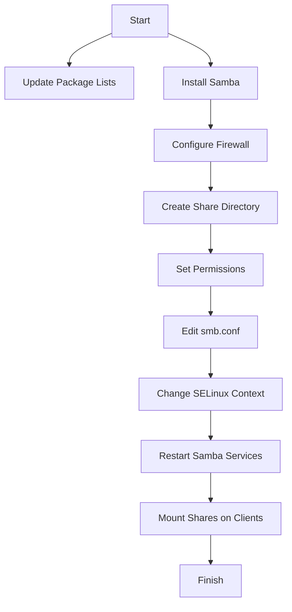

# **Comprehensive Samba Setup Guide** 🖥️🔗

**Overview:**  
**Samba** is an open-source software suite that allows file and printer sharing between Linux/Unix and Windows systems using the SMB/CIFS protocol. This guide provides detailed, step-by-step instructions for setting up Samba on a Linux server, allowing seamless access from both Linux and Windows clients.

---

### **Table of Contents**

1. [What is Samba?](#1-what-is-samba)
2. [Differences Between SMB and CIFS](#2-differences-between-smb-and-cifs)
3. [Installation Steps](#3-installation-steps)
4. [Configuration](#4-configuration)
5. [Mounting Samba Shares](#5-mounting-samba-shares)
6. [Troubleshooting](#6-troubleshooting)
7. [Summary Scripts](#7-summary-scripts)
8. [Visual Representation](#8-visual-representation)
9. [Conclusion](#9-conclusion)

---

### **1. What is Samba?** 🖥️

**Samba** is a software suite that provides seamless file and printer sharing services to SMB/CIFS clients. It allows Linux systems to act as a file server for Windows clients, enabling users to access files on the Linux server as if they were local. Samba can also be used to integrate Linux servers and desktops into Active Directory environments.

---

### **2. Differences Between SMB and CIFS** 🔍

- **SMB (Server Message Block):** A network protocol primarily used for providing shared access to files and printers.
- **CIFS (Common Internet File System):** A specific implementation of SMB, designed for cross-platform file sharing over the internet. While CIFS is a version of SMB, it is often used interchangeably.

### **3. Installation Steps** 📦

#### **For Ubuntu/Debian:**

1. **Update Package Lists:**

   ```bash
   sudo apt update
   ```

   - Ensures that you have the latest package information.

2. **Install Samba:**
   ```bash
   sudo apt install samba
   ```

#### **For RHEL/CentOS:**

1. **Install Samba Packages:**
   ```bash
   sudo dnf install samba samba-client samba-common
   ```

#### **Configure Firewall (Allow Samba):**

**For Ubuntu:**

```bash
sudo ufw allow 'Samba'
```

- Allows Samba traffic through the firewall.

**For RHEL/CentOS:**

```bash
sudo firewall-cmd --permanent --add-service=samba
sudo firewall-cmd --reload
```

- Adds the Samba service to the firewall rules and reloads the configuration.

---

### **4. Configuration** 🛠️

#### **Create Share Directory:**

1. **Create the directory to share:**

   ```bash
   sudo mkdir -p /srv/samba/shared
   ```

   - Creates the shared directory.

2. **Set Permissions:**
   ```bash
   sudo chown -R $USER:$USER /srv/samba/shared
   sudo chmod 755 /srv/samba/shared
   ```
   - Changes the ownership and sets appropriate permissions.

#### **Edit Samba Configuration:**

1. **Open the Samba configuration file:**

   ```bash
   sudo nano /etc/samba/smb.conf
   ```

   - Edits the Samba configuration file.

2. **Add the following section at the end of the file:**
   ```ini
   [Shared]
       path = /srv/samba/shared
       browseable = yes
       read only = no
       guest ok = no
       valid users = yourusername
   ```
   - Configures the shared directory. Replace `yourusername` with your actual username.

#### **Change SELinux Context (for RHEL/CentOS):**

```bash
sudo chcon -t samba_share_t /srv/samba/shared
```

- Adjusts SELinux settings to allow access to the shared directory.

#### **Restart Samba Services:**

1. **Enable and start Samba services:**
   ```bash
   sudo systemctl enable smb
   sudo systemctl start smb
   sudo systemctl enable nmb
   sudo systemctl start nmb
   ```
   - Ensures that Samba services start on boot and starts the services.

---

### **5. Mounting Samba Shares** 🔗

#### **On Windows:**

1. **Open File Explorer.**
2. **Map Network Drive:**
   - Click on "This PC" and then "Map network drive."
   - Enter `\\<Samba_Server_IP>\Shared` (replace `<Samba_Server_IP>` with the actual server IP).
   - Click “Finish” and enter your credentials when prompted.

#### **On Linux:**

1. **Install CIFS Utilities:**

   ```bash
   sudo apt install cifs-utils
   ```

   - Installs necessary utilities for mounting CIFS shares.

2. **Create a Mount Point:**

   ```bash
   sudo mkdir -p /mnt/samba/shared
   ```

3. **Mount the Share:**
   ```bash
   sudo mount -t cifs //192.168.1.100/Shared /mnt/samba/shared -o username=yourusername
   ```
   - Mounts the Samba share; you will be prompted for your password.

#### **Automatic Mounting (Optional):**

To automatically mount the share at boot, add the following line to `/etc/fstab`:

```bash
//192.168.1.100/Shared /mnt/samba/shared cifs username=yourusername,password=yourpassword 0 0
```

- Ensure to replace `yourusername` and `yourpassword` with actual credentials. Be cautious, as storing passwords in `/etc/fstab` can be insecure.

---

### **6. Troubleshooting** 🛠️

- **Access Denied:**

  - Ensure the user exists in Samba with `sudo smbpasswd -a yourusername`.
  - Check permissions on the shared directory.

- **Share Not Visible:**

  - Confirm Samba services are running: `sudo systemctl status smb nmb`.
  - Ensure the firewall allows Samba traffic.

- **Cannot Mount Share:**
  - Check the server IP and share name.
  - Verify network connectivity with `ping <Samba_Server_IP>`.

---

### **7. Summary Scripts** 📜

#### **Installation Script:**

```bash
# For Ubuntu/Debian
sudo apt update
sudo apt install samba
sudo ufw allow 'Samba'

# For RHEL/CentOS
sudo dnf install samba samba-client samba-common
sudo firewall-cmd --permanent --add-service=samba
sudo firewall-cmd --reload
```

#### **Configuration Script:**

```bash
# Create shared directory
sudo mkdir -p /srv/samba/shared
sudo chown -R $USER:$USER /srv/samba/shared
sudo chmod 755 /srv/samba/shared

# Add to smb.conf
echo "[Shared]
path = /srv/samba/shared
browseable = yes
read only = no
guest ok = no
valid users = yourusername" | sudo tee -a /etc/samba/smb.conf

# Change SELinux context (RHEL/CentOS)
sudo chcon -t samba_share_t /srv/samba/shared

# Restart services
sudo systemctl enable smb nmb
sudo systemctl start smb nmb
```

---

### **8. Visual Representation** 📊

#### **Mermaid Graph: Samba Setup Process**



---

### **9. Conclusion** 🎉

By following this detailed setup guide, you can successfully install and configure Samba on your Linux server, allowing file sharing with both Linux and Windows clients. Make sure to troubleshoot any issues that arise during installation or configuration. Enjoy your new file-sharing capabilities! 🌟

---
