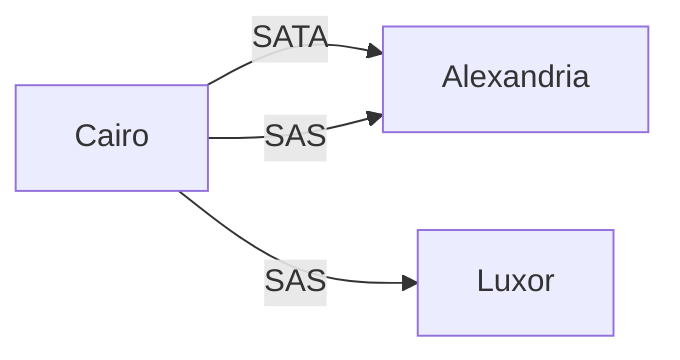

# **SATA and SAS Tutorial** 📚🔍

### **Table of Contents**

1. [What is SATA?](#1-what-is-sata)
2. [What is SAS?](#2-what-is-sas)
3. [Key Differences Between SATA and SAS](#3-key-differences-between-sata-and-sas)
4. [Examples of SATA and SAS](#4-examples-of-sata-and-sas)
5. [Configuration for SATA and SAS](#5-configuration-for-sata-and-sas)
   - [SATA Configuration Example](#sata-configuration-example)
   - [SAS Configuration Example](#sas-configuration-example)
6. [Changing Speed](#6-changing-speed)
7. [Visual Representation](#7-visual-representation)
8. [Conclusion](#8-conclusion)

---

### **1. What is SATA?** 💻🔌

**SATA (Serial Advanced Technology Attachment)** is an interface for connecting storage devices like hard drives and SSDs to a computer's motherboard, providing faster data transfer rates compared to older interfaces like PATA.

### **2. What is SAS?** ⚙️🔄

**SAS (Serial Attached SCSI)** is a protocol used primarily in enterprise environments to connect storage devices. It offers advantages such as higher performance and better reliability.

### **3. Key Differences Between SATA and SAS** 🔍⚖️

| Feature                 | SATA                    | SAS                              |
| ----------------------- | ----------------------- | -------------------------------- |
| **Speed**               | Up to 6 Gbps (SATA III) | Up to 12 Gbps and higher         |
| **Reliability**         | Less reliable           | More reliable                    |
| **Cost**                | More affordable         | More expensive                   |
| **Cable Configuration** | All wires in one cable  | Wires split into multiple cables |

### **4. Examples of SATA and SAS** 🌍🚗

- **SATA**: Imagine a single highway connecting Cairo to Alexandria, where all traffic travels together.
- **SAS**: Think of multiple routes from Cairo: one to Alexandria and another to Luxor, allowing for efficient traffic flow.

### **5. Configuration for SATA and SAS** 🛠️🔧

#### **SATA Configuration Example**:

To configure a SATA device on a Linux system and check its connection speed:

```bash
# List SATA devices and their speeds
lsblk -o NAME,SIZE,TYPE,MOUNTPOINT,ROTA,RM,TRAN

# Check the speed of a specific SATA device (e.g., /dev/sda)
cat /sys/class/scsi_disk/0:0:0:0/device/speed
```

#### **SAS Configuration Example**:

For SAS devices, use the following commands to list SAS devices:

```bash
# List SAS devices and their status
sas2ircu LIST

# Check the speed of a specific SAS device
cat /sys/class/scsi_disk/0:0:0:0/device/speed
```

### **6. Changing Speed** 🔄⚡

To change the speed of SATA or SAS devices, follow these steps:

1. **Reboot the System**: Access the BIOS/UEFI during startup (usually by pressing `Del`, `F2`, or `Esc`).
2. **Locate SATA Configuration**: Find **SATA Configuration** or **Advanced Settings**.
3. **Select Desired Mode**: Choose between options like `AHCI`, `IDE`, or `RAID`.
4. **Save Changes and Exit**.

### **7. Visual Representation** 📊📈

#### **SATA vs. SAS Traffic Flow**:



- **SATA**: A single route (Cairo to Alexandria).
- **SAS**: Multiple routes (Cairo to Alexandria and Cairo to Luxor).

### **8. Conclusion** 🏁

Understanding **SATA** and **SAS** is crucial for selecting the right storage solutions for your needs. SATA is ideal for consumer applications, while SAS is designed for enterprise-level reliability and performance.

---
