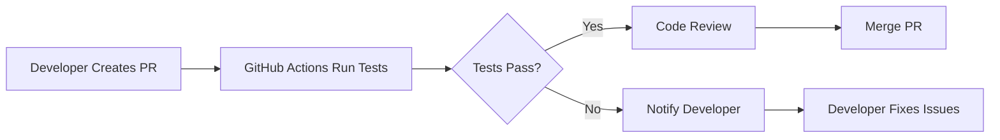
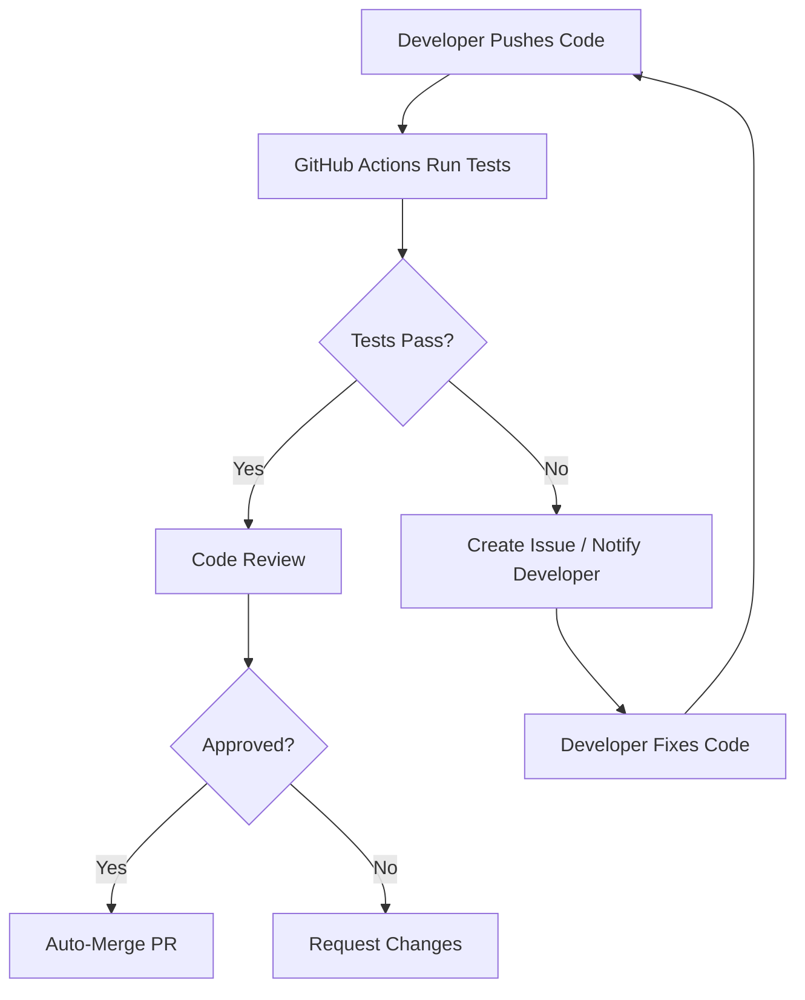

# Automating Code Testing and Merging with GitHub Actions 🤖🔧

Welcome to this comprehensive tutorial! Here, you'll learn how to set up GitHub to automatically test any code a developer submits, automate the merging process if tests pass, and notify developers of bugs if tests fail. This ensures high code quality and streamlines your development workflow.

---

## 📋 Table of Contents

1. [Prerequisites](#prerequisites)
2. [Setting Up GitHub Actions for Testing](#setting-up-github-actions-for-testing)
3. [Configuring Branch Protection Rules](#configuring-branch-protection-rules)
4. [Automating the Merge Process](#automating-the-merge-process)
5. [Notifying Developers of Test Failures](#notifying-developers-of-test-failures)
6. [Putting It All Together](#putting-it-all-together)
7. [Additional Resources](#additional-resources)
8. [Conclusion](#conclusion)

---

## 🌟 Prerequisites

Before diving in, ensure you have the following:

- **GitHub Repository**: You must have administrative access to the repository you intend to set up.
- **Test Suite**: Your project should have automated tests written (e.g., using Jest, pytest, etc.).
- **Basic GitHub Knowledge**: Familiarity with GitHub Actions, pull requests, and repository settings.

---

## 🛠️ Setting Up GitHub Actions for Testing

GitHub Actions allows you to automate workflows directly within your GitHub repository. We'll set up an action to run your test suite whenever code is pushed or a pull request is created.

### Step 1: Create a GitHub Actions Workflow

1. **Navigate to Your Repository:**

   - Go to your repository on GitHub.

2. **Access the Actions Tab:**

   - Click on the `Actions` tab located near the top of the repository page.

3. **Set Up a New Workflow:**

   - Click on `New workflow`.
   - You can choose a pre-defined template or set up a workflow yourself. For this tutorial, we'll create a custom workflow.

4. **Create a Workflow File:**
   - Click on `set up a workflow yourself` to create a new YAML file.
   - Name the file (e.g., `ci.yml`) and place it in the `.github/workflows/` directory.

### Step 2: Define the Workflow

Here's an example workflow for a Node.js project. Adjust the steps according to your project's requirements.

```yaml
name: CI Pipeline 🚀

# Trigger the workflow on push or pull request to the main branch
on:
  push:
    branches: [main]
  pull_request:
    branches: [main]

jobs:
  build-and-test:
    runs-on: ubuntu-latest

    steps:
      # Step 1: Check out the repository
      - name: 🛎️ Checkout Code
        uses: actions/checkout@v3

      # Step 2: Set up the programming language environment
      - name: 📦 Set up Node.js
        uses: actions/setup-node@v3
        with:
          node-version: "14"

      # Step 3: Install dependencies
      - name: 📥 Install Dependencies
        run: npm install

      # Step 4: Run the test suite
      - name: 🧪 Run Tests
        run: npm test
```

### Step 3: Commit the Workflow

1. **Commit the File:**

   - After defining the workflow, commit the `ci.yml` file to your repository.

2. **Verify the Workflow:**
   - Any push or pull request to the `main` branch will now trigger this workflow.
   - Navigate to the `Actions` tab to see the workflow runs.

---

## 🔒 Configuring Branch Protection Rules

To ensure that only code passing all tests gets merged into critical branches (like `main`), set up branch protection rules.

### Step 1: Access Branch Protection Settings

1. **Navigate to Repository Settings:**

   - Go to your repository on GitHub.
   - Click on `Settings`.

2. **Access Branches Settings:**

   - In the sidebar, click on `Branches`.

3. **Add a Branch Protection Rule:**
   - Under `Branch protection rules`, click `Add rule`.

### Step 2: Define the Protection Rule

1. **Branch Name Pattern:**

   - Specify the branch you want to protect (e.g., `main`).

2. **Require Pull Request Reviews:**

   - Check `Require a pull request before merging`.
   - Optionally, set the number of required approvals.

3. **Require Status Checks:**

   - Check `Require status checks to pass before merging`.
   - Select the specific checks (e.g., `CI Pipeline 🚀`).

4. **Additional Options:**

   - **Require branches to be up to date before merging:** Ensures the branch is up-to-date with the base branch.
   - **Include administrators:** Apply these rules to repository administrators as well.

5. **Save the Rule:**
   - Click `Create` to enforce the protection rules.

### 🗺️ Branch Protection Workflow Diagram



---

## 🤖 Automating the Merge Process

Once tests pass and code reviews are approved, you can automate the merging of pull requests.

### Option 1: Enable GitHub's Auto-Merge Feature

GitHub provides a built-in auto-merge feature that automatically merges pull requests when all conditions are met.

#### Step 1: Enable Auto-Merge on a Pull Request

1. **Open a Pull Request (PR):**

   - Navigate to the `Pull requests` tab and create a new PR.

2. **Enable Auto-Merge:**

   - On the PR page, click the `Enable auto-merge` button.
   - Choose the merge method (e.g., Merge commit, Squash and merge, Rebase and merge).

3. **Confirm Auto-Merge:**
   - Once all required status checks pass and approvals are met, GitHub will automatically merge the PR.

### Option 2: Use GitHub Actions to Automate Merging

For more advanced automation, you can set up a GitHub Action to handle merging.

#### Step 1: Create an Auto-Merge Workflow

1. **Create a New Workflow File:**

   - In `.github/workflows/`, create a new file named `auto-merge.yml`.

2. **Define the Workflow:**

```yaml
name: 🛠️ Auto Merge PR

on:
  pull_request:
    types: [closed]

jobs:
  auto-merge:
    if: github.event.pull_request.merged == true
    runs-on: ubuntu-latest

    steps:
      - name: 🔍 Check if PR was merged
        run: echo "PR was merged successfully."
```

**Note:** The above example is a placeholder. For actual auto-merging, consider using community actions like [`pascalgn/automerge-action`](https://github.com/pascalgn/automerge-action).

#### Step 2: Use a Community Action for Auto-Merge

1. **Modify the Workflow to Use Automerge Action:**

```yaml
name: 🛠️ Auto Merge PR

on:
  pull_request:
    types: [labeled, opened, synchronize, reopened]

jobs:
  automerge:
    runs-on: ubuntu-latest
    if: github.event.pull_request.mergeable_state == 'clean'

    steps:
      - name: 🤖 Automerge
        uses: pascalgn/automerge-action@v0.14.3
        env:
          GITHUB_TOKEN: ${{ secrets.GITHUB_TOKEN }}
```

2. **Configure the Action:**
   - Ensure that the `GITHUB_TOKEN` has the necessary permissions.
   - The action will automatically merge PRs when all checks pass and the PR is approved.

---

## 🐛 Notifying Developers of Test Failures

When tests fail, it's essential to notify developers promptly to address the issues.

### Step 1: GitHub Actions Automatic Notifications

GitHub automatically provides feedback on the status of actions:

- **Success:** A green checkmark appears on the PR.
- **Failure:** A red cross appears with a link to the failing workflow.

Developers can click on the workflow to view detailed logs and identify issues.

### Step 2: Creating GitHub Issues for Failed Tests (Optional)

For more proactive notifications, you can set up a GitHub Action to create issues when tests fail.

#### Example Workflow to Create Issues on Test Failures

1. **Create a New Workflow File:**

   - In `.github/workflows/`, create a file named `notify-on-failure.yml`.

2. **Define the Workflow:**

```yaml
name: ⚠️ Notify on Test Failure

on:
  push:
    branches: [main]
  pull_request:
    branches: [main]

jobs:
  notify:
    runs-on: ubuntu-latest
    steps:
      - name: 🛎️ Checkout Code
        uses: actions/checkout@v3

      - name: 📦 Set up Node.js
        uses: actions/setup-node@v3
        with:
          node-version: "14"

      - name: 📥 Install Dependencies
        run: npm install

      - name: 🧪 Run Tests
        run: npm test
        continue-on-error: true

      - name: 📝 Create Issue on Failure
        if: failure()
        uses: peter-evans/create-issue-from-file@v3
        with:
          title: "❌ Test Failure in PR #${{ github.event.pull_request.number }}"
          content: |
            The tests for PR #${{ github.event.pull_request.number }} have failed.

            **Details:**
            - **Repository:** ${{ github.repository }}
            - **Commit:** ${{ github.sha }}
            - **Author:** ${{ github.actor }}

            Please check the [test logs](${{ github.server_url }}/${{ github.repository }}/actions/runs/${{ github.run_id }}) and address the issues.
          labels: [bug, tests]
```

**Explanation:**

- **continue-on-error:** Allows the workflow to continue even if tests fail.
- **Condition `if: failure()`:** Triggers the issue creation only if the tests fail.
- **Issue Content:** Provides relevant details and a link to the test logs for easy access.

### 📣 Enhanced Notifications with Slack (Optional)

For real-time notifications, integrate GitHub Actions with Slack.

#### Example Workflow Integration

1. **Set Up Slack Webhook:**

   - Create an Incoming Webhook in your Slack workspace.

2. **Store the Webhook URL as a Secret:**

   - Go to `Settings` > `Secrets` > `Actions` in your GitHub repository.
   - Add a new secret (e.g., `SLACK_WEBHOOK_URL`).

3. **Modify the Workflow to Send Slack Messages:**

```yaml
- name: 📣 Notify Slack on Failure
  if: failure()
  uses: rtCamp/action-slack-notify@v2
  env:
    SLACK_WEBHOOK: ${{ secrets.SLACK_WEBHOOK_URL }}
    SLACK_MESSAGE: "❌ Tests failed for PR #${{ github.event.pull_request.number }}. Please check the logs and address the issues."
```

---

## 🗂️ Putting It All Together

By combining GitHub Actions, branch protection rules, auto-merge features, and notification systems, you create a robust CI/CD pipeline that ensures only quality code is merged into your main branches.

### 📈 Workflow Overview

1. **Developer Submits Code:**

   - Pushes code to a feature branch or creates a pull request.

2. **Automated Testing:**
   - GitHub Actions run the defined test suite.
3. **Branch Protection Enforcement:**

   - Only allows merging if tests pass and reviews are approved.

4. **Automated Merging:**

   - If all conditions are met, the pull request is merged automatically.

5. **Failure Notifications:**
   - If tests fail, developers are notified via GitHub issues or Slack messages.

### 🖼️ Comprehensive Workflow Diagram



---

## 📊 Example Table: Summary of Actions

| **Step**                 | **Tool/Feature**                    | **Description**                                      |
| ------------------------ | ----------------------------------- | ---------------------------------------------------- |
| **Code Submission**      | GitHub Pull Request                 | Developers submit code via pull requests.            |
| **Automated Testing**    | GitHub Actions (`ci.yml`)           | Runs the test suite on code changes.                 |
| **Enforce Code Quality** | Branch Protection Rules             | Requires passing tests and reviews before merging.   |
| **Automate Merging**     | GitHub Auto-Merge or Actions        | Automatically merges PRs when conditions are met.    |
| **Notify on Failures**   | GitHub Issues / Slack Notifications | Alerts developers of test failures for prompt fixes. |

---

## 📌 Additional Resources

- [GitHub Actions Documentation](https://docs.github.com/en/actions)
- [Branch Protection Rules Guide](https://docs.github.com/en/repositories/configuring-branches-and-merges-in-your-repository/managing-protected-branches)
- [Pascalgn Automerge Action](https://github.com/pascalgn/automerge-action)
- [Create Issues from GitHub Actions](https://github.com/peter-evans/create-issue-from-file)
- [Mermaid Diagrams](https://mermaid-js.github.io/mermaid/#/)

---

## 🎓 Conclusion

Congratulations! 🎉 You've successfully set up a system that automatically tests and merges code, ensuring only high-quality code makes it into your main branches. This automation not only enhances code reliability but also accelerates your development workflow by reducing manual overhead.

**Next Steps:**

- **Enhance Testing:** Incorporate more comprehensive tests (integration, end-to-end).
- **Security Checks:** Add security scanning actions to detect vulnerabilities.
- **Continuous Deployment:** Extend the pipeline to deploy your application automatically after merging.
- **Monitor and Improve:** Regularly review workflow runs and optimize as needed.

**Happy Coding and Automating!** 🚀👩‍💻👨‍💻

---
