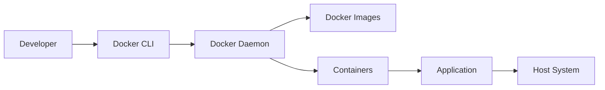
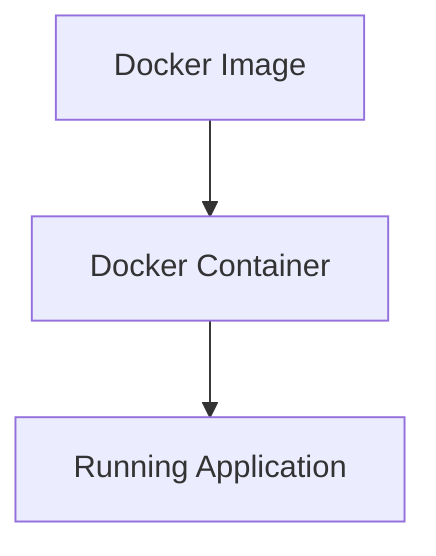
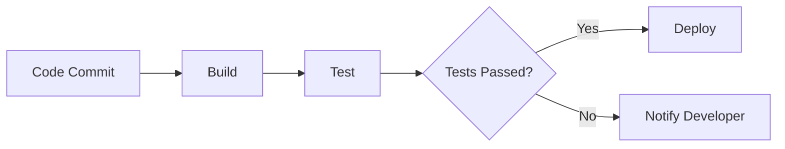
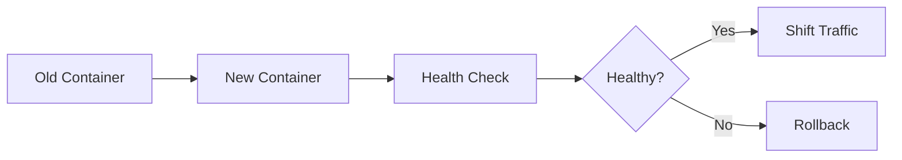

# Introduction to Docker 🚀

Welcome to the **Introduction to Docker** tutorial! Whether you're a developer, system administrator, or just curious about containerization, this guide will walk you through everything you need to know to get started with Docker.

---

## 📋 Outline

- [What is Docker?](#what-is-docker)
- [Who Needs to Learn Docker?](#who-needs-to-learn-docker)
- [Course Agenda](#what-is-course-agenda)
  - [Section 1: Introduction to Docker](#section-1-introduction-to-docker)
  - [Section 2: Docker Basics with NodeJS](#section-2-docker-basics-with-nodejs)
  - [Section 3: Advanced Development with Docker](#section-3-advanced-development-with-docker)
  - [Section 4: Docker with Databases and Web Servers](#section-4-docker-with-databases-and-web-servers)
  - [Section 5: Docker for Production Deployment](#section-5-docker-for-production-deployment)
  - [Section 6: Docker Orchestration](#section-6-docker-orchestration)

---

## 🌟 What is Docker?

Docker is an open-source platform that automates the deployment, scaling, and management of applications using **containerization**. Containers allow developers to package applications with all necessary dependencies, ensuring consistency across multiple environments.

**Key Features:**

- **Lightweight**: Containers share the host system's kernel, making them more efficient than traditional virtual machines.
- **Portable**: Easily move containers between different environments (development, staging, production).
- **Scalable**: Manage and scale applications seamlessly with container orchestration tools.

**Mermaid Diagram: Docker Architecture**



---

## 👥 Who Needs to Learn Docker?

Docker is beneficial for a wide range of professionals, including:

| Role                      | Benefit from Docker                              |
| ------------------------- | ------------------------------------------------ |
| **Developers**            | Simplify environment setup, ensure consistency   |
| **System Administrators** | Efficiently manage applications across servers   |
| **DevOps Engineers**      | Streamline CI/CD pipelines, automate deployments |
| **QA Engineers**          | Create consistent testing environments           |
| **Students & Hobbyists**  | Learn modern application deployment techniques   |

---

## 📚 What is Course Agenda?

This course is structured into six comprehensive sections, each focusing on different aspects of Docker. Here's what you'll learn:

### Section 1: Introduction to Docker

- **Problem**: Understanding the challenges in application deployment.
- **What and Why Docker?**: Exploring the need for containerization and Docker's role.

### Section 2: Docker Basics with NodeJS

- **NodeJS Application**: Setting up a simple NodeJS app.
- **Dockerfile**: Writing Dockerfiles to containerize applications.
- **Images and Containers**: Understanding the difference and creation process.
- **Docker Commands**: Essential commands to manage Docker.

### Section 3: Advanced Development with Docker

- **Local Development and Hot-Reload**: Enhancing development workflows.
- **Volumes**: Managing persistent data.
- **Docker Compose**: Orchestrating multi-container applications.
- **Environments (Dev, Staging, Production)**: Configuring different environments.

### Section 4: Docker with Databases and Web Servers

- **Docker with MongoDB**: Containerizing MongoDB databases.
- **Docker with Redis**: Integrating Redis for caching.
- **Docker Nginx**: Using Nginx as a reverse proxy.
- **Docker PostgreSQL**: Managing PostgreSQL databases.
- **Docker Laravel**: Containerizing Laravel applications.

### Section 5: Docker for Production Deployment

- **Production Deployment on AWS**: Deploying Docker containers to AWS.
- **Load Balancing with Nginx**: Distributing traffic efficiently.
- **Automation with Watchtower**: Automatically updating containers.
- **How CI/CD Works?**: Implementing Continuous Integration and Continuous Deployment.

### Section 6: Docker Orchestration

- **Kubernetes & Swarm**: Introduction to container orchestration tools.
- **Docker Swarm**: Setting up and managing Docker Swarm.
- **Rolling Updates**: Updating applications without downtime.

---

## 🛠 Section 1: Introduction to Docker

### 🔍 Problem

Deploying applications across different environments (development, testing, production) often leads to inconsistencies and unexpected issues. Traditional virtual machines (VMs) can be resource-heavy and slow to start, complicating the deployment process.

### 🐳 What and Why Docker?

Docker addresses these challenges by providing a lightweight, portable, and efficient way to package applications and their dependencies into containers.

**Benefits of Docker:**

- **Consistency**: Same environment across all stages of development and deployment.
- **Efficiency**: Containers are lightweight and start quickly.
- **Scalability**: Easily scale applications horizontally by running multiple container instances.

**Emoji Summary:**

- 🧰 **Toolset**: Simplifies application deployment
- 🔄 **Consistency**: Ensures uniform environments
- 🚀 **Speed**: Faster startup times compared to VMs

---

## 🐳 Section 2: Docker Basics with NodeJS

### 🚀 NodeJS Application

Let's start by setting up a simple NodeJS application.

**Example `app.js`:**

```javascript
const express = require("express");
const app = express();
const PORT = process.env.PORT || 3000;

app.get("/", (req, res) => {
  res.send("Hello, Docker!");
});

app.listen(PORT, () => {
  console.log(`Server is running on port ${PORT}`);
});
```

### 📄 Dockerfile

A Dockerfile defines the environment and instructions to build a Docker image.

**Example `Dockerfile`:**

```dockerfile
# Use official NodeJS image as base
FROM node:14

# Set working directory
WORKDIR /app

# Copy package.json and install dependencies
COPY package*.json ./
RUN npm install

# Copy the rest of the application code
COPY . .

# Expose the application port
EXPOSE 3000

# Start the application
CMD ["node", "app.js"]
```

### 📦 Images and Containers

- **Image**: A read-only template with instructions to create a container.
- **Container**: A runnable instance of an image.

**Mermaid Diagram: Images vs Containers**



### 🛠 Docker Commands

| Command                            | Description                                    |
| ---------------------------------- | ---------------------------------------------- |
| `docker build -t myapp .`          | Build an image from the Dockerfile             |
| `docker run -d -p 3000:3000 myapp` | Run a container in detached mode mapping ports |
| `docker ps`                        | List running containers                        |
| `docker stop <container_id>`       | Stop a running container                       |
| `docker rm <container_id>`         | Remove a stopped container                     |
| `docker images`                    | List all Docker images                         |

---

## 🔧 Section 3: Advanced Development with Docker

### 🔄 Local Development and **Hot-Reload**

Implementing hot-reload enhances the development experience by automatically restarting the application upon code changes.

**Example with Nodemon:**

**Dockerfile:**

```dockerfile
FROM node:14

WORKDIR /app

COPY package*.json ./
RUN npm install -g nodemon
RUN npm install

COPY . .

EXPOSE 3000

CMD ["nodemon", "app.js"]
```

**docker-compose.yml:**

```yaml
version: "3"
services:
  app:
    build: .
    ports:
      - "3000:3000"
    volumes:
      - .:/app
      - /app/node_modules
```

### 📂 Volumes

Volumes allow data to persist outside of containers and facilitate data sharing between containers.

**Example Usage:**

```bash
docker run -d -v mydata:/data myapp
```

### 🛠 Docker Compose

Docker Compose simplifies managing multi-container applications.

**Example `docker-compose.yml`:**

```yaml
version: "3"
services:
  web:
    build: .
    ports:
      - "3000:3000"
    volumes:
      - .:/app
  db:
    image: mongo
    ports:
      - "27017:27017"
```

### 🌐 Environments **Dev, Staging, and Production**

Configuring different environments ensures that applications behave correctly across various stages.

**Example:**

```yaml
version: "3"
services:
  app:
    build: .
    environment:
      - NODE_ENV=development
    ports:
      - "3000:3000"
  db:
    image: mongo
    environment:
      - MONGO_INITDB_ROOT_USERNAME=root
      - MONGO_INITDB_ROOT_PASSWORD=example
```

---

## 🗄 Section 4: Docker with Databases and Web Servers

### 🐋 Docker **with MongoDB**

**docker-compose.yml:**

```yaml
version: "3"
services:
  mongodb:
    image: mongo
    restart: always
    environment:
      MONGO_INITDB_ROOT_USERNAME: root
      MONGO_INITDB_ROOT_PASSWORD: example
    ports:
      - "27017:27017"
    volumes:
      - mongo-data:/data/db

volumes:
  mongo-data:
```

### 🐋 Docker **with Redis**

**docker-compose.yml:**

```yaml
version: "3"
services:
  redis:
    image: redis:alpine
    ports:
      - "6379:6379"
    volumes:
      - redis-data:/data

volumes:
  redis-data:
```

### 🐋 Docker **with Nginx**

Using Nginx as a reverse proxy.

**docker-compose.yml:**

```yaml
version: "3"
services:
  nginx:
    image: nginx:alpine
    ports:
      - "80:80"
    volumes:
      - ./nginx.conf:/etc/nginx/nginx.conf
    depends_on:
      - web
  web:
    build: .
    ports:
      - "3000:3000"
```

**Example `nginx.conf`:**

```nginx
events { }

http {
    server {
        listen 80;
        location / {
            proxy_pass http://web:3000;
            proxy_set_header Host $host;
            proxy_set_header X-Real-IP $remote_addr;
        }
    }
}
```

### 🐋 Docker **with PostgreSQL**

**docker-compose.yml:**

```yaml
version: "3"
services:
  postgres:
    image: postgres:13
    environment:
      POSTGRES_USER: user
      POSTGRES_PASSWORD: password
      POSTGRES_DB: mydb
    ports:
      - "5432:5432"
    volumes:
      - postgres-data:/var/lib/postgresql/data

volumes:
  postgres-data:
```

### 🐋 Docker **with Laravel**

**Dockerfile for Laravel:**

```dockerfile
FROM php:7.4-fpm

# Install dependencies
RUN apt-get update && apt-get install -y \
    build-essential \
    libpng-dev \
    libjpeg62-turbo-dev \
    libfreetype6-dev \
    locales \
    zip \
    jpegoptim optipng pngquant gifsicle \
    vim \
    unzip \
    git \
    curl

# Install PHP extensions
RUN docker-php-ext-install pdo_mysql mbstring exif pcntl bcmath gd

# Install Composer
COPY --from=composer:latest /usr/bin/composer /usr/bin/composer

WORKDIR /var/www

COPY . .

RUN composer install

CMD ["php-fpm"]
```

**docker-compose.yml:**

```yaml
version: "3"
services:
  app:
    build:
      context: .
      dockerfile: Dockerfile
    image: laravel-app
    container_name: laravel-app
    restart: unless-stopped
    ports:
      - "8000:80"
    volumes:
      - .:/var/www
    networks:
      - app-network

  webserver:
    image: nginx:alpine
    container_name: nginx
    restart: unless-stopped
    ports:
      - "80:80"
    volumes:
      - .:/var/www
      - ./nginx.conf:/etc/nginx/conf.d/default.conf
    networks:
      - app-network

  db:
    image: mysql:5.7
    container_name: mysql
    restart: unless-stopped
    environment:
      MYSQL_DATABASE: laravel
      MYSQL_ROOT_PASSWORD: secret
      MYSQL_PASSWORD: secret
      MYSQL_USER: laravel
    ports:
      - "3306:3306"
    volumes:
      - dbdata:/var/lib/mysql
    networks:
      - app-network

networks:
  app-network:
    driver: bridge

volumes:
  dbdata:
```

---

## 🚀 Section 5: Docker for Production Deployment

### ☁️ Production Deployment on **AWS**

Deploying Docker containers to AWS using services like **Elastic Container Service (ECS)** or **Elastic Kubernetes Service (EKS)**.

**Steps:**

1. **Build and Push Docker Image**:
   ```bash
   docker build -t myapp .
   docker tag myapp:latest <aws_account_id>.dkr.ecr.<region>.amazonaws.com/myapp:latest
   docker push <aws_account_id>.dkr.ecr.<region>.amazonaws.com/myapp:latest
   ```
2. **Configure AWS ECS**:
   - Create a new ECS cluster.
   - Define task definitions using the pushed image.
   - Set up services and load balancers.

### ⚖️ Load Balancing with **Nginx**

Distribute incoming traffic across multiple containers to ensure reliability and performance.

**Example Configuration:**

```nginx
http {
    upstream myapp {
        server app1:3000;
        server app2:3000;
    }

    server {
        listen 80;

        location / {
            proxy_pass http://myapp;
        }
    }
}
```

### 🤖 Automation with **Watchtower**

Automatically update running Docker containers when a new image is available.

**Running Watchtower:**

```bash
docker run -d \
  --name watchtower \
  -v /var/run/docker.sock:/var/run/docker.sock \
  containrrr/watchtower
```

### 🔄 How **CI/CD** Works?

**CI/CD** stands for **Continuous Integration** and **Continuous Deployment**. It automates the process of integrating code changes, testing, and deploying applications.

**CI/CD Pipeline Steps:**

1. **Code Commit**: Developers push code to a repository.
2. **Build**: CI tools like Jenkins or GitHub Actions build the Docker image.
3. **Test**: Automated tests are run to ensure code quality.
4. **Deploy**: If tests pass, the image is deployed to production environments.

**Mermaid Diagram: CI/CD Pipeline**



---

## 🗃 Section 6: Docker Orchestration

### 🕸 Docker Orchestration: **Kubernetes & Swarm**

Orchestration tools manage the deployment, scaling, and operation of containerized applications.

**Comparison Table:**

| Feature         | Kubernetes                        | Docker Swarm                    |
| --------------- | --------------------------------- | ------------------------------- |
| **Complexity**  | High                              | Low                             |
| **Scalability** | Excellent                         | Good                            |
| **Ecosystem**   | Large, extensive tooling          | Simpler, integrated with Docker |
| **Use Cases**   | Large-scale, complex applications | Smaller to medium applications  |

### 🐳 Docker Swarm

Docker Swarm is Docker's native clustering and orchestration tool.

**Setting Up a Swarm Cluster:**

1. **Initialize Swarm:**
   ```bash
   docker swarm init --advertise-addr <MANAGER-IP>
   ```
2. **Join Nodes to Swarm:**
   ```bash
   docker swarm join --token <TOKEN> <MANAGER-IP>:2377
   ```
3. **Deploy a Service:**
   ```bash
   docker service create --replicas 3 --name myapp -p 80:80 myapp
   ```

### 🔄 Rolling Updates

Update applications with zero downtime by gradually replacing containers.

**Deploying a Rolling Update:**

```bash
docker service update --image myapp:newversion myapp
```

**Mermaid Diagram: Rolling Update Process**



---

## 🎓 Conclusion

Congratulations! You've now been introduced to Docker and its core concepts. From setting up simple containers to orchestrating complex deployments, Docker empowers you to build, ship, and run applications efficiently across various environments.

**Next Steps:**

- **Practice**: Implement Docker in your projects.
- **Explore**: Dive deeper into Kubernetes or Docker Swarm.
- **Certify**: Consider obtaining Docker certifications to validate your skills.

**Happy Docking!** 🐳🚢

---

## 📌 Additional Resources

- [Docker Official Documentation](https://docs.docker.com/)
- [Docker Hub](https://hub.docker.com/)
- [Kubernetes Documentation](https://kubernetes.io/docs/)
- [Docker Compose Documentation](https://docs.docker.com/compose/)
- [Watchtower GitHub](https://github.com/containrrr/watchtower)

---
