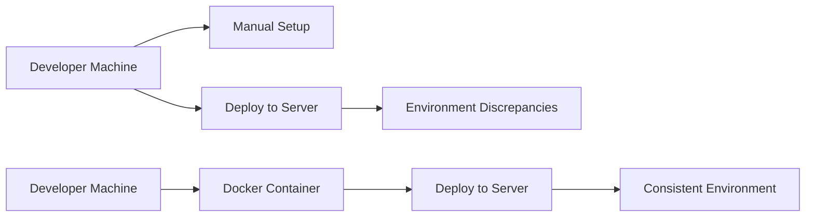
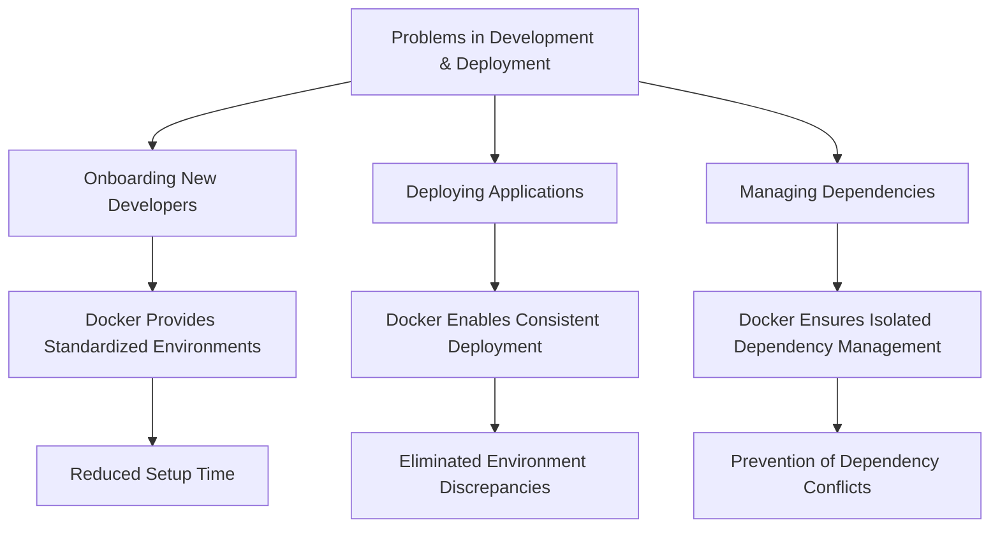
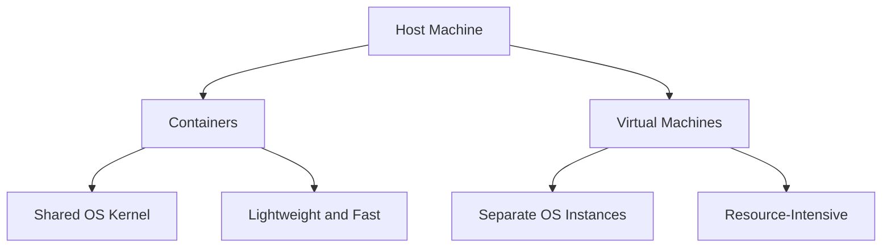
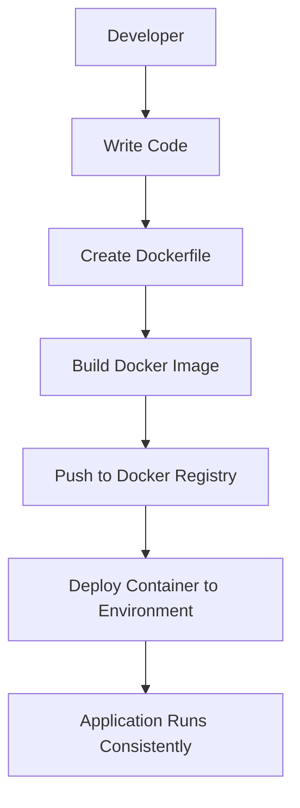

# Problem and Why Docker? 🐳🔍

Welcome to the **Problem and Why Docker** section! In this part, we'll explore the common challenges faced in software development and deployment, and how Docker effectively addresses these issues. We'll enhance the explanations with tables and diagrams to provide a clear and comprehensive understanding.

---

## 📋 Outline

- [**What Problems Does Docker Help Solve?**](#what-problems-does-docker-help-solve)
  - [Onboarding New Developers](#onboarding-new-developers)
  - [Deploying Your App](#deploying-your-app)
  - [Managing Dependencies Across Environments](#managing-dependencies-across-environments)
- [**What is Docker?**](#what-is-docker)
  - [Definition of Docker](#definition-of-docker)
  - [How Docker Solves the Above Problems](#how-docker-solves-the-above-problems)
  - [Containers vs. Virtual Machines](#containers-vs-virtual-machines)

---

## 🐳 What Problems Does Docker Help Solve?

Docker addresses several key challenges in modern software development and deployment. Let's delve into the primary problems Docker mitigates and how it provides solutions.

### 1. Onboarding New Developers 👩‍💻👨‍💻

**The Problem:**

- **Time-Consuming Setup:** New developers often spend significant time setting up their development environment, installing dependencies, and configuring tools.
- **Environment Inconsistencies:** Differences between development environments can lead to the "it works on my machine" syndrome, causing delays and frustration.

**Docker's Solution:**

- **Standardized Environments:** Docker containers encapsulate all necessary dependencies and configurations, ensuring a consistent setup across all developers' machines.
- **Quick Start:** New team members can get up and running quickly by simply running a Docker command to launch the development environment.

**Table: Traditional Setup vs. Dockerized Setup**

| **Aspect**                | **Traditional Setup**               | **Dockerized Setup**                      |
| ------------------------- | ----------------------------------- | ----------------------------------------- |
| **Environment Setup**     | Manual installation of dependencies | Automated via Dockerfile                  |
| **Consistency**           | Varies across different machines    | Uniform across all environments           |
| **Setup Time**            | Hours or days                       | Minutes                                   |
| **Onboarding Complexity** | High, with potential for errors     | Low, straightforward with Docker commands |

### 2. Deploying Your App 🚀

**The Problem:**

- **Environment Discrepancies:** Deploying applications across different environments (development, staging, production) can introduce issues due to varying configurations.
- **Scalability Challenges:** Managing and scaling applications manually across multiple servers is error-prone and inefficient.

**Docker's Solution:**

- **Environment Consistency:** Docker ensures that the application runs the same way in any environment by packaging it with all necessary dependencies.
- **Ease of Deployment:** Containers can be easily deployed, scaled, and managed using container orchestration tools like Kubernetes or Docker Swarm.

**Diagram: Traditional Deployment vs. Docker Deployment**

### 3. Managing Dependencies Across Environments 📦🔄

**The Problem:**

- **Dependency Hell:** Different projects may require conflicting versions of libraries or tools, leading to complex dependency management.
- **System Conflicts:** Installing multiple dependencies directly on the host system can cause conflicts and instability.

**Docker's Solution:**

- **Isolation:** Each Docker container runs in its own isolated environment, allowing multiple applications with different dependencies to coexist without conflicts.
- **Dependency Management:** Dependencies are defined within Dockerfiles, ensuring that the exact versions needed are used every time the container is built.

**Table: Dependency Management Comparison**

| **Feature**             | **Without Docker**                            | **With Docker**                                 |
| ----------------------- | --------------------------------------------- | ----------------------------------------------- |
| **Isolation**           | Shared host environment                       | Each container has its own isolated environment |
| **Conflict Resolution** | Manual management of conflicting dependencies | Automatic isolation prevents conflicts          |
| **Reproducibility**     | Inconsistent across setups                    | Consistent and reproducible environments        |
| **Maintenance**         | Higher complexity                             | Simplified via containerization                 |

---

## 🛠️ What is Docker?

Docker is a powerful containerization platform that revolutionizes how applications are built, shipped, and run. Let's break down what Docker is and how it addresses the problems outlined above.

### Definition of Docker 📜

Docker is an open-source platform that automates the deployment, scaling, and management of applications using **containerization**. Containers are lightweight, standalone packages that include everything needed to run a piece of software, including the code, runtime, libraries, and system tools.

**Key Components:**

- **Docker Engine:** The core application that enables containerization.
- **Docker Images:** Read-only templates used to create containers.
- **Docker Containers:** Runnable instances of Docker images.
- **Docker Hub:** A cloud-based registry service for sharing Docker images.

### How Docker Solves the Above Problems 🛠️

Docker addresses the challenges of onboarding, deployment, and dependency management through its containerization approach.

**1. Standardized Environments:**

- **Solution:** Docker images encapsulate the application's environment, ensuring consistency across all stages from development to production.

**2. Simplified Deployment:**

- **Solution:** Containers can be deployed uniformly across different environments, eliminating the "it works on my machine" problem.

**3. Efficient Dependency Management:**

- **Solution:** Dependencies are defined within Dockerfiles, allowing for precise control over the application's requirements and preventing conflicts.

**Diagram: How Docker Solves Common Problems**

### Containers vs. Virtual Machines 🖥️🆚🧰

Understanding the difference between Docker containers and traditional virtual machines (VMs) is crucial to appreciating Docker's efficiency and performance benefits.

| **Feature**         | **Containers**                                | **Virtual Machines**                                |
| ------------------- | --------------------------------------------- | --------------------------------------------------- |
| **Architecture**    | Share the host OS kernel                      | Include a full guest OS                             |
| **Resource Usage**  | Lightweight, minimal overhead                 | Heavier, more resource-intensive                    |
| **Startup Time**    | Fast (seconds)                                | Slower (minutes)                                    |
| **Portability**     | Highly portable across different environments | Less portable due to dependence on hypervisor setup |
| **Isolation Level** | Process-level isolation                       | Full hardware-level isolation                       |
| **Scalability**     | Easier to scale horizontally                  | More challenging to scale quickly                   |

**Diagram: Containers vs. Virtual Machines**

**Key Takeaways:**

- **Efficiency:** Containers are more resource-efficient compared to VMs because they share the host OS kernel.
- **Speed:** Containers can start up almost instantly, facilitating rapid development and deployment cycles.
- **Scalability:** The lightweight nature of containers makes it easier to scale applications horizontally.

---

## 📈 Summary Tables and Diagrams

To consolidate the information, here are additional tables and diagrams that highlight Docker's advantages and functionalities.

### Table: Benefits of Using Docker

| **Benefit**         | **Description**                                                          |
| ------------------- | ------------------------------------------------------------------------ |
| **Portability**     | Run containers consistently across various environments.                 |
| **Scalability**     | Easily scale applications by deploying multiple container instances.     |
| **Isolation**       | Isolate applications to prevent conflicts and enhance security.          |
| **Efficiency**      | Utilize system resources more effectively compared to VMs.               |
| **Reproducibility** | Ensure consistent environments for development, testing, and production. |

### Diagram: Docker Workflow

### Table: Docker vs. Traditional Deployment

| **Aspect**                  | **Traditional Deployment**          | **Docker Deployment**                          |
| --------------------------- | ----------------------------------- | ---------------------------------------------- |
| **Setup Process**           | Manual, time-consuming              | Automated via Dockerfiles                      |
| **Environment Consistency** | High risk of discrepancies          | Guaranteed consistency across all environments |
| **Deployment Speed**        | Slower due to manual configurations | Faster with containerized deployments          |
| **Resource Utilization**    | Less efficient, higher overhead     | More efficient, lower overhead                 |
| **Scalability**             | Challenging to scale rapidly        | Easily scalable using orchestration tools      |

---

## 🎓 Conclusion

Docker transforms the way developers build, ship, and run applications by addressing fundamental challenges in onboarding, deployment, and dependency management. Through containerization, Docker ensures consistency, portability, and efficiency, making it an indispensable tool in modern software development workflows.

**Next Steps:**

- **Hands-On Practice:** Start containerizing a simple application to experience Docker's benefits firsthand.
- **Deep Dive into Dockerfiles:** Learn how to write effective Dockerfiles to optimize your containers.
- **Explore Orchestration Tools:** Understand how Docker integrates with Kubernetes or Docker Swarm for managing complex deployments.

**Happy Docking!** 🐳🚢

---

## 📌 Additional Resources

- [Docker Official Documentation](https://docs.docker.com/)
- [Docker vs. Virtual Machines](https://www.docker.com/resources/what-container)
- [Mermaid Diagram Syntax](https://mermaid-js.github.io/mermaid/#/)
- [Dockerfile Best Practices](https://docs.docker.com/develop/develop-images/dockerfile_best-practices/)

---
