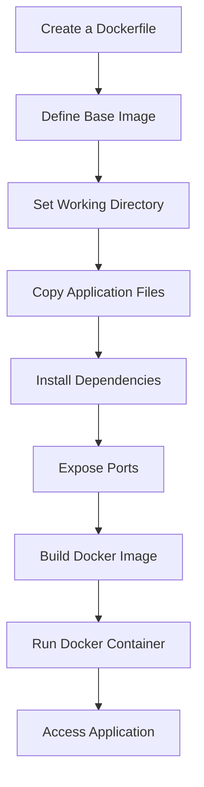

# Docker Images and Docker Containers 📦🐳

## Outline:

- [x] What is **Docker Hub**?
- [x] How to Deal with **Docker Hub** Basic Operations?
- [x] What is the Default Workflow for Docker?
- [x] What Does **Layer Architecture** Mean in Docker?
- [x] What are Common **Layer Architectures** in a Dockerfile?

---

### What is **Docker Hub**? 🌐

**Docker Hub** is a cloud-based repository that allows you to share, store, and manage Docker images. It acts as a central registry for Docker images, enabling users to pull images for their applications and push their custom images for public or private use.

### How to Deal with **Docker Hub** Basic Operations? ⚙️

| Operation       | Command                    | Description                                             |
| --------------- | -------------------------- | ------------------------------------------------------- |
| Pull an Image   | `docker pull <image_name>` | Downloads an image from Docker Hub.                     |
| Push an Image   | `docker push <image_name>` | Uploads a custom image to Docker Hub.                   |
| List Images     | `docker images`            | Displays a list of images stored on your local machine. |
| Remove an Image | `docker rmi <image_name>`  | Deletes an image from your local machine.               |

---

### What is the Default Workflow for Docker? 🔄

1. **Create a Dockerfile**: A text file containing instructions to build a Docker image.
2. **Dockerfile Builds Docker Image**: Execute commands to create the image.
3. **Docker Image Runs Docker Container**: Launch the container from the built image.



---

### What Does **Layer Architecture** Mean in Docker? 🏗️

**Layer Architecture** in Docker refers to the way Docker images are constructed from a series of layers, each representing a set of changes or commands applied to the base image. This layered approach allows for efficient storage and reuse of image components, reducing the overall size and improving the speed of builds.

### What are Common **Layer Architectures** in a Dockerfile? 📜

Here are common layers in a Dockerfile, along with examples and comments explaining each layer:

```dockerfile
# Layer 1: Base Image Layer
FROM node:14-alpine  # Use a lightweight Node.js image

# Layer 2: Package Installation Layer
RUN apk add --no-cache bash  # Install bash in the image

# Layer 3: Set Working Directory Layer
WORKDIR /app  # Set the working directory for subsequent commands

# Layer 4: Copy Files Layer
COPY package.json package-lock.json ./  # Copy package files for dependency installation

# Layer 5: Install Dependencies Layer
RUN npm install  # Install application dependencies

# Layer 6: Copy Application Files Layer
COPY . .  # Copy all application files into the container

# Layer 7: Expose Port Layer
EXPOSE 3000  # Expose port 3000 for the application

# Layer 8: Environment Variable Layer
ENV NODE_ENV=production  # Set the environment to production

# Layer 9: Final Command Layer
CMD ["npm", "start"]  # Command to run when the container starts
```

### Breakdown of Each Layer

| **Layer**   | **Description**                                                            | **Emoji** |
| ----------- | -------------------------------------------------------------------------- | --------- |
| **Layer 1** | Base Image Layer - Sets the starting point for the image.                  | 🍽️        |
| **Layer 2** | Package Installation Layer - Installs necessary packages.                  | 📦        |
| **Layer 3** | Set Working Directory Layer - Sets the working directory inside the image. | 🗂️        |
| **Layer 4** | Copy Files Layer - Copies files needed for building the application.       | 📄        |
| **Layer 5** | Install Dependencies Layer - Installs project dependencies.                | ⚙️        |
| **Layer 6** | Copy Application Files Layer - Copies the application code.                | 💻        |
| **Layer 7** | Expose Port Layer - Specifies the port to expose.                          | 🔒        |
| **Layer 8** | Environment Variable Layer - Sets environment variables for the container. | 🌍        |
| **Layer 9** | Final Command Layer - Defines the command to run the application.          | ▶️        |

---

### Conclusion 🎉

This documentation provides a comprehensive overview of Docker images, Docker containers, and the essential commands to interact with Docker Hub. Understanding the layered architecture of Dockerfiles and how to use them effectively is key to efficient container management. Happy Dockering! 🐳
