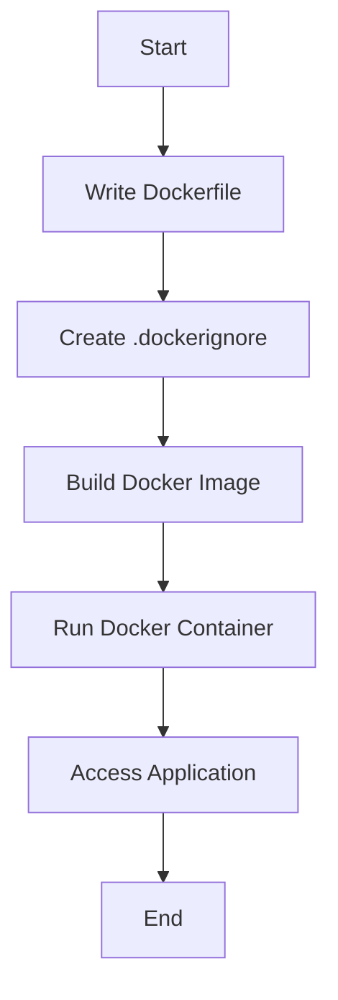
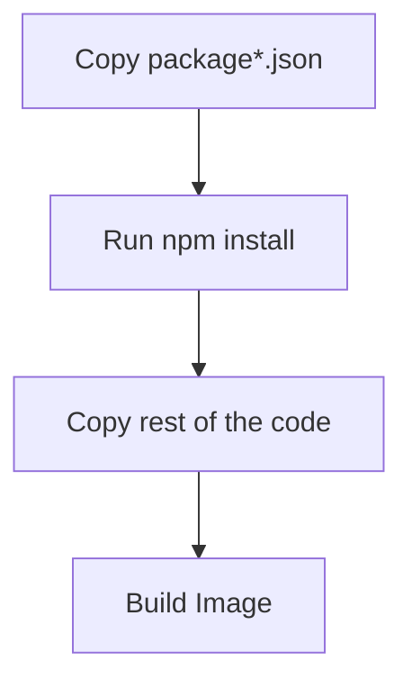
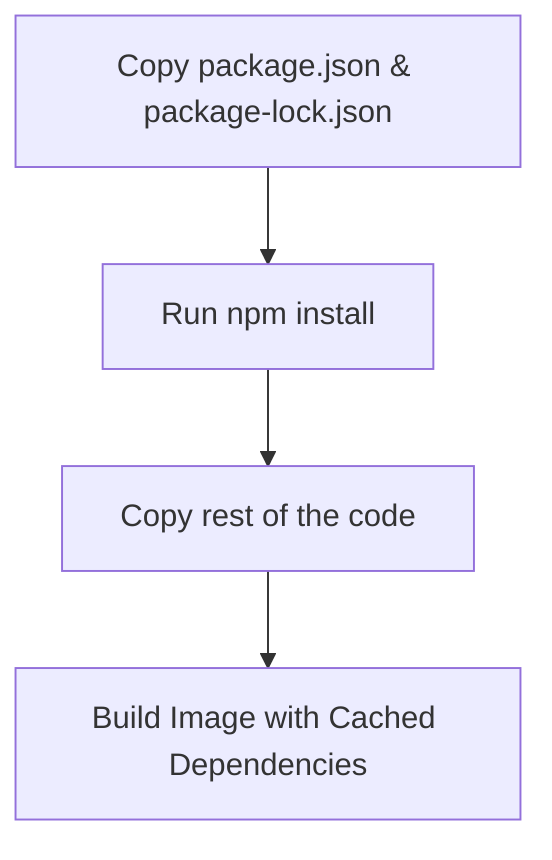

# 🐳 Dockerizing a Node.js Application: A Step-by-Step Tutorial 🚀

Welcome to this comprehensive guide on Dockerizing your Node.js application! Whether you're a seasoned developer or just getting started, this tutorial will walk you through the essential steps to containerize your app using Docker. We'll sprinkle in some emojis, tables, and even a Mermaid diagram to make the journey enjoyable and easy to follow. Let's dive in! 🎉

---

## 📋 Table of Contents

1. [Prerequisites](#prerequisites)
2. [Project Structure](#project-structure)
3. [Creating the `.dockerignore` File](#creating-thedockerignore-file)
4. [Writing the `Dockerfile`](#writing-the-dockerfile)
5. [Building the Docker Image](#building-the-docker-image)
6. [Running the Docker Container](#running-the-docker-container)
7. [Understanding the Process](#understanding-the-process)
8. [Docker Optimization](#docker-optimization)
   - [❓ Do I Need to Copy All Files?](#do-i-need-to-copy-all-files)
   - [📦 Why Did We Split `package.json` Copy Command in Node.js Project?](#why-did-we-split-packagejson-copy-command-in-nodejs-project)
   - [🔧 How to Execute Any Command Inside the Container?](#how-to-execute-any-command-inside-the-container)
   - [🖥️ How to Enter the Container Shell and How to Exit?](#how-to-enter-the-container-shell-and-how-to-exit)
   - [🚫 How to Create `.dockerignore` and What Are Good Practices?](#how-to-create-dockerignore-and-what-are-good-practices)
     - [📚 Understanding Docker Cache Methodology](#understanding-docker-cache-methodology)
     - [🔄 Caching `npm install` for Faster Builds](#caching-npm-install-for-faster-builds)
9. [Conclusion](#conclusion)

---

## 1. Prerequisites 📌

Before we begin, ensure you have the following installed on your machine:

- **[Docker](https://www.docker.com/get-started)**: To build and run Docker containers.
- **[Node.js](https://nodejs.org/en/download/)**: For running your Node.js application.
- **A Code Editor**: Such as VS Code, Sublime Text, or Atom.

---

## 2. Project Structure 📁

Let's start by understanding the structure of a typical Node.js project that we'll Dockerize. Here's a snapshot of the essential files and directories:

```bash
root@459610f2f584:/app# ls
Dockerfile  index.js  node_modules  package-lock.json  package.json
```

To see hidden files, use the `-a` flag:

```bash
root@459610f2f584:/app# ls -a
.   .Dockerignore  Dockerfile  node_modules  package.json
..  .env           index.js    package-lock.json
```

### 📄 File Overview

| File/Directory      | Description                                                              |
| ------------------- | ------------------------------------------------------------------------ |
| `Dockerfile`        | Instructions to build the Docker image. 📦                               |
| `index.js`          | Entry point of your Node.js application. 📝                              |
| `node_modules`      | Directory containing installed Node.js packages. 📂                      |
| `package.json`      | Defines project metadata and dependencies. 📜                            |
| `package-lock.json` | Locks the versions of dependencies. 🔒                                   |
| `.Dockerignore`     | Specifies files/directories to ignore when building the Docker image. 🚫 |
| `.env`              | Environment variables for your application. 🌐                           |

---

## 3. Creating the `.dockerignore` File 🛑

The `.dockerignore` file helps in excluding files and directories from the Docker build context, making the build process faster and the image smaller.

### 📝 Example `.dockerignore` Content

```dockerignore
node_modules
npm-debug.log
.git
.env
Dockerfile*
```

### 📋 Explanation

| Entry           | Purpose                                                  |
| --------------- | -------------------------------------------------------- |
| `node_modules`  | Exclude dependencies; they'll be installed in Docker. 📦 |
| `npm-debug.log` | Ignore debug logs. 🗒️                                    |
| `.git`          | Exclude Git history. 🔒                                  |
| `.env`          | Prevent environment variables from being included. 🌐    |
| `Dockerfile*`   | Avoid copying Dockerfiles unintentionally. 📄            |

---

## 4. Writing the `Dockerfile` 🖥️

The `Dockerfile` contains a set of instructions to assemble a Docker image for your Node.js app.

### 📝 Sample `Dockerfile`

```dockerfile
# Use the official Node.js LTS image as the base
FROM node:18-alpine

# Set the working directory in the container
WORKDIR /app

# Copy package.json and package-lock.json
COPY package*.json ./

# Install dependencies
RUN npm install --production

# Copy the rest of the application code
COPY . .

# Expose the port the app runs on
EXPOSE 3000

# Define the command to run the app
CMD ["node", "index.js"]
```

### 📋 Breakdown of Instructions

| Instruction                    | Description                                                                              |
| ------------------------------ | ---------------------------------------------------------------------------------------- |
| `FROM node:18-alpine`          | Sets the base image to Node.js LTS version with Alpine Linux for a lightweight image. 🐳 |
| `WORKDIR /app`                 | Sets the working directory inside the container to `/app`. 📂                            |
| `COPY package*.json ./`        | Copies `package.json` and `package-lock.json` to the container. 📄                       |
| `RUN npm install --production` | Installs dependencies without dev dependencies. 🚀                                       |
| `COPY . .`                     | Copies all remaining files to the container. 📁                                          |
| `EXPOSE 3000`                  | Exposes port `3000` for the application. 🌐                                              |
| `CMD ["node", "index.js"]`     | Specifies the command to run the application. 🏃‍♂️                                         |

---

## 5. Building the Docker Image 🏗️

Now that we have our `Dockerfile` and `.dockerignore` set up, let's build the Docker image.

### 💻 Terminal Commands

```bash
# Navigate to your project directory
cd /path/to/your/project

# Build the Docker image
docker build -t my-node-app:latest .
```

### 🖼️ Image Tagging

- **`my-node-app`**: Name of your Docker image.
- **`latest`**: Tag indicating the latest version.

---

## 6. Running the Docker Container 🏃‍♀️

With the image built, it's time to run your application inside a Docker container.

### 💻 Terminal Commands

```bash
# Run the Docker container
docker run -d -p 3000:3000 --name my-node-app-container my-node-app:latest
```

### 📋 Explanation

| Option                         | Description                                                      |
| ------------------------------ | ---------------------------------------------------------------- |
| `-d`                           | Runs the container in detached mode (in the background). 🛌      |
| `-p 3000:3000`                 | Maps port `3000` of the host to port `3000` of the container. 🌐 |
| `--name my-node-app-container` | Names the running container for easy reference. 📛               |
| `my-node-app:latest`           | Specifies the image to use for the container. 🖼️                 |

---

## 7. Understanding the Process 📊

Let's visualize the entire Dockerization process using a Mermaid flowchart.



### 🌟 Key Steps

1. **Write Dockerfile**: Define how your application should be built inside the container.
2. **Create `.dockerignore`**: Exclude unnecessary files to optimize the build.
3. **Build Docker Image**: Assemble the image based on the `Dockerfile`.
4. **Run Docker Container**: Launch the containerized application.
5. **Access Application**: Interact with your app via the mapped port.

---

## 8. Docker Optimization 🔧

Optimizing your Docker setup can lead to faster builds, smaller images, and more efficient deployments. In this section, we'll address common optimization questions and best practices. Let's enhance your Docker workflow! 🚀

### ❓ Do I Need to Copy All Files?

**Short Answer:** No, you should only copy the necessary files to keep your Docker image lean and secure.

### 📋 Detailed Explanation

Copying all files from your project directory can lead to larger Docker images, longer build times, and potential security risks if sensitive files are inadvertently included. Instead, selectively copy only the files needed for your application to run.

### 🛠️ Best Practices

- **Use `.dockerignore`**: Exclude unnecessary files and directories.
- **Multi-stage Builds**: Separate build-time dependencies from runtime dependencies.
- **Selective Copying**: Copy only the essential files required for your application.

---

### 📦 Why Did We Split `package.json` Copy Command in Node.js Project?

**Purpose:** To leverage Docker's caching mechanism for faster builds.

### 📋 Explanation

By copying `package.json` and `package-lock.json` separately and running `npm install` before copying the rest of the application code, Docker can cache the layer where dependencies are installed. This means that unless your dependencies change, Docker can reuse the cached layer, speeding up subsequent builds.

### 📊 Illustration



### 📉 Benefits

| Benefit               | Description                                                                                |
| --------------------- | ------------------------------------------------------------------------------------------ |
| **Faster Builds**     | Dependencies are cached, reducing build time when code changes but dependencies do not. ⏩ |
| **Efficient Caching** | Only rebuild layers that have changed, saving computational resources. 💡                  |
| **Smaller Images**    | Avoids unnecessary duplication of dependencies in the final image. 📦                      |

---

### 🔧 How to Execute Any Command Inside the Container?

Executing commands inside a running container is essential for debugging, maintenance, and performing administrative tasks.

### 📝 Methods

1. **Using `docker exec`**

   ```bash
   docker exec -it <container_name> <command>
   ```

   - **Example:** Open a bash shell inside the container.

     ```bash
     docker exec -it my-node-app-container /bin/sh
     ```

2. **Using `docker run`**

   For running one-off commands in a new container based on an existing image.

   ```bash
   docker run -it --rm my-node-app:latest <command>
   ```

   - **Example:** Run a shell session.

     ```bash
     docker run -it --rm my-node-app:latest /bin/sh
     ```

### 📋 Explanation

| Command               | Description                                                                    |
| --------------------- | ------------------------------------------------------------------------------ |
| `docker exec -it`     | Executes a command in a running container interactively. 🖥️                    |
| `docker run -it --rm` | Runs a new container for a one-time command and removes it after execution. 🗑️ |
| `<container_name>`    | The name of your running container. 📛                                         |
| `<command>`           | The command you want to execute inside the container. 🔧                       |

---

### 🖥️ How to Enter the Container Shell and How to Exit?

Interacting with the container's shell allows you to perform real-time operations inside the container.

#### 📥 Entering the Container Shell

1. **Using `docker exec` with `/bin/sh` or `/bin/bash`**

   ```bash
   docker exec -it my-node-app-container /bin/sh
   ```

   Or, if the container has Bash:

   ```bash
   docker exec -it my-node-app-container /bin/bash
   ```

2. **Using `docker attach`**

   ```bash
   docker attach my-node-app-container
   ```

   _Note:_ This attaches your terminal to the main process. Use `docker exec` for shell access to avoid interrupting the main process.

#### 📤 Exiting the Container Shell

- **Exit Shell:** Type `exit` or press `Ctrl + D` to exit the shell session.

### 📋 Steps

| Step            | Command/Action                                  | Description                                               |
| --------------- | ----------------------------------------------- | --------------------------------------------------------- |
| **Enter Shell** | `docker exec -it my-node-app-container /bin/sh` | Opens a shell inside the container. 🖥️                    |
| **Exit Shell**  | Type `exit` or press `Ctrl + D`                 | Closes the shell session and returns to host terminal. 🚪 |

---

### 🚫 How to Create `.dockerignore` and What Are Good Practices?

Creating a `.dockerignore` file is crucial for optimizing Docker builds. It prevents unnecessary files from being copied into the Docker image, reducing build time and image size.

#### 📝 Creating `.dockerignore`

1. **Create the File**

   ```bash
   touch .dockerignore
   ```

2. **Add Entries to Exclude**

   ```dockerignore
   node_modules
   npm-debug.log
   .git
   .env
   Dockerfile*
   ```

#### 📋 Good Practices

| Practice                      | Description                                                        |
| ----------------------------- | ------------------------------------------------------------------ |
| **Exclude `node_modules`**    | Dependencies are installed inside the container. 📦                |
| **Ignore Logs**               | Prevent log files like `npm-debug.log` from being included. 🗒️     |
| **Exclude Version Control**   | Omit `.git` directory to keep image clean and secure. 🔒           |
| **Exclude Environment Files** | Prevent sensitive `.env` files from being baked into the image. 🌐 |
| **Avoid Dockerfile Copies**   | Use `Dockerfile*` to exclude all Dockerfile variations. 📄         |
| **Exclude Test Files**        | Prevent including test suites and related files. 🧪                |
| **Exclude Documentation**     | Omit docs if not needed inside the image. 📚                       |

---

#### 📚 Understanding Docker Cache Methodology

Docker builds images in layers. Each instruction in the `Dockerfile` creates a new layer. Docker caches these layers, so if a layer hasn't changed, Docker can reuse the cached version, speeding up the build process.

### 🧩 How It Works

1. **Layer Caching:** Each instruction (`FROM`, `COPY`, `RUN`, etc.) creates a layer.
2. **Cache Utilization:** If a layer hasn't changed since the last build, Docker reuses the cached layer.
3. **Order Matters:** Place instructions that change less frequently at the top to maximize cache hits.

### 📈 Illustration

```mermaid
graph TD
    A[FROM node:18-alpine] --> B[COPY package*.json ./]
    B --> C[RUN npm install --production]
    C --> D[COPY . .]
    D --> E[EXPOSE 3000]
    E --> F[CMD ["node", "index.js"]]
```

---

#### 🔄 Caching `npm install` for Faster Builds

By copying `package.json` and `package-lock.json` separately and running `npm install` before copying the rest of the application code, you leverage Docker's caching to avoid reinstalling dependencies unless they change.

### 🛠️ Step-by-Step Guide

1. **Copy `package*.json` First**

   ```dockerfile
   COPY package*.json ./
   ```

2. **Run `npm install`**

   ```dockerfile
   RUN npm install --production
   ```

3. **Copy the Rest of the Application**

   ```dockerfile
   COPY . .
   ```

### 📋 Benefits

| Benefit                | Description                                                             |
| ---------------------- | ----------------------------------------------------------------------- |
| **Reduced Build Time** | Dependencies are cached; only reinstalled if `package.json` changes. ⏱️ |
| **Smaller Image Size** | Only necessary dependencies are included. 📦                            |
| **Consistent Builds**  | Ensures dependencies are consistently installed based on lock files. 🔒 |

### 📊 Visualization



---

## 9. Conclusion 🎯

Congratulations! You've successfully Dockerized and optimized your Node.js application. Here's a quick recap of what we've covered:

- **Project Setup**: Organized essential files and directories.
- **Dockerignore**: Optimized the build context by excluding unnecessary files.
- **Dockerfile**: Crafted instructions to build a lightweight and efficient Docker image.
- **Building & Running**: Created and launched your application inside a Docker container.
- **Docker Optimization**: Implemented best practices to enhance build speed and image efficiency.
- **Visualization**: Used Mermaid diagrams to understand process flows.

### 📈 Next Steps

- **Docker Compose**: For managing multi-container applications.
- **Continuous Integration**: Automate your Docker builds and deployments.
- **Optimizing Images Further**: Reduce image size and improve security.
- **Monitoring & Logging**: Implement monitoring solutions for your Docker containers.
- **Security Best Practices**: Ensure your Docker images and containers are secure.

Feel free to explore and expand upon this foundation to suit your project's unique needs. Happy Dockerizing! 🐳✨

---
