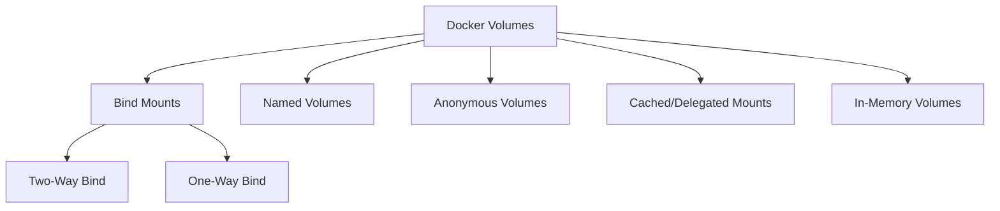

# Docker Volumes & Bind Mounts Tutorial 📦🔄

## 📑 Table of Contents

1. [Introduction to Docker Volumes & Bind Mounts](#1-introduction-to-docker-volumes--bind-mounts)
2. [Types of Docker Volumes](#2-types-of-docker-volumes)
   - 2.1 [Bind Mounts 📁](#21-bind-mounts-📁)
     - 2.1.1 [Two-Way Bind (Bidirectional Sync) 🔄](#211-two-way-bind-bidirectional-sync-🔄)
     - 2.1.2 [One-Way Bind (Unidirectional Sync) 🔒](#212-one-way-bind-unidirectional-sync-🔒)
   - 2.2 [Named Volumes 📦](#22-named-volumes-📦)
   - 2.3 [Anonymous Volumes 🤫](#23-anonymous-volumes-🤫)
   - 2.4 [Cached/Delegated Mounts ⚡](#24-cacheddelegated-mounts-⚡)
   - 2.5 [In-Memory Volumes (tmpfs) 🧠](#25-in-memory-volumes-tmpfs-🧠)
3. [Comparison of Volume Types](#3-comparison-of-volume-types)
4. [Practical Examples with Shell Commands 🖥️](#4-practical-examples-with-shell-commands-🖥️)
5. [Visual Representations 📊](#5-visual-representations-📊)
6. [Conclusion 🎯](#6-conclusion-🎯)

---

### 1. Introduction to Docker Volumes & Bind Mounts

Docker is a powerful platform for developing, shipping, and running applications in containers. One of the key features of Docker is its ability to manage data persistence through **Volumes** and **Bind Mounts**. Understanding how to use these effectively is crucial for ensuring your applications maintain their data correctly across container restarts and updates.

---

### 2. Types of Docker Volumes

There are several types of volumes you can use in Docker. Each has its own use cases and benefits.

| Type                                | Description                                                 | Use Cases                            |
| ----------------------------------- | ----------------------------------------------------------- | ------------------------------------ |
| **1. Bind Mounts** 📁               | Maps a host path to a container path                        | Development, testing, real-time sync |
| **2. Named Volumes** 📦             | Managed by Docker, referenced by name                       | Persistent storage                   |
| **3. Anonymous Volumes** 🤫         | Similar to named but not referenced by name                 | Temporary data, automatic cleanup    |
| **4. Cached/Delegated Mounts** ⚡   | Performance-oriented mounts, ideal for read-heavy workloads | High-performance scenarios           |
| **5. In-Memory Volumes (tmpfs)** 🧠 | Volumes stored in memory for fast access                    | Temporary data needing speed         |

---

#### 2.1 Bind Mounts 📁

Bind mounts directly map a directory from the host machine to a directory in the container. They allow for real-time updates and are particularly useful in development environments.

##### 2.1.1 Two-Way Bind (Bidirectional Sync) 🔄

Both the host and the container can read and write data, allowing for real-time updates.

**Shell Command Example:**

```bash
docker run -v /path/on/host:/path/in/container my-image
```

##### 2.1.2 One-Way Bind (Unidirectional Sync) 🔒

Data flows from the host to the container, but changes in the container do not affect the host.

**Shell Command Example:**

```bash
docker run -v /path/on/host:/path/in/container:ro my-image
```

---

#### 2.2 Named Volumes 📦

Named volumes are managed by Docker and can be referenced by name, making them suitable for persistent storage.

**Shell Command Example:**

```bash
docker volume create my-volume
docker run -v my-volume:/path/in/container my-image
```

---

#### 2.3 Anonymous Volumes 🤫

Anonymous volumes are similar to named volumes but are not referenced by name. They are useful for temporary data that should be automatically cleaned up when not in use.

**Shell Command Example:**

```bash
docker run -v /path/in/container my-image
```

---

#### 2.4 Cached/Delegated Mounts ⚡

Cached and delegated mounts optimize performance for read-heavy workloads by defining how data is synchronized between the host and the container.

**Shell Command Example:**

```bash
docker run -v /path/on/host:/path/in/container:cached my-image
```

---

#### 2.5 In-Memory Volumes (tmpfs) 🧠

These volumes are stored in memory for fast access, making them suitable for temporary data that requires speed.

**Shell Command Example:**

```bash
docker run --tmpfs /path/in/container my-image
```

---

### 3. Comparison of Volume Types

| Volume Type                    | Persistence | Managed by Docker | Real-Time Sync | Use Cases                         |
| ------------------------------ | ----------- | ----------------- | -------------- | --------------------------------- |
| **Bind Mounts** 📁             | No          | No                | Yes            | Development, real-time updates    |
| **Named Volumes** 📦           | Yes         | Yes               | No             | Persistent storage                |
| **Anonymous Volumes** 🤫       | Yes         | Yes               | No             | Temporary data, automatic cleanup |
| **Cached/Delegated Mounts** ⚡ | Yes         | Yes               | Yes            | High-performance scenarios        |
| **In-Memory Volumes** 🧠       | No          | No                | Yes            | Temporary data needing speed      |

---

### 4. Practical Examples with Shell Commands 🖥️

1. **Create a Named Volume**:

   ```bash
   docker volume create my_volume
   ```

2. **Run a Container with a Named Volume**:

   ```bash
   docker run -v my_volume:/data my-image
   ```

3. **Run a Container with a Bind Mount**:

   ```bash
   docker run -v /host/path:/container/path my-image
   ```

4. **Run a Container with a tmpfs Volume**:
   ```bash
   docker run --tmpfs /data my-image
   ```

---

### 5. Visual Representations 📊

#### 5.1 Mermaid Graph for Volume Types



---

### 6. Conclusion 🎯

Understanding the different types of Docker volumes and bind mounts is essential for efficient data management in containerized applications. By choosing the right volume type for your use case, you can enhance your application's performance and ensure data persistence across container instances.

---
